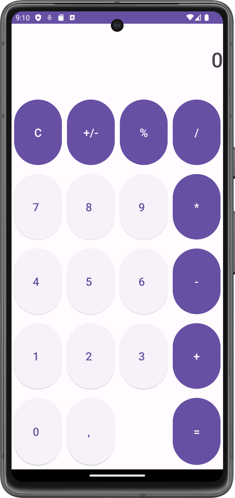
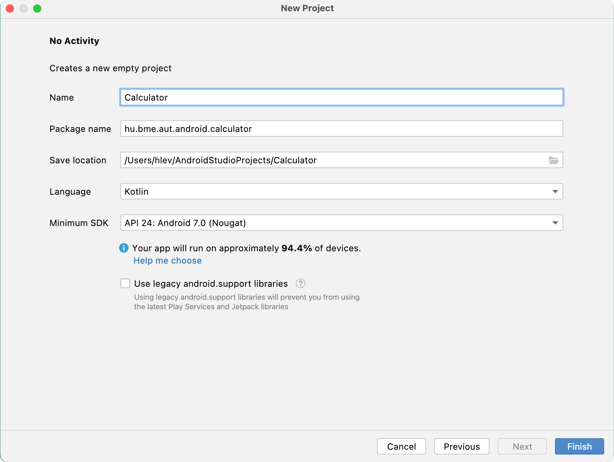
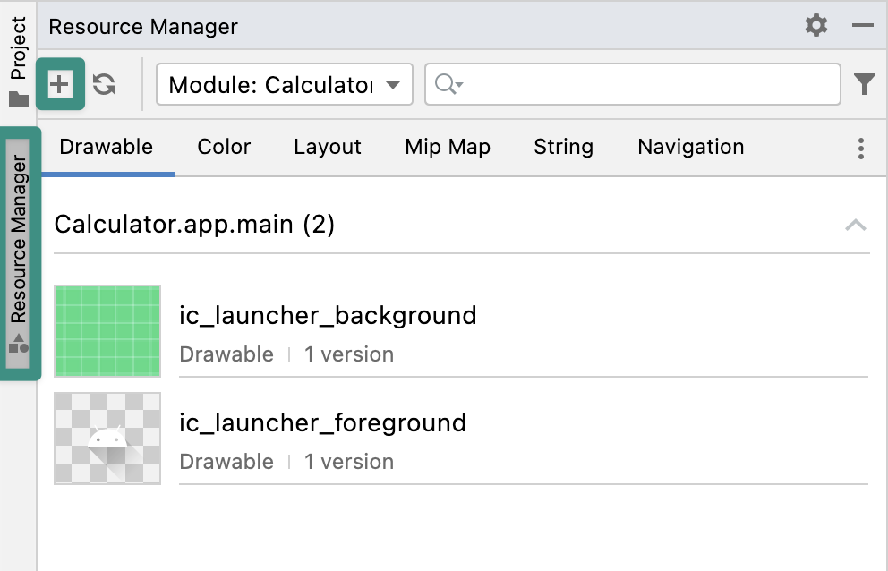
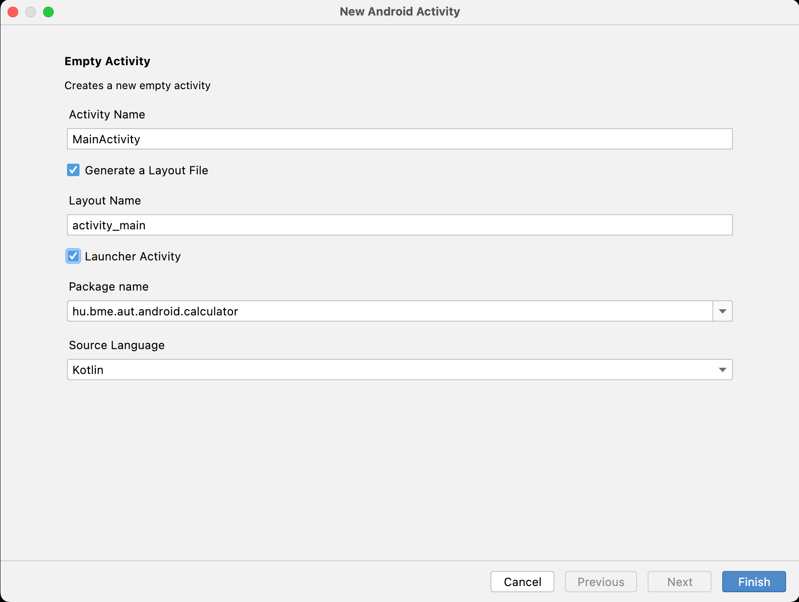
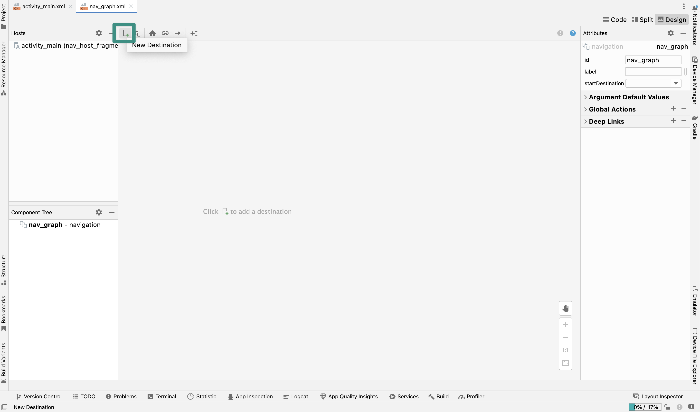
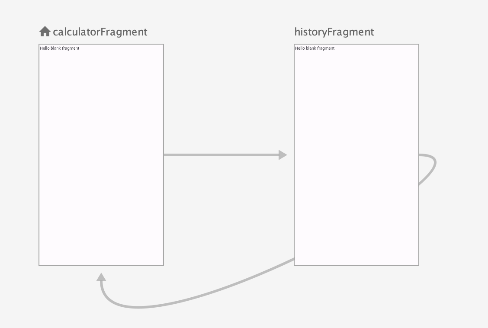

# Labor03 - Számológép (Calculator)

## A labor célja
A legfontosabb `XML`-alapú UI fejlesztési komponensek használatának bemutatása egy számológép alkalmazáson keresztül. A labor során megismerkedünk a `Jetpack Navigation` könyvtárral, a `Fragment`-ekkel és a `RecyclerView` elkészítési lépéseivel.

<p float="left">


</p>

### Felhasznált technológiák:

- `Activity`
- `Fragment`
- `Jetpack Navigation`
- `RecyclerView` és `RecyclerViewAdapter`
- `TableLayout`, `TextView`, `Button`
- `View Binding`

## Előkészületek

A feladatok megoldása során ne felejtsd el követni a [feladat beadás folyamatát](../../tudnivalok/github/GitHub.md).

### Git repository létrehozása és letöltése

1. Moodle-ben keresd meg a laborhoz tartozó meghívó URL-jét és annak segítségével hozd létre a saját repository-dat.

1. Várd meg, míg elkészül a repository, majd checkout-old ki.

    !!! tip ""
        Egyetemi laborokban, ha a checkout során nem kér a rendszer felhasználónevet és jelszót, és nem sikerül a checkout, akkor valószínűleg a gépen korábban megjegyzett felhasználónévvel próbálkozott a rendszer. Először töröld ki a mentett belépési adatokat (lásd [itt](../../tudnivalok/github/GitHub-credentials.md)), és próbáld újra.

1. Hozz létre egy új ágat `megoldas` néven, és ezen az ágon dolgozz.

1. A `neptun.txt` fájlba írd bele a Neptun kódodat. A fájlban semmi más ne szerepeljen, csak egyetlen sorban a Neptun kód 6 karaktere.

## Projekt létrehozása

Első lépésként indítsuk el az Android Studio-t, majd:

1. Hozzunk létre egy új projektet, válasszuk ki a **No Activity** opciót, majd kattintsunk a *Next* gombra.
2. A projekt neve legyen `Calculator`, a kezdő package pedig `hu.bme.aut.android.calculator`.
3. Nyelvnek továbbra is a **Kotlin**-t használjuk.
4. A minimum API szint pedig legyen **24: Android 7.0 (Nougat)**.



!!!danger "FILE PATH"
	A projekt a repository-ban lévő `Calculator` könyvtárba kerüljön, és beadásnál legyen is felpusholva! A kód nélkül nem tudunk maximális pontot adni a laborra!
	
Ha ezzel megvagyunk, akkor térjünk rá a *Gradle* fájlokra, amik a projektünk buildelési folyamatának konfigurációjáért felelnek. Elsőre nézzük a **project** szintű *Gradle* fájlt:

A *Jetpack Navigation* könyvtár használata miatt vegyük fel a többi plugin mellé a `androidx.navigation.safeargs`-ot:

```groovy
plugins {
	...
	id("androidx.navigation.safeargs") version "2.7.3" apply false
}
```

Nyissuk meg a **module** szintű *Gradle* fájlunkat.

Engedélyezzük a View Binding-ot:

```groovy
...
android {
	...
    buildFeatures {
        viewBinding = true
    }
}
```

Győződjünk meg arról, hogy a függőségként felvett könyvtárak verziója a lehető legfrissebb. (Ez akkor áll fenn, ha egyik könyvtár sincs sárga színnel (*Warning*) kiemelve.)

!!!info ""
	Ha szerepelnének ilyen figyelmeztetések, akkor a kurzorunkat a megfelelő könyvtár felé vive megjelenik egy ablak, amin belül a `Change to 'some_version'`-re kattintva módosíthatjuk az aktuális verziót egy újabbra.

Vegyük fel azokat a további függőségeket, amikre még szükségünk lesz a projekt során. Ehhez a pluginok közé még vegyük fel a `androidx.navigation.safeargs.kotlin`-t.

```groovy
plugins {
    ...
    id("androidx.navigation.safeargs.kotlin")
}

android { ... }

dependencies {
	...
    val nav_version = "2.7.3"
    implementation ("androidx.navigation:navigation-fragment-ktx:$nav_version")
    implementation ("androidx.navigation:navigation-ui-ktx:$nav_version")
}
```

Ha végeztünk szinkronizáljuk a *Gradle* fájlokat. (Ha esetleg nem lenne, meg hogy ezt hol lehet, akkor a *SHIFT* gomb dupla lenyomásával megnyílik egy kereső, amiben a *Sync project with Gradle files*-t megadva ez elvégezhető.) 

Szükségünk lesz még néhány *string* és *drawable* erőforrásra, amit most érdemes előre felvenni. A *string* erőforrások eléréséhez nyissuk meg a `res/values/string.xml` fájlt és vegyük fel az alábbi erőforrásokat:

```xml
<resources>
    <string name="app_name">Calculator</string>
    <string name="text_calculator_console">0</string>
    <string name="text_operation">%1$.2f %2$s %3$.2f = %4$.2f</string>
    <string name="button_text_delete">C</string>
    <string name="button_text_sign">+/-</string>
    <string name="button_text_modulo">%</string>
    <string name="button_text_division">/</string>
    <string name="button_text_number_seven">7</string>
    <string name="button_text_number_eight">8</string>
    <string name="button_text_number_nine">9</string>
    <string name="button_text_multiplication">*</string>
    <string name="button_text_number_four">4</string>
    <string name="button_text_number_five">5</string>
    <string name="button_text_number_six">6</string>
    <string name="button_text_subtraction">-</string>
    <string name="button_text_number_one">1</string>
    <string name="button_text_number_two">2</string>
    <string name="button_text_number_three">3</string>
    <string name="button_text_addition">+</string>
    <string name="button_text_number_zero">0</string>
    <string name="button_text_come">,</string>
    <string name="button_text_equivalence">=</string>
    <string name="menu_item_title_delete">Delete</string>
    <string name="menu_item_content_description_delete">Action to delete history</string>
    <string name="button_text_load">Load</string>
    <string name="app_bar_title_history">History</string>
</resources>
```

Majd nyissuk meg a *ResourceManager*-t (bal oldali menüsáv), válasszuk ki a *drawable* erőforrásokat, majd kattintsunk a **+** gombra, ahol válasszuk ki a **Vector Asset** lehetőséget.



Ekkor megnyílik az *Asset Studio*. Itt kattintsunk a *Clip art* mellett lévő gombra, és keressük meg az **arrow back** nevű ikont. Az *Name* attribútumot állítsuk át `ic_arrow_back_24`-re. Kattintsunk a *Next* majd a *Finish* gombra.


Végezetül szeretnénk a *Material You* keretrendszerre áttérni a UI kinézete esetében. Ehhez nyissuk a `res/values/` elérési úton lévő `themes.xml` fájlt, és írjuk át a tartalmát a következőre:

```xml
<resources xmlns:tools="http://schemas.android.com/tools">
    <!-- Base application theme. -->
    <style name="Base.Theme.Calculator" parent="Theme.Material3.DayNight.NoActionBar">
        <!-- Customize your light theme here. -->
        <!-- <item name="colorPrimary">@color/my_light_primary</item> -->
    </style>

    <style name="Theme.Calculator" parent="Base.Theme.Calculator" />
</resources>
```

Majd töröljük ki a `night` erőforrásminősítővel ellátott verziót.

## Jetpack Navigation
A következő részben a *Jetpack Navigation* könyvtárral fogunk megismerkedni. Segítségével *Activity*-k és *Fragment*-ek közötti navigációt lehet megvalósítani úgy, hogy az egyes képernyők közti útvonalakat egy gráffal modellezzük.

Első lépésként a *ResourceManager* segítségével, hozzunk létre egy navigációs gráfot. Válasszuk ki a *Navigation* opciót, majd kattintsunk a **+** gombra, ahol válasszuk a *Navigation Resource File* lehetőséget. Az erőforrás fájl neve legyen `nav_graph`.

Ezután hozzunk létre egy új *Empty Views Activity*-t (jobb klikk *calculator* package-n --> *New* --> *Activity* --> *Empty Views Activity*). Itt pipáljuk be a *Launcher Activity* opciót, ugyanis szeretnénk, hogy az *Activity* a futtató eszköz menüjéből indítható legyen. Majd kattintsunk a *Finish* gombra.



Keressük meg a `MainActivity`-hez tartozó `activity_main.xml` fájlt (`res/layout`), és vegyünk fel benne egy `FragmentContainerView` komponenst:

```xml
<?xml version="1.0" encoding="utf-8"?>
<androidx.constraintlayout.widget.ConstraintLayout xmlns:android="http://schemas.android.com/apk/res/android"
    xmlns:app="http://schemas.android.com/apk/res-auto"
    xmlns:tools="http://schemas.android.com/tools"
    android:layout_width="match_parent"
    android:layout_height="match_parent"
    tools:context=".MainActivity">

    <androidx.fragment.app.FragmentContainerView
        android:id="@+id/nav_host_fragment"
        android:name="androidx.navigation.fragment.NavHostFragment"
        android:layout_width="0dp"
        android:layout_height="0dp"
        app:defaultNavHost="true"
        app:layout_constraintBottom_toBottomOf="parent"
        app:layout_constraintLeft_toLeftOf="parent"
        app:layout_constraintRight_toRightOf="parent"
        app:layout_constraintTop_toTopOf="parent"
        app:navGraph="@navigation/nav_graph" />

</androidx.constraintlayout.widget.ConstraintLayout>
```

!!!note "FragmentContainerView"
	Ez egy egyedi *layout* típus, ami a *Fragment*-ek megjelenítésére használatos.

	- Az **android:name** attribútum tartalmazza a `NavHost` implementációnk osztálynevét.
	- Az **app:navGraph** attribútum hivatkozik arra a navigációs erőforrásra, amit korábban generáltunk.
	- Az **app:defaultNavhost="true"** attribútum biztosítja, hogy a `NavHostFragment` kezelni tudja a visszafelé navigálást (amit egy dedikált fizikai gombbal vagy interakcióval válthatunk ki). Csak egyetlen `NavHost` lehet alapértelmezettnek (*default*) beállítva.

Következő lépésként nyissuk meg a `nav_graph.xml`-t (`res/navigation`) *Design* módban. Kattintsunk a *New Destination* gombra, ott válasszuk ki a *Create New Destination* majd *Fragment (Blank)* opciókat. A *Fragment* neve legyene `CalculatorFragment`. Ezután véglegesítsük a létrehozást a *Next* és *Finish* gombra való kattintással.



Hozzunk létre ugyanezzel a módszerrel egy újabb *Fragment*-t `HistoryFragment` néven. Ha ezzel megvagyunk, vigyük a kurzorunkat a `CalculatorFragment` fölé, ekkor megjelenik egy karika a *Fragment* jobb oldalán. Kattintsunk rá, majd a *bal* klikket lenyomva húzzuk a kurzort a másik *Fragment* fölé és ott engedjük el. Így létrejött egy útvonal a `CalculatorFragment` és a `HistoryFragment` között. Végezzük el ugyanezt visszafelé. Ha ezzel megvagyunk, akkor következőt kell látnunk:



!!!example "BEADANDÓ (1 pont)" 
	Készíts egy **képernyőképet**, amin látszódik **a futó alkalmazás** (emulátoron, készüléket tükrözve vagy képernyőfelvétellel), a **`nav_graph.xml` kódja,** valamint a **neptun kódod a kódban valahol kommentként**.

	A képet a megoldásban a repository-ba f1.png néven töltsd föl.

	A képernyőkép szükséges feltétele a pontszám megszerzésének.


## CalculatorOperator

A labor következő szakaszában a `CalculatorOperator` nevű segédosztályt fogjuk implementálni, aminek a feladata, hogy eltárolja a számológép állapotát, és kiszámítsa a támogatott műveletek eredményét. Ezt a *Kotlin* [`Regex`](https://kotlinlang.org/api/latest/jvm/stdlib/kotlin.text/-regex/) könyvtárának segítségével végzi el.

Első lépésként hozzunk létre egy új `util` package-t (jobb klikk *calculator* package-en --> *New* --> *package*), benne `Util` nevű *Kotlin* objektummal. Ez az objektum fogja tartalmazni az olyan konstansokat és segédváltozókat, amik a számológép működtetéséhez szükségesek.

```kotlin
object Util {
    const val COMMA = "."

    private const val numberPattern = "0[.][0-9]+|[1-9][0-9]*[.][0-9]+|[1-9][0-9]*|0|^[\\s]"
    val numberRegex = Regex(numberPattern)

    private const val halfOperation = "[/*%+-]($numberPattern)|^[\\s]"
    val halfOperationRegex = Regex(halfOperation)

    private const val operationSymbolPattern = "[/*%+-]|^[\\s]"
    val operationSymbol = Regex(operationSymbolPattern)
}
```

Ha ezzel megvagyunk hozzunk létre egy új `model` package-t a *calculator* package-n belül, majd hozzunk létre benne egy új `enum` osztályt `OperationSymbol` néven, ami a számológéppel elvégezhető műveleteket reprezentálja. Az `enum` osztályunk rendelkezzen egy konstruktorral, ami a műveletekhez a hozzájuk tartozó szimbólumot rendeli `String`-ként.

```kotlin
enum class OperationSymbol(val symbol: String) {
    DIVISION("/"),   // 0
    MULTIPLICATION("*"),   // 1
    SUBTRACTION("-"),   // 2
    ADDITION("+"),   // 3
    MODULO("-");   // 4
}
``` 

Következő lépésként egészítsük ki az osztályt egy `companion object`-el benne egy olyan `getByOrdinal()` nevű segédfüggvénnyel, ami a sorrend szerinti index alapján visszaadja a megfelelő `OperationSymbol`-t. Tehát `0` esetén a `DIVISION`-t, `1` esetén `MULTIPLICATION`-t és így tovább.

```kotlin
companion object {
    fun getByOrdinal(ordinal: Int): OperationSymbol? {
        var operation: OperationSymbol? = null
        for (value in values()) {
            if (value.ordinal == ordinal) {
                operation = value
                break
            }
        }
        return operation
    }
}

```

!!!info ""
	Az `enum` osztályhoz tartozó `values()` metódus az osztályban definiált `enum` objektumok tömbjét adja vissza.

Ezután a *util* package-ben hozzunk létre egy `CalculatorOperator` nevű *Kotlin* `object`-t (`Singleton` osztály). Ez a `Singleton` felel a számológép vezérléséért.

Első lépésként a `CalculatorOperator` osztályon belül vegyünk fel egy `CalculatorState` nevű `data class`-t. Ez a számológép állapotának tárolásáért felel, ami a `CalculatorOperator` metódusai számára írható és olvasható, más osztályok számára pedig csak olvasható.

```kotlin
object CalculatorOperator {
    
    var state: CalculatorState = CalculatorState()
        private set

    data class CalculatorState(
        val input: String = "",
        val number1: Double = Double.NaN,
        val number2: Double = Double.NaN,
        val operation: OperationSymbol = OperationSymbol.ADDITION,
        val result: Double = Double.NaN
    )
}
```

!!!info "data class"
	 A [`data class`](https://kotlinlang.org/docs/data-classes.html) egy nagyon hasznos funkció a Kotlin nyelvben. Segítségével az elsődleges konstruktorban (ami közvetlenül az osztálynév után áll) deklarált változókra automatikusan generálódnak a `hashCode()`, `equals()`, illetve `toString()` függvények, melyek hasznosak a különböző adathalmazok kezelésére. Bár megengedett, az adat osztályoknál lehetőleg kerüljük a változtatható változókat (`var`).

Importáljuk a hiányzó referenciákat, majd implementáljuk a számok beviteléért felelős `onNumberPressed()` metódust:

```kotlin
fun onNumberPressed(number: Int) {
    state = state.copy(
        input = state.input + "$number"
    )
}
```

!!!info ""
	A számok bevitele úgy történik, hogy az állapot `input` attribútumát mindig egy hozzáfűzött számmal megváltoztatott értékkel "frissítjük".

Következő lépésként implementáljuk a műveletek elvégzéséért felelős metódust:

```kotlin
fun onOperationPressed(operation: Int) {
    val input = state.input
    if (Util.numberRegex.matches(input)) {
        state = state.copy(
            number1 = Util.numberRegex.find(input)!!.value.toDouble(),
            operation = OperationSymbol.getByOrdinal(operation)!!,
            input = OperationSymbol.getByOrdinal(operation)!!.symbol
        )
    } else if (Util.halfOperationRegex.matches(input)) {
        val number2 = Util.numberRegex.find(input)!!.value.toDouble()
        val result = countResult(number2)
        state = state.copy(
            number1 = result,
            number2 = Double.NaN,
            operation = OperationSymbol.getByOrdinal(operation)!!,
            input = OperationSymbol.getByOrdinal(operation)!!.symbol
        )
    } else if (Util.operationSymbol.matches(input)) {
        state = state.copy(
            operation = OperationSymbol.getByOrdinal(operation)!!,
            input = OperationSymbol.getByOrdinal(operation)!!.symbol
        )
    } else {
        state = state.copy(
            operation = OperationSymbol.getByOrdinal(operation)!!,
            input = OperationSymbol.getByOrdinal(operation)!!.symbol
        )
    }
}
```
???note "Ha érdekel az `onOperationPressed()` működési elve, akkor ezt a fület lenyitva tudod megismerni."
	A műveletek kezelése során három esetet különböztetünk meg egymástól:

	
	Az első eset, amikor az `input` string már tartalmaz valamilyen számot. Ekkor ezt a számot eltároljuk a számológép állapotának (`state`) `number1` attribútumában, majd az `input`-ot felülírjük a bevitt művelet szimbólumával, illetve az `operation` attribútumba is elmentjük a megfelelő `OperationSymbol` `enum` objektumot.


	A második eset akkor történik, amikor az `input`-ban egy szimbólumot valamilyen szám is követ (pl. "*5"). Ekkor a `number1` attribútum már tartalmaz egy számot (az 1. eset már lezajlott), így az első esetben felvett műveleti szimbólummal és az azt követő számmal már el is végezhető egy művelet. A művelet eredményével felülírjuk a `number1` értékét, majd a korábbiakhoz hasonlóan eltároljuk az új művelet szimbólumát.


	A harmadik eset, akkor áll fenn, amikor csak egy műveleti szimbólum van az `input`-ban (pl. "*"), ami helyett mást akarunk elvégezni, ekkor csak simán lecseréljük az `operation`-t és az `input`-ot.


	Végső esetben, amikor az `input` teljesen üres, akkor inicializáljuk az új műveleti értékekkel a `state`-et.


Még szükségünk van a `countResult()` metódusra, aminek segítségével kiszámíthatóak a műveletek eredményei:

```kotlin
private fun countResult(number2: Double): Double {
    return when (state.operation) {
        OperationSymbol.DIVISION -> state.number1 / number2
        OperationSymbol.MULTIPLICATION -> state.number1 * number2
        OperationSymbol.MODULO -> state.number1 % number2
        OperationSymbol.ADDITION -> state.number1 + number2
        OperationSymbol.SUBTRACTION -> state.number1 - number2
    }
}
```

Végezetül vegyük fel az előjelváltásért, a tizedesjegyért, a művelet elvégzéséért (`=`) és a törtlésért felelős metódusokat. Ezekben a metódusokban a számológép állapotának frissítése a fentiekhez hasonlóan történik.

```kotlin
fun onSignChange(): Double {
    val input = state.input
    return if (Util.numberRegex.matches(input)) {
        val number1 = -Util.numberRegex.find(input)!!.value.toDouble()
        state = state.copy(
            result = Double.NaN,
            number1 = number1,
            input = ""
        )
        number1
    } else if (Util.halfOperationRegex.matches(input)) {
        val number2 =  -Util.numberRegex.find(input)!!.value.toDouble()
        state = state.copy(
            number2 = number2,
            input = ""
        )
        number2
    } else Double.NaN
}

fun addComa() {
    state = state.copy(
        input = state.input + Util.COMMA
    )
}

fun onEquivalence(): Double {
    val input = state.input
    return if (Util.halfOperationRegex.matches(input)) {
        val number2 = Util.numberRegex.find(input)!!.value.toDouble()
        val result = countResult(number2)

        state = state.copy(
            input = "",
            number1 = result,
            number2 = Double.NaN,
            operation = OperationSymbol.ADDITION,
            result = Double.NaN
        )
        result
    } else if (!state.number2.isNaN()) {
        val result = countResult(state.number2)
        
        state = state.copy(
            input = "",
            number1 = result,
            number2 = Double.NaN,
            operation = OperationSymbol.ADDITION,
            result = Double.NaN
        )
        result
    } else Double.NaN
}

fun onDelete() {
    state = state.copy(
        number1 = Double.NaN,
        number2 = Double.NaN,
        result = Double.NaN,
        input = ""
    )
}
```

## CalculatorFragment

Első lépésként keressük meg a `res/layout` alatt található `fragment_calculator.xml` fájlt, ahol `CalculatorFragment` *View* komponenseit és azok elrendezését fogjuk meghatározni. 

A laborra fordítható idő miatt csak ismerkedjünk meg az *XML* felépítési elvével és másoljuk át a kész *View hierarchiát*, ami az alábbi részt követően elérhető egyben, egy lenyíló részt kinyitva.

```xml
<?xml version="1.0" encoding="utf-8"?>
<TableLayout xmlns:android="http://schemas.android.com/apk/res/android"
    android:layout_width="match_parent"
    android:layout_height="match_parent">
    <TableRow
        android:layout_width="fill_parent"
        android:layout_weight="1">
        ...
    </TableRow>
    ...
</TableLayout>
```

A `CalculatorFragment`-ünk táblázatos elrendezését egy `TableLayout` határozza meg, aminek a sorait `TableRow`-k segítségével tudjuk megadni. A táblázat mind a 6 sora ugyanolyan magasságú, amit úgy tudunk elérni, hogy a `TableRow`-k esetén az `android:layout_weight="1"` attribútumot felvesszük. Emellett minden gomb rendelkezik *5dp* margin-nal, hogy ne legyenek túl közel egymáshoz.

```xml
<TextView
    android:id="@+id/consoleTextView"
    android:layout_height="match_parent"
    android:layout_weight="1"
    android:text="@string/text_calculator_console" 
    android:textSize="40sp"
    android:gravity="center_vertical|end"
    android:fontFamily="sans-serif-medium"/>
```

A táblázat első sorában a konzol szerepét betöltő `TextView` szerepel. Az általa megjelenített szöveg a `View`-n belül jobb oldalt, függőlegesen középre igazítva látható félkövér betűtípussal. Ez az `android:gravity` és `android:fontFamily` attribútumokkal érhető el.

```xml
 <Button
    android:id="@+id/deleteButton"
    android:layout_height="match_parent"
    android:layout_margin="5dp"
    android:layout_weight="1"
    android:textSize="22sp"
    android:text="@string/button_text_delete"
    style="@style/Widget.Material3.Button"/>
```

A konzol alatt lévő sorokban a művelet és szám gombok következnek. A gombok egyenletesen töltik ki a sorokban elfoglalható teret, ami ugyancsak az `android:layout_weight="1"` attribútum felvételével érhető el.

???success "CalculatorFragment teljes XML kódja"
	```xml
	<?xml version="1.0" encoding="utf-8"?>
	<TableLayout xmlns:android="http://schemas.android.com/apk/res/android"
	    android:layout_width="match_parent"
	    android:layout_height="match_parent">
	
	    <TableRow
	        android:layout_width="fill_parent"
	        android:layout_weight="1">
	
	        <TextView
	            android:id="@+id/consoleTextView"
	            android:layout_height="match_parent"
	            android:layout_weight="1"
	            android:clickable="true"
	            android:focusable="true"
	            android:fontFamily="sans-serif-medium"
	
	            android:gravity="center_vertical|end"
	            android:text="@string/text_calculator_console"
	            android:textSize="40sp" />
	    </TableRow>
	
	    <TableRow
	        android:layout_width="fill_parent"
	        android:layout_height="wrap_content"
	        android:layout_weight="1">
	
	        <Button
	            android:id="@+id/deleteButton"
	            style="@style/Widget.Material3.Button"
	            android:layout_height="match_parent"
	            android:layout_margin="5dp"
	            android:layout_weight="1"
	            android:text="@string/button_text_delete"
	            android:textSize="22sp" />
	
	        <Button
	            android:id="@+id/signButton"
	            style="@style/Widget.Material3.Button"
	            android:layout_height="match_parent"
	            android:layout_margin="5dp"
	            android:layout_weight="1"
	            android:text="@string/button_text_sign"
	            android:textSize="22sp" />
	
	        <Button
	            android:id="@+id/modulo_button"
	            style="@style/Widget.Material3.Button"
	            android:layout_height="match_parent"
	            android:layout_margin="5dp"
	            android:layout_weight="1"
	            android:text="@string/button_text_modulo"
	            android:textSize="22sp" />
	
	        <Button
	            android:id="@+id/operationDivisionButton"
	            style="@style/Widget.Material3.Button"
	            android:layout_height="match_parent"
	            android:layout_margin="5dp"
	            android:layout_weight="1"
	            android:text="@string/button_text_division"
	            android:textSize="22sp" />
	    </TableRow>
	
	    <TableRow
	        android:layout_width="fill_parent"
	        android:layout_height="wrap_content"
	        android:layout_weight="1">
	
	        <Button
	            android:id="@+id/number7Button"
	            style="@style/Widget.Material3.Button.ElevatedButton.Icon"
	            android:layout_height="match_parent"
	            android:layout_margin="5dp"
	            android:layout_weight="1"
	            android:text="@string/button_text_number_seven"
	            android:textSize="22sp" />
	
	        <Button
	            android:id="@+id/number8Button"
	            style="@style/Widget.Material3.Button.ElevatedButton.Icon"
	            android:layout_height="match_parent"
	            android:layout_margin="5dp"
	            android:layout_weight="1"
	            android:text="@string/button_text_number_eight"
	            android:textSize="22sp" />
	
	        <Button
	            android:id="@+id/number9Button"
	            style="@style/Widget.Material3.Button.ElevatedButton.Icon"
	            android:layout_height="match_parent"
	            android:layout_margin="5dp"
	            android:layout_weight="1"
	            android:text="@string/button_text_number_nine"
	            android:textSize="22sp" />
	
	        <Button
	            android:id="@+id/operationMultiplicationButton"
	            style="@style/Widget.Material3.Button"
	            android:layout_height="match_parent"
	            android:layout_margin="5dp"
	            android:layout_weight="1"
	            android:text="@string/button_text_multiplication"
	            android:textSize="22sp" />
	    </TableRow>
	
	    <TableRow
	        android:layout_width="fill_parent"
	        android:layout_height="wrap_content"
	        android:layout_weight="1">
	
	        <Button
	            android:id="@+id/number4Button"
	            style="@style/Widget.Material3.Button.ElevatedButton.Icon"
	            android:layout_height="match_parent"
	            android:layout_margin="5dp"
	            android:layout_weight="1"
	            android:text="@string/button_text_number_four"
	            android:textSize="22sp" />
	
	        <Button
	            android:id="@+id/number5Button"
	            style="@style/Widget.Material3.Button.ElevatedButton.Icon"
	            android:layout_height="match_parent"
	            android:layout_margin="5dp"
	            android:layout_weight="1"
	            android:text="@string/button_text_number_five"
	            android:textSize="22sp" />
	
	        <Button
	            android:id="@+id/number6Button"
	            style="@style/Widget.Material3.Button.ElevatedButton.Icon"
	            android:layout_height="match_parent"
	            android:layout_margin="5dp"
	            android:layout_weight="1"
	            android:text="@string/button_text_number_six"
	            android:textSize="22sp" />
	
	        <Button
	            android:id="@+id/operationSubtractionButton"
	            style="@style/Widget.Material3.Button"
	            android:layout_height="match_parent"
	            android:layout_margin="5dp"
	            android:layout_weight="1"
	            android:text="@string/button_text_subtraction"
	            android:textSize="22sp" />
	    </TableRow>
	
	    <TableRow
	        android:layout_width="fill_parent"
	        android:layout_height="wrap_content"
	        android:layout_weight="1">
	
	        <Button
	            android:id="@+id/number1Button"
	            style="@style/Widget.Material3.Button.ElevatedButton.Icon"
	            android:layout_height="match_parent"
	            android:layout_margin="5dp"
	            android:layout_weight="1"
	            android:text="@string/button_text_number_one"
	            android:textSize="22sp" />
	
	        <Button
	            android:id="@+id/number2Button"
	            style="@style/Widget.Material3.Button.ElevatedButton.Icon"
	            android:layout_height="match_parent"
	            android:layout_margin="5dp"
	            android:layout_weight="1"
	            android:text="@string/button_text_number_two"
	            android:textSize="22sp" />
	
	        <Button
	            android:id="@+id/number3Button"
	            style="@style/Widget.Material3.Button.ElevatedButton.Icon"
	            android:layout_height="match_parent"
	            android:layout_margin="5dp"
	            android:layout_weight="1"
	            android:text="@string/button_text_number_three"
	            android:textSize="22sp" />
	
	        <Button
	            android:id="@+id/operationAdditionButton"
	            style="@style/Widget.Material3.Button"
	            android:layout_height="match_parent"
	            android:layout_margin="5dp"
	            android:layout_weight="1"
	            android:text="@string/button_text_addition"
	            android:textSize="22sp" />
	    </TableRow>
	
	    <TableRow
	        android:layout_width="fill_parent"
	        android:layout_height="wrap_content"
	        android:layout_weight="1"
	        android:weightSum="4">
	
	        <Button
	            android:id="@+id/number0Button"
	            style="@style/Widget.Material3.Button.ElevatedButton.Icon"
	            android:layout_height="match_parent"
	            android:layout_margin="5dp"
	            android:layout_weight="1"
	            android:text="@string/button_text_number_zero"
	            android:textSize="22sp" />
	
	        <Button
	            android:id="@+id/commaButton"
	            style="@style/Widget.Material3.Button.ElevatedButton.Icon"
	            android:layout_height="match_parent"
	            android:layout_margin="5dp"
	            android:layout_weight="1"
	            android:text="@string/button_text_come"
	            android:textSize="22sp" />
	
	        <Button
	            style="@style/Widget.Material3.Button.ElevatedButton.Icon"
	            android:layout_height="match_parent"
	            android:layout_margin="5dp"
	            android:layout_weight="1"
	            android:enabled="false"
	            android:visibility="invisible" />
	
	        <Button
	            android:id="@+id/operationEquivalenceButton"
	            style="@style/Widget.Material3.Button"
	            android:layout_height="match_parent"
	            android:layout_margin="5dp"
	            android:layout_weight="1"
	            android:text="@string/button_text_equivalence"
	            android:textSize="22sp" />
	    </TableRow>
	</TableLayout>
	```

Térjünk át a `CalculatorFragment` osztályra, ahol a fájl tartalmát cseréljük le a következőre:

```kotlin
package hu.bme.aut.android.calculator

import android.os.Bundle
import android.view.LayoutInflater
import android.view.View
import android.view.ViewGroup
import androidx.fragment.app.Fragment
import hu.bme.aut.android.calculator.databinding.FragmentCalculatorBinding

class CalculatorFragment : Fragment() {

    private var _binding: FragmentCalculatorBinding? = null
    private val binding get() = _binding!!

    override fun onCreateView(
        inflater: LayoutInflater, container: ViewGroup?,
        savedInstanceState: Bundle?
    ): View {
        _binding = FragmentCalculatorBinding.inflate(inflater, container, false)
        return binding.root
    }

    override fun onDestroyView() {
        super.onDestroyView()
        _binding = null
    }
}
```

Mielőtt rátérnénk a *Fragment* által kezelt *View* komponensek inicializálására, vegyünk fel még két `Set`-et, amikben a szám és művelet gombokhoz tartozó *View*-k referenciáit fogjuk tárolni. Bevezetésükkel az inicalizálás könnyebben elvégezhető. Importáljuk a hiányzó referenciákat.

```kotlin
private lateinit var numberButtons: Set<Button>

private lateinit var operationButtons: Set<Button>
```

Ha ezzel megvagyunk tároljunk el egy referenciát a számológép állapotáról.

```kotlin
private val calcState get() = CalculatorOperator.state
```

Importáljuk a hiányzó referenciát. Majd térjünk át az `onViewCreated()` metódusra, ahol megadhatjuk a *View* komponensek eseményekre adott viselkedését.

Első lépésként szervezzük ki a számok megjelenítésének elvét egy `setResult()` nevű metódusba. Ez segíti, hogy az egész és a valós számok különböző módon jelenjenek meg a képernyőn.

```kotlin
private fun setResult(value: Double) {
    if (value.isNaN()) {
        binding.consoleTextView.text = ""
    } else if (value % 1.0 == 0.0) {
        binding.consoleTextView.text = value.toInt().toString()
    } else {
        binding.consoleTextView.text = String.format("%.2f",value)
    }
}
```
Ezután implementáljuk az `initButtons()` metódust. 

```kotlin
private fun initButtons() {
    // Init number and operation button sets
    with(binding) {
        numberButtons = setOf(
            number0Button, number1Button, number2Button,
            number3Button, number4Button, number5Button,
            number6Button, number7Button, number8Button,
            number9Button
        )

        operationButtons = setOf(
            operationDivisionButton,
            operationMultiplicationButton,
            operationSubtractionButton,
            operationAdditionButton,
            moduloButton
        )
    }

    // Init click listeners for number buttons
    numberButtons.forEachIndexed { number, button ->
        button.setOnClickListener {
            CalculatorOperator.onNumberPressed(number)
            binding.consoleTextView.text = numberRegex.find(calcState.input)?.value ?: ""
        }
    }

    // Init click listeners for number buttons
    operationButtons.forEachIndexed { operation, button ->
        button.setOnClickListener {
            CalculatorOperator.onOperationPressed(operation)
            setResult(calcState.result)
        }
    }

    // Init click listener for sign button
    binding.signButton.setOnClickListener {
        setResult(CalculatorOperator.onSignChange())
    }

    // Init click listener for delete button
    binding.deleteButton.setOnClickListener {
        CalculatorOperator.onDelete()
        setResult(calcState.result)
    }

    // Init click listener for comma button
    binding.commaButton.setOnClickListener {
        CalculatorOperator.addComa()
        binding.consoleTextView.text = calcState.input
    }

    // Init click listener for equivalence button
    binding.operationEquivalenceButton.setOnClickListener {
        setResult(CalculatorOperator.onEquivalence())
    }
}
```

Itt először inicializáljuk `Set`-eket. Majd egy `forEachIndexed` ciklissal beállítjuk az eseménykezelőjüket. Ezután sorra elvégezzük az eseménykezelők beállítását azokra a gombokra is, amikből csak egy-egy példány létezik.

!!!info ""
	A [`with`](https://kotlinlang.org/docs/scope-functions.html#with) egy olyan `scope` függvény, aminek segítségével azt tudjuk kifejezni, hogy: *ezzel az objektummal csináld a következőt*. Így sok esetben kicsit átláthatóbbá lehet tenni a kódot, mivel a `context`-ként megadott `binding` objektumra `this`-ként hivatkozhatunk. Vannak más `scope` függvények is különböző felhasználási esetekre. Róluk [ezen](https://kotlinlang.org/docs/scope-functions.html) a linken lehet olvasni.

Végezetül hívjuk meg ezt az `initButtons()` metódust az `onViewCreated()`-ben.

```kotlin
 override fun onViewCreated(view: View, savedInstanceState: Bundle?) {
    super.onViewCreated(view, savedInstanceState)

    initButtons()   
}
```

!!!example "BEADANDÓ (1 pont)" 
	Készíts egy **képernyőképet**, amin látszódik **a *CalculatorFragment* egy beleírt számmal** (emulátoron, készüléket tükrözve vagy képernyőfelvétellel), az **ahhoz tartozó kódrészlet,** valamint a **neptun kódod a kódban valahol kommentként**.

	A képet a megoldásban a repository-ba f2.png néven töltsd föl.

	A képernyőkép szükséges feltétele a pontszám megszerzésének.

## RecyclerView

A `RecyclerView` könyvtár megkönnyíti a nagy adathalmazok hatékony megjelenítését. Meg kell határozni, hogy az egyes elemek hogyan nézzenek ki. Így az adathalmazt átadva egy *Adapter* nevű komponensnek az dinamikusan létrehozza az elemeket akkor, amikor éppen szükség van rájuk.

Ahogy a név is sugallja, a `RecyclerView` újrahasznosítja ezeket a *View* elemeket. Amikor egy elem eltűnik a képernyőről, a RecyclerView nem szabadítja fel, hanem újra felhasználja azt a képernyőn megjelenő új elemhez. Ennek köszönhetően a `RecyclerView` bevezetésével javul a teljesítmény és az alkalmazás válaszideje, továbbá csökkenti az energiafogyasztást.

A `RecyclerView` implementálása így három lépésből áll:


1. lépés: *View* elem *layout*-jának meghatározása
1. lépés: *Adapter* osztály implementálása
1. lépés: `RecyclerView` felvétele a *Fragment*/*Activity*-ben és inicializálása a megfelelő osztályban

Hozzunk lére egy új *XML* fájlt `view_history_item.xml` néven a`res/layout` mappában. A lista elem `LinearLayout`-ot használ a komponensei vízszintes sorba történő elrendezéséhez (`android:orientation="horizontal"`). A `LinearLayout` esetén is rendelhetünk súlyozást (arányokat) az egyes *View* komponensekhez az `android:weightSum` és az `android:layout_weight` attribútumok segítségével.

```xml
<?xml version="1.0" encoding="utf-8"?>
<LinearLayout xmlns:android="http://schemas.android.com/apk/res/android"
    android:id="@+id/historyView"
    android:layout_width="match_parent"
    android:layout_height="wrap_content"
    xmlns:tools="http://schemas.android.com/tools"
    android:orientation="horizontal"
    android:gravity="center_vertical"
    android:layout_margin="5dp"
    android:weightSum="5">

    <TextView
        android:id="@+id/operationTextView"
        android:layout_width="wrap_content"
        android:layout_height="wrap_content"
        tools:text="1 + 1 = 2"
        android:layout_margin="5dp"
        android:layout_weight="4"
        android:textSize="22sp"
        android:layout_gravity="start"
        android:fontFamily="sans-serif-medium" />

    <Button
        android:id="@+id/loadButton"
        style="?attr/materialButtonOutlinedStyle"
        android:layout_width="wrap_content"
        android:layout_height="wrap_content"
        android:layout_margin="5dp"
        android:text="@string/button_text_load"
        android:layout_weight="1"/>

</LinearLayout>
```

Következő lépésként készítsük el a `HistoryAdapter` osztályunkat. Ehhez hozzunk létre egy új *adapter* package-et, majd benne egy új *Kotlin* osztályt `HistoryAdapter` néven. Az osztályunk belsejében vegyünk fel egy `ViewHolder` nevű `inner class`-t, aminek konstruktorában egy `ViewHistoryItemBinding` szerepeljen, amit majd ez egyes *View* referenciák inicializálásához használunk fel. Importáljuk a hiányzó `ViewHistoryItemBinding` referenciát.

```kotlin
package hu.bme.aut.android.calculator.adapter

import android.widget.Button
import android.widget.TextView
import androidx.recyclerview.widget.RecyclerView
import hu.bme.aut.android.calculator.databinding.ViewHistoryItemBinding

class HistoryAdapter {

    inner class ViewHolder(binding: ViewHistoryItemBinding) :
        RecyclerView.ViewHolder(binding.historyView) {

        val operationTextView: TextView
        val loadButton: Button

        init {
            operationTextView = binding.operationTextView
            loadButton = binding.loadButton
        }
    }
}
```

A `HistoryAdapter`-t származtassuk le a `RecyclerView.Adapter` *absztrakt* osztályból, és az elsődleges konstruktorában vegyünk fel egy *history* változót, ami a számológép által elmentett korábbi műveleteket tartalmazza. Importáljuk a hiányzó referenciákat.

```kotlin
class HistoryAdapter(
    private val history: List<CalculatorOperator.CalculatorState>,
    private val context: Context
) : RecyclerView.Adapter<HistoryAdapter.ViewHolder>()
```

Az *AndroidStudio* most hibát jelez ez azért van, mert implementálnunk kell az `onCreateViewHolder()`, `onBindViewHolder()` és a `getItemCount()` metódusokat.

```kotlin
override fun onCreateViewHolder(parent: ViewGroup, viewType: Int): ViewHolder {
    val binding = ViewHistoryItemBinding.inflate(LayoutInflater.from(parent.context),parent,false)
    return ViewHolder(binding)
}

override fun onBindViewHolder(holder: ViewHolder, position: Int) {
    val operation = history[position]
    holder.operationTextView.text = context.getString(
        R.string.text_operation,
        operation.number1,
        operation.operation.symbol,
        operation.number2,
        operation.result
    )
    holder.loadButton.setOnClickListener {
        // TODO: implement event handler
    }
}

override fun getItemCount(): Int = history.size
```

!!!info "getString()"
	Ha a `String` erőforrásunkban valamilyen változó értékét szeretnénk megjeleníteni (formázás), akkor azt úgy tehetjük meg, hogy az erőforrásunkban argumantumokat helyezünk el. Esetünkben egy ilyen argumentum például a `%1$.2f`, ami kettő tizedesjegyig jeleníti meg a számokat. 
	
	A `Context`-ből elérhető `getString()` metódus segítségével pedig az erőforrás `id`-jának megadását követően felsorolhatjuk az argumentumainkat, amik alapján a `getString()` elvégzi azok beszúrását.

A lista elemre való kattintás kezeléséhez szükségünk lesz egy `interface`-re, amit majd a listát megjelenító *Fragment* fog implementálni. Vegyünk fel egy belső `interface`-t `ClickListener` néven, ami rendelkezzen egy `onClick(loadedData: String)` metódussal. És egészítsük ki az *Adapter* konstruktorát egy `onClickListener` változóval.  

```kotlin
class HistoryAdapter(
    private val onClickListener: ClickListener,
    private val history: List<CalculatorOperator.CalculatorState>,
    private val context: Context
) : RecyclerView.Adapter<HistoryAdapter.ViewHolder>() {
    ...
```

```kotlin
interface ClickListener {
    fun onClick(loadedData: String)
}
```

!!!example "BEADANDÓ (1 pont)" 
	Készíts egy **képernyőképet**, amin látszódik a **HistoryAdapter osztály kódja,** valamint a **neptun kódod a kódban valahol kommentként**.

	A képet a megoldásban a repository-ba f3.png néven töltsd föl.

	A képernyőkép szükséges feltétele a pontszám megszerzésének.


	
## HistoryFragment

Térjünk vissza a `CalculatorOperator`-ra, hogy kezelni tudja az elvégzett műveletek mentését. Egészítsük ki az osztályt egy `history` változóval, egy `loadState()` és egy `addStateToHsitory()` metódussal, illetve módosítsuk az `onOperationPressed()` és `onEquaivalence()` metódusokat.

```kotlin
object CalculatorOperator {

    val history = mutableListOf<CalculatorState>()

    fun loadState(value: String) {
        state = state.copy(
            input = "",
            number1 = value.toDouble(),
            number2 = 0.0,
            result = 0.0,
            operation = OperationSymbol.ADDITION
        )
    }

    private fun addStateToHistory() {
        history.add(state)
    }
    ...
```

```kotlin
fun onOperationPressed(operation: Int) {
    val input = state.input
    if (Util.numberRegex.matches(input)) {
        state = state.copy(
            number1 = Util.numberRegex.find(input)!!.value.toDouble(),
            operation = OperationSymbol.getByOrdinal(operation)!!,
            input = OperationSymbol.getByOrdinal(operation)!!.symbol
        )
    } else if (Util.halfOperationRegex.matches(input)) {
        val number2 = Util.numberRegex.find(input)!!.value.toDouble()
        state = state.copy(
            number2 = number2,
            result = countResult(number2),
        )

        addStateToHistory()

        state = state.copy(
            number1 = state.result,
            number2 = Double.NaN,
            operation = OperationSymbol.getByOrdinal(operation)!!,
            input =  OperationSymbol.getByOrdinal(operation)!!.symbol
        )
    } else if (Util.operationSymbol.matches(input)) {
        state = state.copy(
            operation = OperationSymbol.getByOrdinal(operation)!!,
            input = OperationSymbol.getByOrdinal(operation)!!.symbol
        )
    } else {
        state = state.copy(
            operation = OperationSymbol.getByOrdinal(operation)!!,
            input = OperationSymbol.getByOrdinal(operation)!!.symbol
        )
    }
}
```

```kotlin
fun onEquivalence(): Double {
    val input = state.input
    return if (Util.halfOperationRegex.matches(input)) {
        val number2 = Util.numberRegex.find(input)!!.value.toDouble()
        val result = countResult(number2)

        state = state.copy(
            number2 = number2,
            result = result
        )

        addStateToHistory()

        state = state.copy(
            input = "",
            number1 = result,
            number2 = Double.NaN,
            operation = OperationSymbol.ADDITION,
            result = Double.NaN
        )
        result
    } else if (!state.number2.isNaN()) {
        val result = countResult(state.number2)
        addStateToHistory()
        state = state.copy(
            input = "",
            number1 = result,
            number2 = Double.NaN,
            operation = OperationSymbol.ADDITION,
            result = Double.NaN
        )
        result
    } else Double.NaN
}
```

Ha ezzel megvagyunk keressük meg a `res/layout` mappában lévő `fragment_history.xml` fájlt és módosítsuk a következő módon.

```xml
<?xml version="1.0" encoding="utf-8"?>
<androidx.constraintlayout.widget.ConstraintLayout xmlns:android="http://schemas.android.com/apk/res/android"
    xmlns:app="http://schemas.android.com/apk/res-auto"
    xmlns:tools="http://schemas.android.com/tools"
    android:layout_width="match_parent"
    android:layout_height="match_parent">

    <com.google.android.material.appbar.AppBarLayout
        android:id="@+id/historyAppBar"
        android:layout_width="match_parent"
        android:layout_height="wrap_content"
        app:layout_constraintEnd_toEndOf="parent"
        app:layout_constraintStart_toStartOf="parent"
        app:layout_constraintTop_toTopOf="parent">

        <com.google.android.material.appbar.MaterialToolbar
            android:id="@+id/topAppBar"
            android:layout_width="match_parent"
            android:layout_height="?attr/actionBarSize"
            app:navigationIcon="@drawable/ic_arrow_back_24"
            app:title="@string/app_bar_title_history" />

    </com.google.android.material.appbar.AppBarLayout>

    <androidx.recyclerview.widget.RecyclerView
        android:id="@+id/historyRecyclerView"
        android:layout_width="match_parent"
        android:layout_height="wrap_content"
        android:clipToPadding="false"
        android:orientation="vertical"
        app:layoutManager="androidx.recyclerview.widget.LinearLayoutManager"
        app:layout_constraintEnd_toEndOf="parent"
        app:layout_constraintStart_toStartOf="parent"
        app:layout_constraintTop_toBottomOf="@id/historyAppBar"
        tools:listitem="@layout/view_history_item" />

</androidx.constraintlayout.widget.ConstraintLayout>
```

!!!info ""
	A `HistoryFragment` egy `AppBar`-t és egy `RecyclerView` jelenít meg. Az `AppBar` rendelkezik egy vissza gombbal, amihez az ikont a labor elején már létrehoztuk. A `RecyclerView` pedig egy függőlegesen görgethető listát jelenít meg.

Térjünk át a `HistoryFragment` osztályra. Az osztálynak most a `Fragment`-ből való származás mellett a `HistoryAdapter.ClickListener` interfészét is implementálnia kell. Az *Adapter* inicializálása most is egy `lateinit var` változó és az `onViewCreated()` metódus segítségével történik. Először inicializáljuk, és utána a `binding` segítséségével összekötjük a *Fragment* által megjelenített `RecyclerView` komponenssel. Végső soron pedig hozzárendelünk egy eseménykezeleőt az `AppBar`-ban lévő vissza gombhoz.

```kotlin
package hu.bme.aut.android.calculator

import android.os.Bundle
import android.view.LayoutInflater
import android.view.View
import android.view.ViewGroup
import androidx.fragment.app.Fragment
import hu.bme.aut.android.calculator.adapter.HistoryAdapter
import hu.bme.aut.android.calculator.databinding.FragmentHistoryBinding
import hu.bme.aut.android.calculator.util.CalculatorOperator

class HistoryFragment: Fragment(), HistoryAdapter.ClickListener {

    private var _binding: FragmentHistoryBinding? = null
    private val binding get() = _binding!!

    private lateinit var adapter: HistoryAdapter

    override fun onCreateView(
        inflater: LayoutInflater,
        container: ViewGroup?,
        savedInstanceState: Bundle?
    ): View {
        _binding = FragmentHistoryBinding.inflate(inflater, container, false)
        return binding.root
    }

    override fun onViewCreated(view: View, savedInstanceState: Bundle?) {
        super.onViewCreated(view, savedInstanceState)

        // Init RecyclerView
        adapter = HistoryAdapter(this@HistoryFragment, CalculatorOperator.history, requireContext())
        binding.historyRecyclerView.adapter = adapter

        binding.topAppBar.setNavigationOnClickListener {
            // TODO: navigate back to CalculatorFragment
        }
    }

    override fun onClick(loadedData: String) {
        // TODO: implement method
    }

    override fun onDestroyView() {
        super.onDestroyView()
        _binding = null
    }
}
```

Azért, hogy a visszatöltött eredmény a felhasználó számára is láthatóvá váljon, egészítsük ki a `CalculatorFragment` `onViewCreated` függvényét:

```kotlin
setResult(CalculatorOperator.state.number1)
```
## Navigáció

Most már csak a *Fragment*-ek közti navigáció véglegesítése van hátra. A `CalculatorFragment`-ről a konzolért felelős `TextView`-ra kattintva térhetünk át a `HistoryFragment`-re. Ehhez térjünk vissza a `CalculatorFragment` `onViewCreated()` metódusára, ahol a *View* komponensek inicializálást végeztük el. Vegyük fel a következő eseménykezelőt és engedélyezzük, hogy a `View` kattintható legyen:

```kotlin
with(binding.consoleTextView) {
    isClickable = true
    setOnClickListener {
        val action = CalculatorFragmentDirections.actionCalculatorFragmentToHistoryFragment()
        findNavController().navigate(action)
    }
}
```

A navigáció kezeléséért az ún. `NavController` felel, amit a `findNavController()` metódussal érhetünk el, rajta pedig a `navigate(action)` metódushívással ki tudjuk váltani a navigációt. Az `action`-ben most a navigációs "útvonal" szerepel, de ha szükséges, akkor ez kiegészíthető további argumentumokkal (lásd a [dokumentációban](https://developer.android.com/guide/navigation/navigation-pass-data)). A `findNavController()`-hez `androidx.navigation.fragment.findNavController` importálására lesz szükségünk.

Ha ezzel megvagyunk térjünk át a `HistoryFragment`-re, ahol a vissza gombra fogjuk beállítani, hogy megnyomásra lépjen vissza a `CalculatorFragment`-re. Itt is az `onViewCreated()` metódusban vagyük fel következő eseménykezelőt:

```kotlin
binding.topAppBar.setNavigationOnClickListener {
    findNavController().popBackStack()
}
```

Végezetül implementáljuk a `HistoryFragment` `onClick()` metódusát.

```kotlin
override fun onClick(loadedData: String) {
    val action = HistoryFragmentDirections.actionHistoryFragmentToCalculatorFragment()
    CalculatorOperator.loadState(loadedData)
    findNavController().navigate(action)
}
```

Ebben az esetben is a `findNavController()`-hez `androidx.navigation.fragment.findNavController` importálására lesz szükségünk. 

Ahhoz, hogy az adatok betöltése megfelelően megtörténnyen térjünk vissza a `HistoryAdapter` `onBindViewHolder()` metódusára, és állítsuk be, hogy a `Load` gombra való kattintás során a `HistoryFragment` által implementált `onClick()` metódust hívja meg:

```kotlin
override fun onBindViewHolder(holder: ViewHolder, position: Int) {
    val operation = history[position]
    holder.operationTextView.text = context.getString(
        R.string.text_operation,
        operation.number1,
        operation.operation.symbol,
        operation.number2,
        operation.result
    )
    holder.loadButton.setOnClickListener {
        if (operation.result % 1.0 == 0.0) {
            onClickListener.onClick(operation.result.toInt().toString())
        } else {
            onClickListener.onClick(String.format("%.10f", operation.result))
        }
    }
}
```

!!!example "BEADANDÓ (1 pont)" 
	Készíts egy **képernyőképet**, amin látszódik **a `HistoryFragment` néhány bejegyzéssel** (emulátoron, készüléket tükrözve vagy képernyőfelvétellel), a **`HistoryFragment` osztály `onClick()` metódusának kódja,** valamint a **neptun kódod a kódban valahol kommentként**.

	A képet a megoldásban a repository-ba f4.png néven töltsd föl.

	A képernyőkép szükséges feltétele a pontszám megszerzésének.
	
## Önálló rész - Előzmények törlése

1. Vegyünk fel egy új törlés `Vector Asset`-et a vissza gombhoz hasonlóan.
2. A `ResourceManager` segítségével készítsünk egy *menu* erőforrást `menu_top_app_bar` néven, ami törlés menü elemet tartalmazza. [Hint](https://developer.android.com/develop/ui/views/components/menus#xml)
3. Implementáljunk egy a törlésért felelős `clearHistory()` metódust a `CalculatorOperator`-ban.
4. A `FragmentHistory`-hoz tartozó XML `layout` fájlban vagyük fel a `Toolbar`-hoz tartozó `app:menu="@menu/menu_top_app_bar"` attribútumot.
5. A `FragmentHistory`-ban vegyük fel a `menu` eseménykezelőjét. 

```kotlin
binding.topAppBar.setOnMenuItemClickListener { menuItem ->
    when(menuItem.itemId) {
        R.id.delete -> {
            val size = CalculatorOperator.history.size
            CalculatorOperator.clearHistory()
            adapter.notifyItemRangeRemoved(0,size)
            true
        }
        else -> false
    }
}
```

!!!tip ""
	Itt fontos megjegyezni, hogy az *adapter*-t értesítenünk kell arról, hogy milyen intervallumot érintett a változtatás. Ezt az `adapter.notifyItemRangeRemoved()`-al tudjuk elvégezni. Ha esetleg új elemet vennénk fel vagy valamilyen egyéb változtatást csinálnánk az `adapter` által megjelenített adathalmazon, arról ugyanígy értesíteni kell az `adapter`-t.

!!!example "BEADANDÓ (1 pont)" 
	Készíts egy **képernyőképet**, amin látszódik az **üres *History* képernyő** (emulátoron, készüléket tükrözve vagy képernyőfelvétellel), a **`HistoryFragment` osztály `setOnMenuItemClickListener` metódusának kódja,** valamint a **neptun kódod a kódban valahol kommentként**.

	A képet a megoldásban a repository-ba f5.png néven töltsd föl.

	A képernyőkép szükséges feltétele a pontszám megszerzésének.
