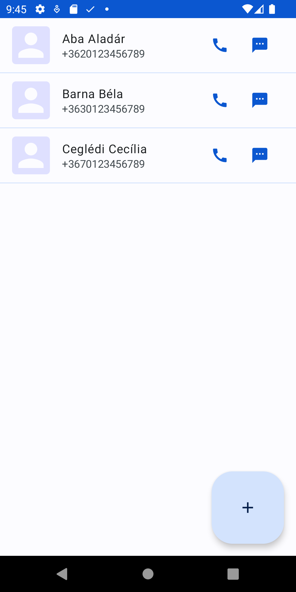
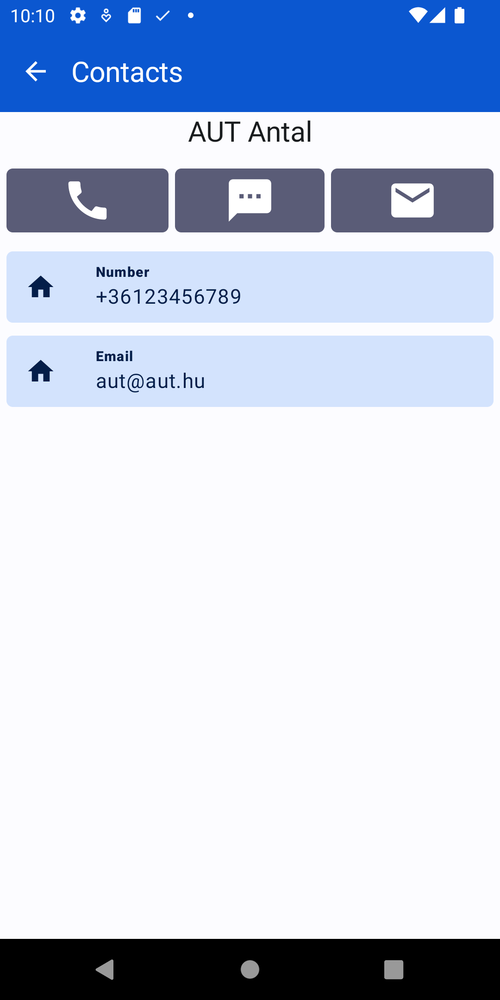
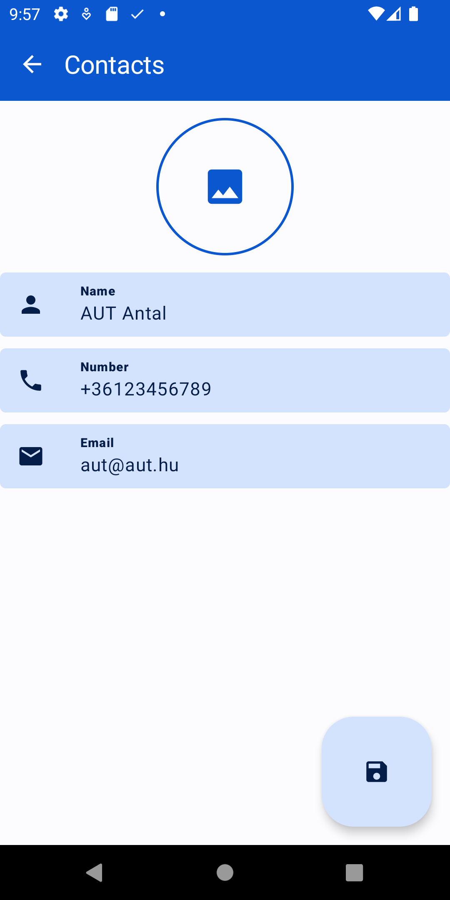

# Labor11 - Futásidejű engedélyek (Contacts)

A labor célja, hogy bemutassa, hogyan lehet a Compose keretrendszerben futásidejű engedélyeket kezelni.

<p float="left">



</p>


## Előkészületek

A feladatok megoldása során ne felejtsd el követni a [feladat beadás folyamatát](../../tudnivalok/github/GitHub.md).

### Git repository létrehozása és letöltése

1. Moodle-ben keresd meg a laborhoz tartozó meghívó URL-jét és annak segítségével hozd létre a saját repository-dat.

2. Várd meg, míg elkészül a repository, majd checkout-old ki.

    !!! tip ""
        Egyetemi laborokban, ha a checkout során nem kér a rendszer felhasználónevet és jelszót, és nem sikerül a checkout, akkor valószínűleg a gépen korábban megjegyzett felhasználónévvel próbálkozott a rendszer. Először töröld ki a mentett belépési adatokat (lásd [itt](../../tudnivalok/github/GitHub-credentials.md)), és próbáld újra.

3. Hozz létre egy új ágat `megoldas` néven, és ezen az ágon dolgozz.

4. A `neptun.txt` fájlba írd bele a Neptun kódodat. A fájlban semmi más ne szerepeljen, csak egyetlen sorban a Neptun kód 6 karaktere.

Ezután indítsuk el az Android Studio-t, majd:

1. Hozzunk létre egy új projektet, válasszuk az *Empty Activity* lehetőséget.
2. A projekt neve legyen `Contacts`, a kezdő package pedig `hu.bme.aut.android.contacts`.
3.  A projektet a repository-n belül egy külön mappában hozzuk létre. 
4. Nyelvnek válasszuk a *Kotlin*-t.
5. A minimum API szint legyen 24 (Android 7.0).

!!!danger "FILE PATH"
	A projekt a repository-ban lévő `Contacts` könyvtárba kerüljön, és beadásnál legyen is felpusholva! A kód nélkül nem tudunk maximális pontot adni a laborra!

Ellenőrízzük, hogy a létrejött projekt lefordul és helyesen működik!

### Verziók frissítése
Vegyük fel az alábbi függőségeket a modul szintű build.gradle fájlunkba, majd a laborvezetővel tekintsük át őket.

```kotlin
dependencies {
    // Compose Bill of Materials
    val composeBom = platform("androidx.compose:compose-bom:2023.10.01")
    implementation(composeBom)
    androidTestImplementation(composeBom)

    // Compose
    implementation("androidx.compose.material3:material3")
    implementation("androidx.compose.ui:ui")
    implementation("androidx.compose.ui:ui-tooling-preview")
    implementation("androidx.compose.material:material-icons-extended")

    // Compose testing
    androidTestImplementation("androidx.compose.ui:ui-test-junit4")
    debugImplementation("androidx.compose.ui:ui-test-manifest")
    debugImplementation("androidx.compose.ui:ui-tooling")

    // Core
    implementation("androidx.core:core-ktx:1.9.0")
    implementation("androidx.activity:activity-compose:1.8.1")

    // Lifecycle, Viewmodel
    val lifecycle_version = "2.6.2"
    implementation("androidx.lifecycle:lifecycle-runtime-compose:$lifecycle_version")
    implementation("androidx.lifecycle:lifecycle-viewmodel-compose:$lifecycle_version")

    // Navigation
    implementation("androidx.navigation:navigation-compose:2.7.5")

    // Permissions
    implementation("com.google.accompanist:accompanist-permissions:0.33.2-alpha")

    // Coil
    implementation("io.coil-kt:coil-compose:2.5.0")

    //Testing
    testImplementation("junit:junit:4.13.2")
    androidTestImplementation("androidx.test.ext:junit:1.1.5")
    androidTestImplementation("androidx.test.espresso:espresso-core:3.5.1")
}
```

Ezek mellett ellenőrizzük a kotlin plugin és a compose verzióját. A labor készítésekor a következőek voltak érvényben:

- _Projekt_ szintű `build.gradle`:
```gradle
plugins {  
  ...
  id 'org.jetbrains.kotlin.android' version '1.8.10' apply false  
}
```
- _Modul_ szintű `build.gradle`:
```gradle
android {
    ...
    composeOptions {
        kotlinCompilerExtensionVersion '1.4.3'
    }
}
```

A modul szintű `build.gradle` fájlban álllítsuk át a `compileSdk` értékét **34**-re!

Végül vegyük fel előre az alkalmazáshoz szükséges szöveges erőforrásokat:

`strings.xml`:
```xml
<resources>
    <string name="app_name">Contacts</string>
    <string name="button_label_request_permission">Grant permission</string>
    <string name="permission_grant_ask_beginning">"The"</string>
    <string name="permission_grant_ask_separator_before_last_permission">, and</string>
    <string name="permission_grant_ask_separator">,</string>
    <string name="permission_grant_ask_singular_permission">" permission is"</string>
    <string name="permission_grant_ask_multiple_permissions">" permissions are"</string>
    <string name="permission_grant_ask_rationale">" important. Please grant all of them for the app to function properly."</string>
    <string name="permission_grant_ask_denied">" denied. The app cannot function without them. Please grant all of them."</string>
    <string name="contact_data_label_name">Name</string>
    <string name="contact_data_label_phonenumber">Number</string>
    <string name="contact_data_label_email">Email</string>
    <string name="some_error_message">Error</string>
</resources>
```


## Kontaktok listája


Hozzunk létre egy új `domain` package-t létre a projektünk gyökerében, mely az alkalmazásunk adatrétegének részeit fogja tartalmazni, majd ezen belül hozzunk létre egy `model` package-et, mely az adatmodellek osztály megfelelőit fogja tartalmazni. Ebben hozzuk létre az alábbi fájlt:

`Contact.kt`:
```kotlin
import android.graphics.Bitmap

data class Contact(
    val id: String = "",
    val name: String = "",
    var phoneNumber: String = "",
    var emailAddress: String = "",
    var photo: Bitmap? = null
)
```

### Navigáció kialakítása

Az előző laborhoz hasonlóan alakítsuk ki a projektben a navigációnál használt osztályokat! 

Hozzunk létre a gyökérkönyvtárban létre egy új package-et `navigation` néven, majd hozzuk létre benne az útvonalakat reprezentáló `Screen` osztályt:
```kotlin
sealed class Screen(val route: String) {  

}
```
 Illetve hozzuk létre a navigációt végző `Composable` függvényt is a `NavGraph.kt` fájlban:
```kotlin
@Composable
fun NavGraph(
    navController: NavHostController = rememberNavController(),
) {
    NavHost(
        navController = navController,
        startDestination = ""
    ) {

    }
}
```

A `NavGraph` Composable szerepe, hogy karban tartsa az útvonalakat, itt fogjuk a navigációs eseményeket feldolgozni.

Végül frissítsük a `MainActivity` tartalmát úgy, hogy a `NavGraph` Composable-t használja:

```kotlin
class MainActivity : ComponentActivity() {
    override fun onCreate(savedInstanceState: Bundle?) {
        super.onCreate(savedInstanceState)
        setContent {
            ContactsTheme {
                NavGraph()
            }
        }
    }
}
```

### Use-casek

A névjegyek kezelését érintő műveletek use-casekbe fogjuk kiszervezni. Az első három use-case, amire szükségünk lesz:  
   - Névjegyek listázása  
   - Hívás indítása  
   - SMS küldése  

Utóbbi két funkcióra nem készítünk saját implementációt, hanem a készüléken elérhető alkalmazásokat fogjuk elindítani implicit intent segítségével.
A kontextuson végzett egyéni függvényhívásokat ezt követően fogjuk implementálni.

Vegyük fel az alábbi use-case-eket a `domain.usecase` package-be.

`LoadContactsUseCase.kt`:
```kotlin
class LoadContactsUseCase(
    private val context: Context
) {
    operator fun invoke(): Flow<ArrayList<Contact>> = context.getContacts()
}
```

`MakeACallUseCase.kt`:
```kotlin
class MakeACallUseCase(
    private val context: Context
) {
    operator fun invoke(phoneNumber: String) {
        val callIntent = Intent(Intent.ACTION_CALL).apply {
            data = Uri.parse("tel:$phoneNumber")
            flags = FLAG_ACTIVITY_NEW_TASK
        }
        context.startActivity(callIntent)
    }
}
```

`SendSMSUseCase.kt`:
```kotlin
class SendSMSUseCase(
    private val context: Context
) {
    operator fun invoke(phoneNumber: String) {
        val intent = Intent(Intent.ACTION_VIEW).apply {
            data = Uri.parse("sms:$phoneNumber")
            flags = Intent.FLAG_ACTIVITY_NEW_TASK
        }
        context.startActivity(intent)
    }
}
```

Röviden tekintsük át a use-case-eket a laborvezetővel.

### Névjegyműveletek

Hozzuk létre a  gyökérkönyvtárban a `data` package-et, majd benne a névjegyek kezelésével kapcsolatos műveleteket elvégző segédosztályt.
A műveletekben a ContentProvider által adott adatok eléréséhez a ContentResolvert és Cursort használunk.

`ContactsOperations.kt`:
```kotlin
object ContactsOperations {

    fun Context.getContacts(): Flow<ArrayList<Contact>> = flow {
        val contacts = ArrayList<Contact>()
        this@getContacts.contentResolver?.performQuery(
            uri = ContactsContract.Contacts.CONTENT_URI,
            sortOrder = ContactsContract.CommonDataKinds.Phone.DISPLAY_NAME + " ASC"
        ).use { cursor ->
            if (cursor != null && cursor.count > 0) {
                val idColumnIndex = cursor.getColumnIndex(ContactsContract.Contacts._ID)
                val nameColumnIndex = cursor.getColumnIndex(ContactsContract.Contacts.DISPLAY_NAME)
                while (cursor.moveToNext()) {
                    val contactId = cursor.getString(idColumnIndex)
                    val name = cursor.getString(nameColumnIndex)
                    if (name != null) {
                        contacts.add(Contact(contactId, name))
                    }
                }
            }
        }
        contacts.forEach {
            it.phoneNumber = getContactPhoneNumber(it.id)
            it.emailAddress = getContactEmail(it.id)
            it.photo = getContactPhoto(it.id)
        }
        emit(contacts)
    }.flowOn(Dispatchers.IO)

    private fun Context.getContactName(id: String): String {
        this.contentResolver?.performQuery(
            uri = ContactsContract.CommonDataKinds.Phone.CONTENT_URI,
            selection = "${ContactsContract.CommonDataKinds.Phone.CONTACT_ID} = ?",
            selectionArgs = arrayOf(id),
        ).use { cursor ->
            return if (cursor == null || !cursor.moveToNext()) {
                ""
            } else {
                val displayNameColumnIndex =
                    cursor.getColumnIndex(ContactsContract.CommonDataKinds.Phone.DISPLAY_NAME)
                cursor.getString(displayNameColumnIndex)
            }
        }
    }

    private fun Context.getContactPhoneNumber(id: String): String {
        this.contentResolver?.performQuery(
            uri = ContactsContract.CommonDataKinds.Phone.CONTENT_URI,
            selection = "${ContactsContract.CommonDataKinds.Phone.CONTACT_ID} = ?",
            selectionArgs = arrayOf(id),
        ).use { cursor ->
            return if (cursor == null || !cursor.moveToNext()) {
                ""
            } else {
                val phoneNumberColumnIndex =
                    cursor.getColumnIndex(ContactsContract.CommonDataKinds.Phone.NUMBER)
                cursor.getString(phoneNumberColumnIndex)
            }
        }
    }

    private fun Context.getContactEmail(id: String): String {
        this.contentResolver?.performQuery(
            uri = ContactsContract.CommonDataKinds.Email.CONTENT_URI,
            selection = "${ContactsContract.CommonDataKinds.Email.CONTACT_ID} = ?",
            selectionArgs = arrayOf(id),
        ).use { cursor ->
            return if (cursor == null || !cursor.moveToNext()) {
                ""
            } else {
                val emailColumnIndex =
                    cursor.getColumnIndex(ContactsContract.CommonDataKinds.Email.ADDRESS)
                cursor.getString(emailColumnIndex)
            }
        }
    }

    private fun Context.getContactPhoto(id: String): Bitmap? {
        var photo = BitmapFactory.decodeResource(this.resources, R.drawable.ic_launcher_foreground)
        ContactsContract.Contacts.openContactPhotoInputStream(
            this.contentResolver,
            ContentUris.withAppendedId(ContactsContract.Contacts.CONTENT_URI, id.toLong())
        ).use {
            if (it != null) {
                photo = BitmapFactory.decodeStream(it)
            }
        }
        return photo
    }

    private fun ContentResolver.performQuery(
        @RequiresPermission.Read uri: Uri,
        projection: Array<String>? = null,
        selection: String? = null,
        selectionArgs: Array<String>? = null,
        sortOrder: String? = null
    ): Cursor? {
        return query(uri, projection, selection, selectionArgs, sortOrder)
    }

}
```

## Engedélykezelés

### Háttér

Android 6.0 (API level 23, Marshmallow) verziótól kezdve a felhasználó futásidőben adhatja meg, vagy utasíthatja el az alkalmazás által kért engedélyeket, és nem az alkalmazás telepítésekor vagy frissítésekor. Dönthet úgy, hogy bizonyos engedélyeket nem ad meg egy alkalmazásnak, így nagyobb fokú irányítás kerül a kezébe. Az alkalmazásengedélyeket később bármikor módosíthatja a rendszerszintű alkalmazás beállításoknál.

Az engedélyek két kategóriába vannak sorolva: *normal* és *dangerous*.

A *normal* kategóriába tartozó engedélyek nem jelentenek közvetlen kockázatot a felhasználó személyes adataira, ezeket az engedélyeket a rendszer automatikusan megadja az alkalmazásnak, ha szüksége van rá.

A *dangerous* kategóriába tartozó engedélyek lehetőséget adhatnak az alkalmazásnak a felhasználó személyes adataihoz való hozzáféréshez. Ebben az esetben a felhasználónak kell megadni az engedélyt az alkalmazás számára. Ennek a közvetlen következménye az, hogy az alkalmazásokat fel kell készíteni arra az esetre, ha nincs megadva egy adott funkció működéséhez elengedhetetlen engedély.

[Ezen az oldalon](https://developer.android.com/guide/topics/permissions/overview#normal-dangerous)  található az összes engedély kategóriánként.

Az `AndroidManifest.xml` fájlban kategóriától függetlenül meg kell adni az alkalmazás számára szükséges összes engedélyt, de ennek hatása eltér a futtató rendszer verziójától és a target SDK verziótól függően:

* Ha az eszköz Android 5.1 (API level 22) vagy alacsonyabb verziót futtat, **VAGY** az alkalmazás target SDK szintje 22 vagy kisebb, akkor a rendszer telepítéskor kéri el az összes szükséges engedélyt. Ha a felhasználó nem fogadja el egyben az összes kérést, akkor a telepítési folyamat leáll.

* Ha az eszköz Android 6.0 (API level 23) vagy nagyobb verziót futtat **ÉS** az alkalmazás target SDK szintje 23 vagy nagyobb, akkor az alkalmazás a futása során fogja elkérni a *dangerous* kategóriába tartozó engedélyeket, a *normal* engedélyeket pedig a rendszer automatikusan megadja. Ebben az esetben a  felhasználó bármikor bármelyik engedélyt megadhatja, vagy visszavonhatja. Megtagadott engedélyekkel az alkalmazás limitált funkcionalitással futhat tovább, erre a helyzetre is fel kell készülni.

Megjegyzés: a Google Play 2018 augusztusától megköveteli a legalább 26-os target SDK verziót új alkalmazásokra, 2018 novemberétől pedig már meglévő alkalmazások frissítéseire is. Ezzel a legalább 6.0-s Androidot futtató eszközökön elkerülhetetlenné vált a futásidejű engedélyek kezelése.

Az engedélyek kezelésére most az [Accompanist](https://google.github.io/accompanist/permissions/) könyvtárat fogjuk most használni, mely a Jetpack Compose keretrenszerben támogatja az engedélyek könnyű kezelését.

### Engedélyek kezelése

Az alkalmazásunknak szüksége lesz engedélyekre a kapcsolatok eléréséhez, szerkesztéséhez, valamint hívás indításához, ezeket vegyük fel a 
`manifest` fájlba az `application` tagen kívülre:
```xml
    <uses-permission android:name="android.permission.READ_CONTACTS"/>
    <uses-permission android:name="android.permission.WRITE_CONTACTS"/>
    <uses-permission android:name="android.permission.CALL_PHONE"/>
```

Az engedélykezelés fontosabb elemei:  
 - A `rememberPermissionState` API által tudunk a felhasználótól egy engedélyre rákérdezni, és az engedély státuszát ellenőrizni.  
 - Egyes esetekben szükség lehet arra, hogy tájékoztassuk a felhasználót arról, hogy miért kér az alkalmazás bizonyos *dangerous* engedélyeket. Ez növelheti a felhasználó bizalmát az alkalmazással szemben.  
 - Ha egy jogosultságot a felhasználó egyszer elutasított, a `shouldShowRationale` változó értéke alapján eldönthető, hogy a kérdéses engedély újra elkérése a rendszer szerint szorul-e részletes magyarázatra. 

Hozzuk létre a gyökér könyvtárban az `util` package-t, majd benne az alábbi, engedélykezelések kiszolgáló segédosztályt.

`PermissionsUtil.kt`:
```kotlin
object PermissionsUtil {
    @ExperimentalPermissionsApi
    fun getTextToShowGivenPermissions(
        permissions: List<PermissionState>,
        shouldShowRationale: Boolean,
        context: Context
    ): String {
        val revokedPermissionsSize = permissions.size
        if (revokedPermissionsSize == 0) return ""
        val textToShow = StringBuilder()

        with(context) {
            textToShow.apply {
                append(getString(R.string.permission_grant_ask_beginning))
            }

            for (i in permissions.indices) {
                val permission = permissions[i].permission
                    .replace(Regex("[a-z]|[.]"), "")
                textToShow.append(" $permission")
                when {
                    revokedPermissionsSize > 1 && i == revokedPermissionsSize - 2 -> {
                        textToShow.append(getString(R.string.permission_grant_ask_separator_before_last_permission))
                    }
                    else -> {
                        textToShow.append(getString(R.string.permission_grant_ask_separator))
                    }
                }
            }
            textToShow.append(
                if (revokedPermissionsSize == 1) {
                    getString(R.string.permission_grant_ask_singular_permission)
                } else getString(R.string.permission_grant_ask_multiple_permissions)
            )
            textToShow.append(
                if (shouldShowRationale) {
                    getString(R.string.permission_grant_ask_rationale)
                } else {
                    getString(R.string.permission_grant_ask_denied)
                }
            )
        }

        return textToShow.toString()
    }
}
```

### Lista felület és logika

Hozzunk létre a gyökérkönyvtáron belül a `feature` package-et, mely az egyes oldalak `Composable` és `ViewModel` osztályait fogja tartalmazni külön packagenként, majd hozzuk létre ebben a `contact_list` package-t.

Először foglalkozzunk az oldalhoz tartozó `ViewModel` osztállyal. Hozzuk létre a `ContactsListViewModel.kt` fájlt, majd másoljuk be az alábbi kódrészletet:

`ContactsViewModel.kt`:
```kotlin
class ContactsViewModel(
    private val loadContactsUseCase: LoadContactsUseCase,
    private val makeCall: MakeACallUseCase,
    private val sendSMS: SendSMSUseCase,
) : ViewModel() {

    private val _state = MutableStateFlow(ContactsState())
    val state = _state.asStateFlow()

    fun onEvent(event: ContactsEvent) {
        when(event) {
            is ContactsEvent.MakeCall -> {
                val phoneNumber = event.phoneNumber
                viewModelScope.launch {
                    makeCall(phoneNumber)
                }
            }
            is ContactsEvent.SendSms -> {
                val phoneNumber = event.phoneNumber
                viewModelScope.launch {
                    sendSMS(phoneNumber)
                }
            }
        }
    }

    fun loadContacts() {
        viewModelScope.launch(Dispatchers.IO) {
            _state.update { it.copy(isLoading = true) }
            loadContactsUseCase().catch { e ->
                _state.update { it.copy(
                    isLoading = false,
                    error = e
                ) }
            }.collect { contacts ->
                _state.update { it.copy(
                    isLoading = false,
                    contacts = contacts
                ) }
            }
        }
    }

    companion object {
        val Factory: ViewModelProvider.Factory = viewModelFactory {
            initializer {
                val context = (this[APPLICATION_KEY] as Application).baseContext
                ContactsViewModel(
                    loadContactsUseCase = LoadContactsUseCase(context),
                    makeCall = MakeACallUseCase(context),
                    sendSMS = SendSMSUseCase(context)
                )
            }
        }
    }

}

data class ContactsState(
    val isLoading: Boolean = false,
    val error: Throwable? = null,
    val isError: Boolean = error != null,
    val contacts: List<Contact> = emptyList()
)

sealed class ContactsEvent {
    data class MakeCall(val phoneNumber: String): ContactsEvent()
    data class SendSms(val phoneNumber: String): ContactsEvent()
}
```
Az előző laborhoz hasonlóan a felületet leíró állapot osztályt `sealed class`-ként deklaráljuk, és jól elkülönített állapot osztályokat veszünk fel, így is jelezve, hogy az egyes állapotokban az oldalunkon mit kell megjeleníteni. Ezeket egy `MutableStateFlow` segítségével kezeljük, melyet egy csak olvasható változatában osztunk meg az oldalt reprezentáló `Composable`-el. 

Mivel a `ViewModel` képes túlélni az őt létrehozó komponenst, ezért a kódból mi nem a konstruktor hívásával fogjuk létrehozni a példányt, hanem a keretrendszernek tudunk átadni egy speciális _factory_ metódust, amit a rendszer az első alkalommal meg fog hívni. Ezt a metódust szerveztük ki a `companion object` részbe, ami jelenleg csak létrehoz egy példányt, a későbbiekben azonban hasznos lesz különböző külső értékek inicializálására.

Külön osztályokat hozunk létre a névjegyeken végzett események rendszerezésére, illetve az állapot tárolására.

A képek és szövegek kezeléséhez hozzuk létre az alábbi segédosztályokat a `ui.model` package-ben:

`UiIcon.kt`:
```kotlin
import androidx.annotation.DrawableRes
import androidx.annotation.StringRes
import androidx.compose.material3.Icon
import androidx.compose.material3.LocalContentColor
import androidx.compose.runtime.Composable
import androidx.compose.ui.Modifier
import androidx.compose.ui.graphics.Color
import androidx.compose.ui.graphics.vector.ImageVector
import androidx.compose.ui.res.painterResource
import androidx.compose.ui.res.stringResource

sealed class UiIcon {
    @Composable
    fun AsImage(
        modifier: Modifier = Modifier,
        tint: Color = LocalContentColor.current,
        @StringRes contentDescriptionResId: Int? = null,
    ) {
        when (this) {
            is ImageRes -> {
                Icon(
                    painter = painterResource(id = drawableResId),
                    tint = tint,
                    modifier = modifier,
                    contentDescription = if (contentDescriptionResId == null) {
                        null
                    } else stringResource(id = contentDescriptionResId)
                )
            }
            is VectorImage -> {
                Icon(
                    imageVector = imageVector,
                    tint = tint,
                    modifier = modifier,
                    contentDescription = if (contentDescriptionResId == null) {
                        null
                    } else stringResource(id = contentDescriptionResId)
                )
            }
        }
    }
}

data class ImageRes(@DrawableRes val drawableResId: Int): UiIcon()

data class VectorImage(val imageVector: ImageVector): UiIcon()
```

`UiText.kt`:
```kotlin
import android.content.Context
import androidx.annotation.StringRes
import androidx.compose.material3.LocalTextStyle
import androidx.compose.material3.Text
import androidx.compose.runtime.Composable
import androidx.compose.ui.Modifier
import androidx.compose.ui.graphics.Color
import androidx.compose.ui.res.stringResource
import androidx.compose.ui.text.TextLayoutResult
import androidx.compose.ui.text.TextStyle
import androidx.compose.ui.text.font.FontFamily
import androidx.compose.ui.text.font.FontStyle
import androidx.compose.ui.text.font.FontWeight
import androidx.compose.ui.text.style.TextAlign
import androidx.compose.ui.text.style.TextDecoration
import androidx.compose.ui.text.style.TextOverflow
import androidx.compose.ui.unit.TextUnit
import hu.bme.aut.android.contacts.R

sealed class UiText {

    data class DynamicString(val text: String) : UiText()

    data class StringResource(
        @StringRes val id: Int,
        val formatArgs: ArrayList<Any> = arrayListOf()
    ) : UiText()

    @Composable
    fun AsText(
        modifier: Modifier = Modifier,
        color: Color = Color.Unspecified,
        fontSize: TextUnit = TextUnit.Unspecified,
        fontStyle: FontStyle? = null,
        fontWeight: FontWeight? = null,
        fontFamily: FontFamily? = null,
        letterSpacing: TextUnit = TextUnit.Unspecified,
        textDecoration: TextDecoration? = null,
        textAlign: TextAlign? = null,
        lineHeight: TextUnit = TextUnit.Unspecified,
        overflow: TextOverflow = TextOverflow.Clip,
        softWrap: Boolean = true,
        maxLines: Int = Int.MAX_VALUE,
        onTextLayout: (TextLayoutResult) -> Unit = {},
        style: TextStyle = LocalTextStyle.current
    ) {
        Text(
            text = when(this) {
                is DynamicString -> {
                    text
                }
                is StringResource -> {
                    stringResource(id = id, formatArgs)
                }
            },
            modifier = modifier,
            color = color,
            fontSize = fontSize,
            fontStyle = fontStyle,
            fontWeight = fontWeight,
            fontFamily = fontFamily,
            letterSpacing = letterSpacing,
            textDecoration = textDecoration,
            textAlign = textAlign,
            lineHeight = lineHeight,
            overflow = overflow,
            softWrap = softWrap,
            maxLines = maxLines,
            onTextLayout = onTextLayout,
            style = style
        )
    }

    fun asString(context: Context): String {
        return when(this) {
            is DynamicString -> {
                text
            }
            is StringResource -> {
                context.getString(id,formatArgs)
            }
        }
    }

}


fun Throwable?.toUiText(): UiText {
    val message: String = this?.message.orEmpty()
    return if (message.isBlank()) {
        UiText.StringResource(R.string.some_error_message)
    } else {
        UiText.DynamicString(message)
    }
}
```

A `ui.common` packagebe hozzuk létre az alábbi, listaelemeket reprezántáló fájlt, és tekintsük át az elrendezését:

`ContactListItem.kt`:
```kotlin
import androidx.compose.foundation.Image
import androidx.compose.foundation.background
import androidx.compose.foundation.layout.Row
import androidx.compose.foundation.layout.Spacer
import androidx.compose.foundation.layout.size
import androidx.compose.foundation.layout.width
import androidx.compose.foundation.shape.RoundedCornerShape
import androidx.compose.material.icons.Icons
import androidx.compose.material.icons.filled.Call
import androidx.compose.material.icons.filled.Person
import androidx.compose.material.icons.filled.Sms
import androidx.compose.material3.Divider
import androidx.compose.material3.ExperimentalMaterial3Api
import androidx.compose.material3.Icon
import androidx.compose.material3.IconButton
import androidx.compose.material3.ListItem
import androidx.compose.material3.MaterialTheme
import androidx.compose.material3.Text
import androidx.compose.runtime.Composable
import androidx.compose.ui.Modifier
import androidx.compose.ui.draw.clip
import androidx.compose.ui.graphics.asImageBitmap
import androidx.compose.ui.layout.ContentScale
import androidx.compose.ui.unit.dp
import hu.bme.aut.android.contacts.domain.model.Contact
import hu.bme.aut.android.contacts.ui.model.VectorImage

@ExperimentalMaterial3Api
@Composable
fun ContactListItem(
    contact: Contact,
    modifier: Modifier = Modifier,
    onMakeCall: (String) -> Unit,
    onSendSms: (String) -> Unit
) {
    ListItem(
        headlineContent = { Text(text = contact.name) },
        supportingContent = { Text(text = contact.phoneNumber) },
        leadingContent = {
            if (contact.photo != null) {
                Image(
                    bitmap = contact.photo!!.asImageBitmap(),
                    contentDescription = null,
                    modifier = Modifier
                        .size(50.dp)
                        .clip(RoundedCornerShape(5.dp)),
                    contentScale = ContentScale.Crop
                )
            } else {
                Icon(
                    imageVector = Icons.Default.Person,
                    contentDescription = null,
                    modifier = Modifier
                        .size(50.dp)
                        .clip(RoundedCornerShape(5.dp))
                        .background(MaterialTheme.colorScheme.secondaryContainer),
                    tint = MaterialTheme.colorScheme.background
                )
            }
        },
        trailingContent = {
            Row {
                IconButton(onClick = { onMakeCall(contact.phoneNumber) }) {
                    VectorImage(Icons.Default.Call)
                        .AsImage(tint = MaterialTheme.colorScheme.primary)
                }
                Spacer(modifier = Modifier.width(5.dp))
                IconButton(onClick = { onSendSms(contact.phoneNumber) }) {
                    VectorImage(Icons.Default.Sms)
                        .AsImage(tint = MaterialTheme.colorScheme.primary)
                }
            }
        },
        modifier = modifier
    )
    Divider(color = MaterialTheme.colorScheme.primaryContainer)
}
```

Ezt követően létrehozhatjuk a képernyőnkhöz tartozó elrendezést a `feature.contact_list` package-ben.
Itt megfigyelhető a korábban említett `rememberMultiplePermissionsState` használata, illetve az engedélyek meglétének ellenőrzése.
Az engedélyek elkérése egy AlertDialog segítségével történik.

`ContactsScreen.kt`:
```kotlin
import androidx.compose.foundation.clickable
import androidx.compose.foundation.layout.Box
import androidx.compose.foundation.layout.fillMaxSize
import androidx.compose.foundation.layout.padding
import androidx.compose.foundation.lazy.LazyColumn
import androidx.compose.material.icons.Icons
import androidx.compose.material.icons.filled.Add
import androidx.compose.material3.AlertDialog
import androidx.compose.material3.Button
import androidx.compose.material3.CircularProgressIndicator
import androidx.compose.material3.ExperimentalMaterial3Api
import androidx.compose.material3.LargeFloatingActionButton
import androidx.compose.material3.MaterialTheme
import androidx.compose.material3.Scaffold
import androidx.compose.material3.Text
import androidx.compose.runtime.Composable
import androidx.compose.runtime.LaunchedEffect
import androidx.compose.runtime.getValue
import androidx.compose.ui.Alignment
import androidx.compose.ui.Modifier
import androidx.compose.ui.platform.LocalContext
import androidx.compose.ui.platform.LocalLifecycleOwner
import androidx.compose.ui.res.stringResource
import androidx.lifecycle.compose.collectAsStateWithLifecycle
import androidx.lifecycle.viewmodel.compose.viewModel
import com.google.accompanist.permissions.ExperimentalPermissionsApi
import com.google.accompanist.permissions.rememberMultiplePermissionsState
import hu.bme.aut.android.contacts.R
import hu.bme.aut.android.contacts.ui.common.ContactListItem
import hu.bme.aut.android.contacts.ui.model.VectorImage
import hu.bme.aut.android.contacts.ui.model.toUiText
import hu.bme.aut.android.contacts.util.PermissionsUtil.getTextToShowGivenPermissions
import androidx.compose.foundation.lazy.items

@ExperimentalPermissionsApi
@ExperimentalMaterial3Api
@Composable
fun ContactsScreen(
    modifier: Modifier = Modifier,
    viewModel: ContactsViewModel = viewModel(factory = ContactsViewModel.Factory),
    onListItemClick: (String) -> Unit,
    onFabClick: () -> Unit
) {
    val context = LocalContext.current
    val lifecycle = LocalLifecycleOwner.current.lifecycle

    val contactsPermissions = rememberMultiplePermissionsState(
        permissions = listOf(
            android.Manifest.permission.READ_CONTACTS,
            android.Manifest.permission.WRITE_CONTACTS,
            android.Manifest.permission.CALL_PHONE
        )
    )

    if (contactsPermissions.allPermissionsGranted) {

        LaunchedEffect(key1 = contactsPermissions.allPermissionsGranted) {
            viewModel.loadContacts()
        }

        val state by viewModel.state.collectAsStateWithLifecycle()

        Scaffold(
            modifier = modifier,
            floatingActionButton = {
                LargeFloatingActionButton(onClick = onFabClick) {
                    VectorImage(Icons.Default.Add).AsImage()
                }
            }
        ) { padding ->
            Box(
                modifier = Modifier
                    .fillMaxSize()
                    .padding(padding),
                contentAlignment = Alignment.Center
            ) {
                if (state.isLoading) {
                    CircularProgressIndicator(color = MaterialTheme.colorScheme.primary)
                } else if (state.isError) {
                    Text(text = state.error.toUiText().asString(context))
                } else {
                    LazyColumn(
                        modifier = Modifier
                            .fillMaxSize()
                    ) {
                        items(state.contacts) { contact ->
                            ContactListItem(
                                contact = contact,
                                modifier = Modifier.clickable {
                                    onListItemClick(contact.id)
                                },
                                onMakeCall = { viewModel.onEvent(ContactsEvent.MakeCall(it)) },
                                onSendSms = { viewModel.onEvent(ContactsEvent.SendSms(it)) }
                            )
                        }
                    }
                }
            }
        }

    } else {
        AlertDialog(
            onDismissRequest = { },
            confirmButton = {
                Button(onClick = { contactsPermissions.launchMultiplePermissionRequest() }) {
                    Text(stringResource(id = R.string.button_label_request_permission))
                }
            },
            text = {
                Text(
                    getTextToShowGivenPermissions(
                        contactsPermissions.revokedPermissions,
                        contactsPermissions.shouldShowRationale,
                        context
                    )
                )
            }
        )
    }
}
```
Ezt követően frissíthetjük a `Screen` osztályunk az új útvonallal:

```kotlin
object Contacts: Screen(route = "contacts")
```

Illetve kiegészíthetjük a `NavGraph` osztályt is a listanézetünkkel:

```kotlin
@OptIn(ExperimentalPermissionsApi::class, ExperimentalMaterial3Api::class)
@Composable
fun NavGraph(
    navController: NavHostController = rememberNavController(),
) {
    NavHost(
        navController = navController,
        startDestination = Screen.Contacts.route
    ) {
        composable(route = Screen.Contacts.route) {
            ContactsScreen(
                onListItemClick = {
                    //TODO
                },
                onFabClick = {
                    //TODO
                }
            )
        }
    }
}
```

Ha hibát dob az Android Studio, adjuk hozzá a hiányzó annotációkat.

### VCF file importálása

A következő lépéseket csak emulátoron szükséges elvégezni, ha nem állnak rendelkezésre névjegyek:  
 - Töltsük le a repository-ban elérhető .vcf fájlt: [névjegyek](./assets/contacts.vcf).  
 - A `Device Explorer` tool használatával másoljuk be a letöltött fájlt az `sdcard/Download` könyvtárba.  
 - Nyissuk meg az emulátor gyári `Névjegyek` alkalmazását, és importáljuk a vcf fájlt.  

!!!example "BEADANDÓ (1 pont)" 
	Készíts egy **képernyőképet**, amelyen látszik a **lista nézet névjegyekkel** (emulátoron, készüléket tükrözve vagy képernyőfelvétellel), az **ahhoz tartozó kódrészlet**, valamint a **neptun kódod a kódban valahol kommentként**. 

	A képet a megoldásban a repository-ba f1.png néven töltsd föl.

	A képernyőkép szükséges feltétele a pontszám megszerzésének.

!!!example "BEADANDÓ (1 pont)" 
	Készíts egy **képernyőképet**, amelyen látszik a **folyamatban levő hívás** (emulátoron, készüléket tükrözve vagy képernyőfelvétellel), az **ahhoz tartozó kódrészlet**, valamint a **neptun kódod a kódban valahol kommentként**. 

	A képet a megoldásban a repository-ba f2.png néven töltsd föl.

	A képernyőkép szükséges feltétele a pontszám megszerzésének.

!!!example "BEADANDÓ (1 pont)" 
	Készíts egy **képernyőképet**, amelyen látszik a **megnyitott SMS képernyő** (emulátoron, készüléket tükrözve vagy képernyőfelvétellel), az **ahhoz tartozó kódrészlet**, valamint a **neptun kódod a kódban valahol kommentként**. 

	A képet a megoldásban a repository-ba f3.png néven töltsd föl.

	A képernyőkép szükséges feltétele a pontszám megszerzésének.

## Önálló feladatok

### Kontaktok hozzáadása

Vegyünk fel egy új use-case-t a névjegyek mentésére:

`SaveContactUseCase.kt`:
```kotlin
class SaveContactUseCase (
    private val context: Context
) {
    operator fun invoke(
        name: String,
        phoneNumber: String,
        emailAddress: String,
        photoUri: Uri?
    ) {
        context.addNewContact(name, phoneNumber, emailAddress, photoUri)
    }
}
```

Egészítsük ki a `ContactOperations` osztályunkat az alábbi, hozzáadáshoz szükséges függvényekkel:

```kotlin
fun Context.addNewContact(
        name: String,
        phoneNumber: String,
        emailAddress: String,
        photoUri: Uri?
    ) {
        val id = 0
        val contentProviderOperations = arrayListOf<ContentProviderOperation>()
        contentProviderOperations.add(
            ContentProviderOperation.newInsert(ContactsContract.RawContacts.CONTENT_URI)
                .withValue(ContactsContract.RawContacts.ACCOUNT_TYPE, null)
                .withValue(ContactsContract.RawContacts.ACCOUNT_NAME, null)
                .build()
        )

        contentProviderOperations.add(
            ContentProviderOperation.newInsert(ContactsContract.Data.CONTENT_URI)
                .withValueBackReference(ContactsContract.RawContacts.Data.RAW_CONTACT_ID,id)
                .withValue(ContactsContract.RawContacts.Data.MIMETYPE,ContactsContract.CommonDataKinds.StructuredName.CONTENT_ITEM_TYPE)
                .withValue(ContactsContract.CommonDataKinds.StructuredName.DISPLAY_NAME, name)
                .build()
        )

        contentProviderOperations.add(
            ContentProviderOperation.newInsert(ContactsContract.Data.CONTENT_URI)
                .withValueBackReference(ContactsContract.RawContacts.Data.RAW_CONTACT_ID,id)
                .withValue(ContactsContract.RawContacts.Data.MIMETYPE,ContactsContract.CommonDataKinds.Phone.CONTENT_ITEM_TYPE)
                .withValue(ContactsContract.CommonDataKinds.Phone.NUMBER, phoneNumber)
                .withValue(ContactsContract.CommonDataKinds.Phone.TYPE, ContactsContract.CommonDataKinds.Phone.TYPE_MAIN)
                .build()
        )

        contentProviderOperations.add(
            ContentProviderOperation.newInsert(ContactsContract.Data.CONTENT_URI)
                .withValueBackReference(ContactsContract.RawContacts.Data.RAW_CONTACT_ID,id)
                .withValue(ContactsContract.RawContacts.Data.MIMETYPE,ContactsContract.CommonDataKinds.Email.CONTENT_ITEM_TYPE)
                .withValue(ContactsContract.CommonDataKinds.Email.ADDRESS, emailAddress)
                .withValue(ContactsContract.CommonDataKinds.Email.TYPE, ContactsContract.CommonDataKinds.Email.TYPE_OTHER)
                .build()
        )

        if (photoUri != null) {
            val photo = if (Build.VERSION.SDK_INT < 28) {
                MediaStore.Images.Media.getBitmap(contentResolver, photoUri)
            } else {
                val source = ImageDecoder.createSource(contentResolver, photoUri)
                ImageDecoder.decodeBitmap(source)
            }

            contentProviderOperations.add(
                ContentProviderOperation.newInsert(ContactsContract.Data.CONTENT_URI)
                    .withValueBackReference(ContactsContract.RawContacts.Data.RAW_CONTACT_ID,id)
                    .withValue(ContactsContract.RawContacts.Data.MIMETYPE,ContactsContract.CommonDataKinds.Photo.CONTENT_ITEM_TYPE)
                    .withValue(ContactsContract.CommonDataKinds.Photo.PHOTO, bitmapToByteArray(photo))
                    .build()
            )
        }

        contentResolver.applyBatch(ContactsContract.AUTHORITY, contentProviderOperations)
    }


    private fun bitmapToByteArray(bitmap: Bitmap): ByteArray {
        val stream = ByteArrayOutputStream()
        bitmap.compress(Bitmap.CompressFormat.PNG, 90, stream)
        return stream.toByteArray()
    }
```

Hozzuk létre a `ui.common` package-ben az alábbi osztályt az adataink újrafelhasználható módon történő megjelenítéséhez:

`ContactDataItem.kt`:
```kotlin
@ExperimentalMaterial3Api
@ExperimentalFoundationApi
@Composable
fun ContactDataItem(
    modifier: Modifier = Modifier,
    enabled: Boolean = false,
    leadingIcon: UiIcon,
    label: UiText,
    value: String,
    onValueChange: (String) -> Unit
) {
    Surface(
        modifier = modifier
            .fillMaxWidth()
            .padding(bottom = 10.dp),
        color = MaterialTheme.colorScheme.primaryContainer,
        shape = RoundedCornerShape(5.dp)
    ) {
        Row(
            modifier = Modifier
                .fillMaxWidth()
                .height(IntrinsicSize.Min),
            verticalAlignment = Alignment.CenterVertically,
            horizontalArrangement = Arrangement.Start
        ) {
            leadingIcon.AsImage(modifier = Modifier.padding(15.dp))
            Column(
                modifier = Modifier
                    .height(IntrinsicSize.Min)
                    .fillMaxWidth()
                    .padding(end = 15.dp)
            ) {
                TextField(
                    value = value,
                    label = {
                        label.AsText(
                            style = MaterialTheme.typography.labelSmall,
                            fontWeight = FontWeight.Black,
                            maxLines = 1
                        )
                    },
                    onValueChange = onValueChange,
                    singleLine = true,
                    shape = RectangleShape,
                    colors = TextFieldDefaults.textFieldColors(
                        focusedTextColor = MaterialTheme.colorScheme.onPrimaryContainer,
                        disabledTextColor = MaterialTheme.colorScheme.onPrimaryContainer,
                        containerColor = Color.Transparent,
                        focusedLabelColor = MaterialTheme.colorScheme.onPrimaryContainer,
                        unfocusedLabelColor = MaterialTheme.colorScheme.onPrimaryContainer,
                        disabledLabelColor = MaterialTheme.colorScheme.onPrimaryContainer,
                        focusedIndicatorColor = Color.Transparent,
                        unfocusedIndicatorColor = Color.Transparent,
                        disabledIndicatorColor = Color.Transparent,
                        errorIndicatorColor = Color.Transparent,
                    ),
                    enabled = enabled,
                    modifier = Modifier.fillMaxWidth()
                )
            }
        }
    }
}

@Preview(showBackground = true)
@ExperimentalMaterial3Api
@ExperimentalFoundationApi
@Composable
fun ContactDataItem_Preview() {
    var value by remember {
        mutableStateOf("data value")
    }
    ContactDataItem(
        enabled = true,
        leadingIcon = VectorImage(Icons.Default.Warning),
        label = UiText.DynamicString("data name"),
        value = value,
        onValueChange = { value = it }
    )
}
```

A `feature.contact_add` package-ben hozzuk létre a hozzá tartozó ViewModel osztályt:

`AddNewContactViewModel.kt`:
```kotlin
class AddNewContactViewModel(
    private val saveContact: SaveContactUseCase
) : ViewModel() {

    private val _state = MutableStateFlow(AddNewContactState())
    val state = _state.asStateFlow()

    fun onEvent(event: AddNewContactEvent) {
        when(event) {
            is AddNewContactEvent.ChangeContactName -> {
                _state.update { it.copy(contactName = event.newValue) }
            }
            is AddNewContactEvent.ChangeContactNumber -> {
                _state.update { it.copy(contactNumber = event.newValue) }
            }
            is AddNewContactEvent.ChangeContactEmail -> {
                _state.update { it.copy(contactEmail = event.newValue) }
            }
            is AddNewContactEvent.ChangeContactPhoto -> {
                _state.update { it.copy(contactPhoto = event.newValue) }
            }
        }
    }

    fun addContact() {
        viewModelScope.launch(Dispatchers.IO) {
            saveContact(
                state.value.contactName,
                state.value.contactNumber,
                state.value.contactEmail,
                state.value.contactPhoto
            )
        }
    }

    companion object {
        val Factory: ViewModelProvider.Factory = viewModelFactory {
            initializer {
                val context = (this[ViewModelProvider.AndroidViewModelFactory.APPLICATION_KEY] as Application).baseContext
                AddNewContactViewModel(saveContact = SaveContactUseCase(context))
            }
        }
    }
}

data class AddNewContactState(
    val contactName: String = "",
    val contactNumber: String = "",
    val contactEmail: String = "",
    val contactPhoto: Uri? = null
)

sealed class AddNewContactEvent {
    data class ChangeContactName(val newValue: String): AddNewContactEvent()
    data class ChangeContactNumber(val newValue: String): AddNewContactEvent()
    data class ChangeContactEmail(val newValue: String): AddNewContactEvent()

    data class ChangeContactPhoto(val newValue: Uri): AddNewContactEvent()
}
```

Ezt követően a felületet is elkészíthetjük:

`AddNewContactScreen.kt`:
```kotlin
@ExperimentalFoundationApi
@ExperimentalMaterial3Api
@Composable
fun AddNewContactScreen(
    modifier: Modifier = Modifier,
    onNavigateBack: () -> Unit,
    viewModel: AddNewContactViewModel = viewModel(factory = AddNewContactViewModel.Factory)
) {
    val state by viewModel.state.collectAsStateWithLifecycle()

    Scaffold(
        modifier = modifier.fillMaxSize(),
        topBar = {
            TopAppBar(
                title = {
                    Text(text = "Contacts")
                },
                navigationIcon = {
                    IconButton(onClick = onNavigateBack) {
                        VectorImage(Icons.Default.ArrowBack).AsImage()
                    }
                },
                colors = TopAppBarDefaults.smallTopAppBarColors(
                    containerColor = MaterialTheme.colorScheme.primary,
                    navigationIconContentColor = MaterialTheme.colorScheme.onPrimary,
                    actionIconContentColor = MaterialTheme.colorScheme.onPrimary,
                    titleContentColor = MaterialTheme.colorScheme.onPrimary
                )
            )
        },
        floatingActionButton = {
            LargeFloatingActionButton(
                onClick = {
                    viewModel.addContact()
                    onNavigateBack()
                }
            ) {
                Icon(
                    imageVector = Icons.Default.Save,
                    contentDescription = null
                )
            }
        }
    ) { padding ->
        Column(
            modifier = Modifier
                .fillMaxSize()
                .padding(padding),
            horizontalAlignment = Alignment.CenterHorizontally
        ) {
           PhotoPicker(
               addImageUri = {
                    viewModel.onEvent(AddNewContactEvent.ChangeContactPhoto(it))
                },
                imageUri = state.contactPhoto
           )

            ContactDataItem(
                enabled = true,
                leadingIcon = VectorImage(Icons.Default.Person),
                label = UiText.StringResource(R.string.contact_data_label_name),
                value = state.contactName,
                onValueChange = { viewModel.onEvent(AddNewContactEvent.ChangeContactName(it)) }
            )

            ContactDataItem(
                enabled = true,
                leadingIcon = VectorImage(Icons.Default.Phone),
                label = UiText.StringResource(R.string.contact_data_label_phonenumber),
                value = state.contactNumber,
                onValueChange = { viewModel.onEvent(AddNewContactEvent.ChangeContactNumber(it)) }
            )

            ContactDataItem(
                enabled = true,
                leadingIcon = VectorImage(Icons.Default.Email),
                label = UiText.StringResource(R.string.contact_data_label_email),
                value = state.contactEmail,
                onValueChange = { viewModel.onEvent(AddNewContactEvent.ChangeContactEmail(it)) }
            )
        }
    }

}

@Composable
fun PhotoPicker(
    addImageUri: (Uri) -> Unit,
    imageUri: Uri?
) {
    val photoPicker = rememberLauncherForActivityResult(
        contract = ActivityResultContracts.PickVisualMedia()
    ) {
        if (it != null) {
            addImageUri(it)
        }
    }

    Box(
        contentAlignment = Alignment.Center,
        modifier = Modifier
            .padding(15.dp)
            .size(120.dp)
            .border(
                border = BorderStroke(2.dp, MaterialTheme.colorScheme.primary),
                shape = RoundedCornerShape(100.dp)
            )
            .clip(shape = RoundedCornerShape(100.dp))
    ) {
        Icon(
            imageVector = Icons.Default.Image,
            contentDescription = null,
            tint = MaterialTheme.colorScheme.primary,
            modifier = Modifier.size(40.dp)
        )
        AsyncImage(
            modifier = Modifier
                .size(120.dp)
                .clip(shape = RoundedCornerShape(100.dp))
                .clickable {
                    photoPicker.launch(
                        PickVisualMediaRequest(
                            ActivityResultContracts.PickVisualMedia.ImageOnly
                        )
                    )
                },
            model = ImageRequest.Builder(LocalContext.current)
                .data(imageUri)
                .crossfade(enable = true)
                .build(),
            contentDescription = null,
            contentScale = ContentScale.Crop,
        )
    }

}
```
<!--
A `ui.util` package-ben hozzuk létre a `UiEvent` osztályt a felületi események kezelésére:

`UiEvent.kt`:
```kotlin
sealed class UiEvent {
    object Success: UiEvent()
    data class Failure(val message: UiText): UiEvent()
}
```
-->

Egészítsük ki a `Screen` osztályunkat az újabb útvonallal:

```kotlin
object AddContact: Screen(route = "add_contact")
```

A `Navgraph`-ban kezeljük a FAB-unk érintését, és vegyük fel az új képernyőt:

```kotlin
onFabClick = {
                    navController.navigate(Screen.AddContact.route)
                }
```

```kotlin
composable(route = Screen.AddContact.route) {
            AddNewContactScreen(
                onNavigateBack = {
                    navController.popBackStack(route = Screen.Contacts.route, inclusive = false)
                }
            )
        }
```

!!!example "BEADANDÓ (1 pont)" 
	Készíts egy **képernyőképet**, amelyen látszik a **saját neveddel kitöltött hozzáadási képernyő** (emulátoron, készüléket tükrözve vagy képernyőfelvétellel), az **ahhoz tartozó kódrészlet**. 

	A képet a megoldásban a repository-ba f4.png néven töltsd föl.

	A képernyőkép szükséges feltétele a pontszám megszerzésének.

### Kontaktok szerkesztése

Vegyünk fel egy új use-case-t a névjegyek részleteinek megjelenítésére:

`GetContactDetailsUseCase.kt`:
```kotlin
class GetContactDetailsUseCase (
    private val context: Context
) {
    operator fun invoke(id: String): Contact {
        return context.getContactDetails(id)
    }
}
```

Egészítsük ki a `ContactOperations` osztályunkat az alábbiakkal:

`ContactsOperations.kt`:
```kotlin
    fun Context.getContactDetails(id: String): Contact {
        return Contact(
            id = id,
            name = getContactName(id),
            phoneNumber = getContactPhoneNumber(id),
            emailAddress = getContactEmail(id),
            photo = getContactPhoto(id)
        )
    }
```
    
A `feature.contact_details` package-ben hozzuk létre a hozzá tartozó ViewModel osztályt:

`ContactDetailsViewModel.kt`:
```kotlin
class ContactDetailsViewModel(
    getContactDetails: GetContactDetailsUseCase,
    private val makeCall: MakeACallUseCase,
    private val sendSMS: SendSMSUseCase,
    savedStateHandle: SavedStateHandle
) : ViewModel() {

    private val _state = MutableStateFlow(ContactDetailsState())
    val state = _state.asStateFlow()

    fun onEvent(event: ContactDetailsEvent) {
        when(event) {
            is ContactDetailsEvent.MakeCall -> {
                makeCall(state.value.contact.phoneNumber)
            }
            is ContactDetailsEvent.SendSms -> {
                sendSMS(state.value.contact.phoneNumber)
            }
        }
    }

    init {
        val id = checkNotNull<String>(savedStateHandle["id"])
        viewModelScope.launch(Dispatchers.IO) {
            try {
                _state.update { it.copy(isLoading = true) }
                val contact = getContactDetails(id)
                _state.update { it.copy(
                    isLoading = false,
                    contact = contact
                ) }
            } catch (e: IOException) {
                _state.update { it.copy(
                    isLoading = false,
                    error = e
                ) }
            }

        }
    }
    companion object {
        val Factory: ViewModelProvider.Factory = viewModelFactory {
            initializer {
                val context = (this[ViewModelProvider.AndroidViewModelFactory.APPLICATION_KEY] as Application).baseContext
                val savedStateHandle = createSavedStateHandle()
                ContactDetailsViewModel(
                    getContactDetails = GetContactDetailsUseCase(context),
                    makeCall = MakeACallUseCase(context),
                    sendSMS = SendSMSUseCase(context),
                    savedStateHandle = savedStateHandle
                )
            }
        }
    }
}

data class ContactDetailsState(
    val isLoading: Boolean = false,
    val error: Throwable? = null,
    val isError: Boolean = error != null,
    val contact: Contact = Contact()
)

sealed class ContactDetailsEvent {
    object MakeCall: ContactDetailsEvent()
    object SendSms: ContactDetailsEvent()

}
```

Hozzuk létre a `ui.common` package-ben az alábbi osztályt a gombjainknak:

`ActionButton.kt`:
```kotlin
@Composable
fun ActionButton(
    modifier: Modifier = Modifier,
    onClick: () -> Unit,
    icon: UiIcon,
    label: UiText? = null
) {

    Surface(
        modifier = modifier
            .clickable { onClick() },
        shape = RoundedCornerShape(5.dp),
        color = MaterialTheme.colorScheme.secondary
    ) {
        Column(
            horizontalAlignment = Alignment.CenterHorizontally
        ) {
            icon.AsImage(
                modifier = Modifier
                    .padding(
                        start = 10.dp,
                        end = 10.dp,
                        top = 5.dp,
                        bottom = if (label == null) 5.dp else 0.dp
                    )
                    .size(if (label == null) 40.dp else 20.dp),
                tint = MaterialTheme.colorScheme.onSecondary
            )

            label?.AsText(
                modifier = Modifier.padding(bottom = 5.dp),
                color = MaterialTheme.colorScheme.onSecondary
            )
        }
    }
}

@Preview
@Composable
fun ActionButton_Preview() {
    ActionButton(
        onClick = { /*TODO*/ },
        icon = VectorImage(Icons.Default.Warning),
        label = UiText.DynamicString("Warning")
    )
}
```

Ezt követően a felületet is elkészíthetjük:

`ContactDetailsScreen.kt`:
```kotlin
@ExperimentalMaterial3Api
@ExperimentalFoundationApi
@Composable
fun ContactDetailsScreen(
    modifier: Modifier = Modifier,
    onNavigateBack: () -> Unit,
    viewModel: ContactDetailsViewModel = viewModel(factory = ContactDetailsViewModel.Factory)
) {
    val state by viewModel.state.collectAsStateWithLifecycle()

    val context = LocalContext.current

    Scaffold(
        topBar = {
            TopAppBar(
                title = {
                    Text(text = "Contacts")
                },
                navigationIcon = {
                    IconButton(onClick = onNavigateBack) {
                        VectorImage(Icons.Default.ArrowBack).AsImage()
                    }
                },
                colors = TopAppBarDefaults.smallTopAppBarColors(
                    containerColor = MaterialTheme.colorScheme.primary,
                    navigationIconContentColor = MaterialTheme.colorScheme.onPrimary,
                    actionIconContentColor = MaterialTheme.colorScheme.onPrimary,
                    titleContentColor = MaterialTheme.colorScheme.onPrimary
                )
            )
        }
    ) { padding ->
        Box(
            modifier = Modifier
                .fillMaxSize()
                .padding(padding),
            contentAlignment = Alignment.Center
        ) {
            if (state.isLoading) {
                CircularProgressIndicator(color = MaterialTheme.colorScheme.primary)
            } else if (state.isError) {
                Text(text = state.error.toUiText().asString(context))
            } else {
                val contact = state.contact
                val photo = contact.photo
                Column(
                    modifier = Modifier
                        .fillMaxSize()
                        .background(MaterialTheme.colorScheme.background),
                    horizontalAlignment = Alignment.CenterHorizontally
                ) {
                    if (photo != null) {
                        Image(
                            bitmap = photo.asImageBitmap(),
                            contentDescription = null,
                            modifier = Modifier
                                .padding(15.dp)
                                .size(120.dp)
                                .clip(shape = RoundedCornerShape(100.dp))
                                .background(Color.Black),
                            alignment = Alignment.Center
                        )
                    }
                    Text(
                        text = contact.name,
                        style = MaterialTheme.typography.titleLarge,
                        textAlign = TextAlign.Center
                    )
                    Spacer(modifier = Modifier.height(15.dp))
                    Row(modifier = Modifier
                        .fillMaxWidth()
                        .padding(horizontal = 5.dp)) {
                        ActionButton(
                            onClick = { viewModel.onEvent(ContactDetailsEvent.MakeCall) },
                            icon = VectorImage(Icons.Default.Call),
                            modifier = Modifier.weight(1f)
                        )
                        ActionButton(
                            onClick = { viewModel.onEvent(ContactDetailsEvent.SendSms) },
                            icon = VectorImage(Icons.Default.Sms),
                            modifier = Modifier
                                .weight(1f)
                                .padding(horizontal = 5.dp)
                        )
                        ActionButton(
                            onClick = { /*TODO*/ },
                            icon = VectorImage(Icons.Default.Mail),
                            modifier = Modifier.weight(1f)
                        )
                    }
                    Spacer(modifier = Modifier.height(15.dp))
                    ContactDataItem(
                        leadingIcon = VectorImage(Icons.Default.Home),
                        label = UiText.StringResource(R.string.contact_data_label_phonenumber),
                        value = contact.phoneNumber,
                        onValueChange = { },
                        modifier = Modifier.padding(horizontal = 5.dp)
                    )
                    ContactDataItem(
                        leadingIcon = VectorImage(Icons.Default.Home),
                        label = UiText.StringResource(R.string.contact_data_label_email),
                        value = contact.emailAddress,
                        onValueChange = { },
                        modifier = Modifier.padding(horizontal = 5.dp)
                    )
                }
            }
        }
    }
}

@ExperimentalMaterial3Api
@ExperimentalFoundationApi
@Preview(showBackground = true)
@Composable
fun ContactDetailsScreen_Preview() {
    ContactDetailsScreen(onNavigateBack = { })
}
```

Egészítsük ki a `Screen` osztályunkat az újabb útvonallal:

```kotlin
object ContactDetails: Screen(route = "contact/{id}") {
        fun passId(id: String) = "contact/$id"
    }
```

A `Navgraph`-ban kezeljük a listaelemek érintését, és vegyük fel az új képernyőt:

```kotlin
onListItemClick = { id ->
                    navController.navigate(Screen.ContactDetails.passId(id))
                },
```

```kotlin
composable(
            route = Screen.ContactDetails.route,
            arguments = listOf(
                navArgument("id") {
                    type = NavType.StringType
                }
            )
        ) {
            ContactDetailsScreen(
                onNavigateBack = {
                    navController.popBackStack(route = Screen.Contacts.route, inclusive = false)
                }
            )
        }
```

!!!example "BEADANDÓ (1 pont)" 
	Készíts egy **képernyőképet**, amelyen látszik a **saját neveddel kitöltött részletek képernyő** (emulátoron, készüléket tükrözve vagy képernyőfelvétellel), az **ahhoz tartozó kódrészlet**.

	A képet a megoldásban a repository-ba f5.png néven töltsd föl.

	A képernyőkép szükséges feltétele a pontszám megszerzésének.
