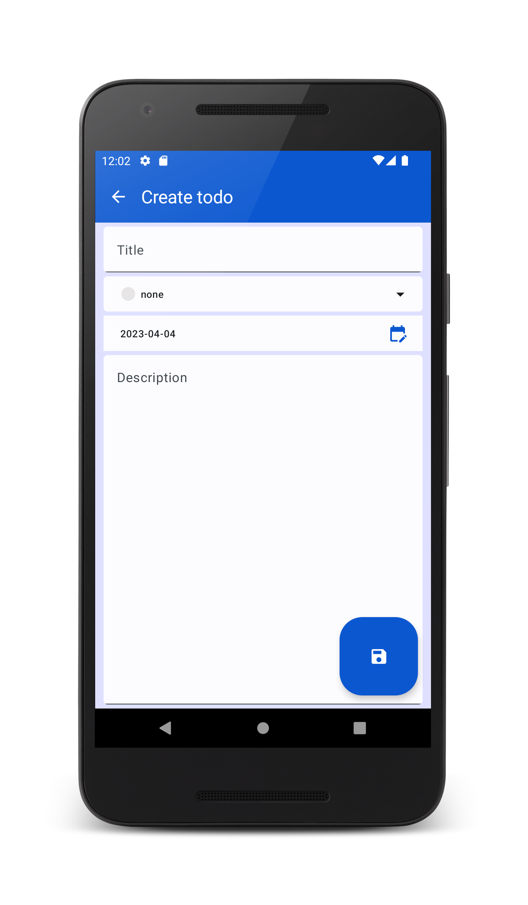
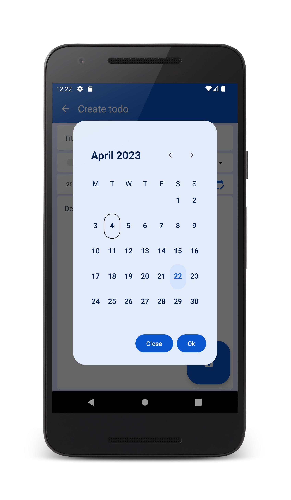

# Labor06 - Perzisztens adattárolás a Room könyvtárral

## Bevezetés

A labor célja a perzisztens adattárolás megismerése ORM technikával, a Room könyvtár segítségével.
A labor egyúttal azt is bemutatja, hogy egy modern, összetett alkalamzás különböző részeit (adatelérés, üzleti logika, felhasználói felület) hogyan tudunk megfelelő rétegezéssel, áttekinthető és jól karban tartható architektúrával kifejleszteni.

Ezeknek az elveknek a megismeréséhez az ötödik laboron megismert Todo alkalmazás kidolgozottabb verzióját készítjük el.


<p float="left">




</p>


## Előkészületek

A feladatok megoldása során ne felejtsd el követni a [feladat beadás folyamatát](../../tudnivalok/github/GitHub.md).

### Git repository létrehozása és letöltése

1. Moodle-ben keresd meg a laborhoz tartozó meghívó URL-jét és annak segítségével hozd létre a saját repository-dat.

1. Várd meg, míg elkészül a repository, majd checkout-old ki.

    !!! tip ""
        Egyetemi laborokban, ha a checkout során nem kér a rendszer felhasználónevet és jelszót, és nem sikerül a checkout, akkor valószínűleg a gépen korábban megjegyzett felhasználónévvel próbálkozott a rendszer. Először töröld ki a mentett belépési adatokat (lásd [itt](../../tudnivalok/github/GitHub-credentials.md)), és próbáld újra.

1. Hozz létre egy új ágat `megoldas` néven, és ezen az ágon dolgozz.

1. A `neptun.txt` fájlba írd bele a Neptun kódodat. A fájlban semmi más ne szerepeljen, csak egyetlen sorban a Neptun kód 6 karaktere.

A Room megismeréséhez ebben a laborban egy előre elkészített projektben fogunk dolgozni, ez megtalálható a repository-n belül. Indítsuk el az Android Studio-t, majd nyissuk meg a projektet.

!!!danger "FILE PATH"
	A projekt a repository-ban lévő `Todo` könyvtárba kerüljön, és beadásnál legyen is felpusholva! A kód nélkül nem tudunk maximális pontot adni a laborra!

Ellenőrízzük, hogy a létrejött projekt lefordul és helyesen működik!

## A réteges architektúra kialakítása

Egy összetettebb alkalmazáson belül a kódot rétegekbe szervezzük, hogy a működés jól átlátható legyen, illetve hogy az alkalmazás egyes részei kevésbé függjenek a többitől. A réteges architektúránkban lesz egy domain modell és üzleti logika, amely a megvalósított funkcionalitás megjelenéstől és adatbáziskezeléstől független részét képezi. A felhasználói felületen bevitt adatoknak külön modellje lesz, és ezt majd át kell alakítanunk a független domain modellre. Az adatbázisba mentéshez szintén külön modellt használunk, és ebben az esetben is konverzióra lesz szükségünk a domain modell és az adatbázismodell között. Az így kialakított rétegezéssel a megjelenítés és az adatbázismodell sem függenek egymástól, csupán a független domain modelltől. Így mind a megjelenés, mind az adabáziskezelő réteg könnyebben módosítható a másiktől függetlenül.

## A domainmodell és az üzleti logika elkészítése

Először a domain réteggel foglalkozunk, ez tulajdonképpen már rendelkezésre áll a `domain.model` package-ben. Ez a domain (a megoldandó feladat) nagyjából technológiafüggetlen része, amelybe még nem vegyülnek a konkrét adattárolási technológiával vagy megjelenítéssel kapcsolatos részletek. Ezzel a közbülső réteggel az alkalmazásunk komponensei lazábban csatolttá válnak, és megkönnyítik, hogy kevés módosítással lecseréljük akár az adatbáziskezelésért felelős Roomot, akár a megjelenítést. Az itt megvalósított üzleti logika műveletek nem függenek közvetlen a Roomtól, csak a reposiory komponensektől, és mivel a tennivalók független domainmodelljével dolgoznak, a megjelenítéstől is függetlenek.

Természetesen más architektúrával is lehet működőképes alkalmazást készíteni, de ez a megoldás vált Android platformon konvencionálissá, ezért ha ezt követjük, akkor könnyebben tudunk együtt dolgozni más fejlesztőkkel. A hivatalos dokumentáció is szentel ennek a kérdésnek egy fejezetet:
[https://developer.android.com/topic/architecture/domain-layer](https://developer.android.com/topic/architecture/domain-layer)

Tekintsük át a `domain.model` package-et, nézzük meg, hogyan épül fel a domainmodell!

## A felhasználói felület elkészítése

Most a felhasználói felület modelljével haladunk tovább. Ezek a korábban létrehozott domainmodellhez igen hasonlatosak, de a rugalmasabb architektúra és a laza csatolás megvalósítása miatt külön modelleket készítünk a felületen megjelenített adatokhoz. Ez egy ilyen egyszerű alkalmazásnál először indokolatlan duplikációnak tűnhet, az az érzésünk, hogy bizonyos dolgokat többször implementálunk. Azonban ahogy egy alkalmazás fejlődik, bővül, egy ilyen lazán csatolt és átlátható architektúra mindenképp kifizetődővé válik.

A felhasználói felület modellje is már rendelkezésre áll a kiinduló projektben. Tekintsük át a `ui.model` package-et! Ebben már rendelkezésre áll a `PriorityUi` és a `TodoUi` osztály, illetve konverziós logika is van a fájloban a domain modellbe/modellből történő konvertáláshoz. Találunk még itt egy `UiText` osztályt a felhasználói felületen megjelenő szöveges üzenetek könnyebb kezeléséhez.

A fent áttekintett UI modellekre épülnek a felhasználói felület megjelenített részei. Ezek a `ui.common` package-ben már szintén rendelkezésre állnak. Tekintsük át ezeket is!

Most az elemi felületi elemekkel végeztünk, most jönnek a tényleges képernyők. Ezek a `feature` package-ben vannak. Ezen belül három fő funkciót fogunk megkülönböztetni: létrehozás, listázás, megjelenítés. Ezek egy-egy subpackage-ben vannak, és a kiinduló projektben ez is mind rendelkezésre állnak. Tekintsük át ezeket is, és elevenítsük fel a funkciójukat.

A felületi elemek elkészítése után gondoskodni kell a köztük történő navigációról is. Ez is már rendelkezésre áll a `navigation` package-ben. Nézzük át ezeket is!

!!!example "BEADANDÓ (1 pont)" 
	Készíts egy **képernyőképet**, amelyen látszik a **teendők listájának előnézete**,
    az **ahhoz tartozó kódrészlet**, valamint a **neptun kódod a kódban valahol kommentként**. 

	A képet a megoldásban a repository-ba f1.png néven töltsd föl.

	A képernyőkép szükséges feltétele a pontszám megszerzésének.

## Az adatréteg elkészítése

Most elkészítjük az adatbázis kezeléséért felelős komponenseket. Most is néhol úgy tűnhet majd, hogy bizonyos dolgokat "duplán" valósítunk meg, azonban ennek az előnyei egy valós komplex alkalmazásban mindig érvényesülnek, ezért érdemes megismernünk, és használnunk ezt az architekturális szervezést.

Az első lépés, hogy a Roomot mint függőséget vegyük fel a projektünkbe. Ehhez először a projekt szintű `build.gradle.kts` fájlban állítsuk be a használni kívánt `kapt` plugin verzióját a függőségek közt:

```kotlin
kotlin("kapt") version "1.9.10" apply false
```

Majd a modul szintű `build.gradle.kts` fájlban engedélyezzük a `kapt` plugint:

```kotlin
plugins {
    id("com.android.application")
    id("org.jetbrains.kotlin.android")
    kotlin("kapt")
}

És ugyanitt vegyük is fel a Room könyvtárat:

```kotlin
    // Room
    val room_version = "2.6.0"
    implementation("androidx.room:room-runtime:$room_version")
    kapt("androidx.room:room-compiler:$room_version")
    implementation("androidx.room:room-ktx:$room_version")
```

Most szükségünk van az elmentett tennivalók adatmodelljére. Mivel a megközelítésünkben a Room könyvtárat használjuk, ez azt jelenti, hogy egy olyan osztályt készítünk, amellyel a szoftverünkben futásidőben egy teendő jól modellezhető, és ezt az osztályt megfeleltetjük az SQLite adatbázisunk egy táblájával. Ez így kényelmes, hiszen a relációs adatmodell kiforrott, közismert, ezért az adatokat gyakran táblákban akarjuk tárolni, ugyanakkor a programunkban az objektumorientált szemléletben mozgunk otthonosan, és az adatokat ezért objektumokban szeretjük tárolni. Ezeket az osztályokat a szoftverfejlesztési terminológiában entitásoknak szoktuk nevezni.

Hozzunk létre ezért egy `data.entities` package-et, és ebbe vegyük fel a következőt:

```kotlin
@Entity(tableName = "todo_table")
data class TodoEntity(
    @PrimaryKey(autoGenerate = true) val id: Int,
    val title: String,
    val priority: Priority,
    val dueDate: LocalDate,
    val description: String
)

fun TodoEntity.asTodo(): Todo = Todo(
    id = id,
    title = title,
    priority = priority,
    dueDate = dueDate,
    description = description
)

fun Todo.asTodoEntity(): TodoEntity = TodoEntity(
    id = id,
    title = title,
    priority = priority,
    dueDate = dueDate,
    description = description
)
```

Ebben a kódban a Room könyvtár annotációval meg van jelölve, hogy az osztály egy entitás lesz, és a `todo_table` nevű táblába lesznek a példányai leképezve, valamint az `id` nevű tagváltozójának megfelelő oszlop lesz az elsődleges kulcs, és ennek értékeit beszúráskor fogja egyedi értékként generálni a környezet, vagyis nem kell nekünk gondoskodnunk róla, hogy minden új teendő új egyedi azonosítót kapjon.

A következő lépés, hogy az entitáshoz kapcsolódó alapműveleteket is támogassuk a Room könyvtár segítségével. Ezt egy DAO (Data Access Object) komponenssel fogjuk megvalósítani. A DAO egy - szintén nem csak Android alatt alkalmazott - tervezési minta, amelynek a lényege, hogy az egy entitáshoz kapcsolódó összes adatbázisműveleteket egy komponensbe gyűjtjük össze. Ez egyrészt jól áttekinthető, illetve ha az adatbázist le szeretnénk cserélni más technológiára, akkor elvileg elegendő lenne a DAO komponens módosítása, bár ilyen jellegű módosításra manapság általában nincs szükség.

Hozzunk létre egy `data.dao` package-et, és ebbe vegyük fel az alábbit:

```kotlin
@Dao
interface TodoDao {

    @Insert(onConflict = OnConflictStrategy.REPLACE)
    suspend fun insertTodo(todo: TodoEntity)

    @Query("SELECT * FROM todo_table")
    fun getAllTodos(): Flow<List<TodoEntity>>

    @Query("SELECT * FROM todo_table WHERE id = :id")
    fun getTodoById(id: Int): Flow<TodoEntity>

    @Update
    suspend fun updateTodo(todo: TodoEntity)

    @Query("DELETE FROM todo_table WHERE id = :id")
    suspend fun deleteTodo(id: Int)
}
```

Láthatjuk, hogy egyrészt maga az interfész is meg van jelölve, mint DAO komponens, másrészt az egyes műveleteken is Room annotációk vannak. A Room az annotációból, illetve az annotált metódus paramétereiből és visszatérési értékéből ki tudja következtetni a szándékunkat. Beszéljük át az egyes metódusok jelentését a gyakorlatvezetővel! Mivel ez a komponens egy interfész, ezt nem mi fogjuk implementálni, hanem a Room készíti el futásidőben az implementációját.

Ezután egy repository komponenst készítünk. Ez némileg úgy tűnik, mintha nem adna hozzá túl sokat a DAO-hoz, azonban fontos célja, hogy a felsőbb rétegeket függetlenítse a Roomtól, hogy ne közvetlen attól függjenek. Tulajdonképpen a kiinduló projektben már létezik egy ilyen komponens, de ezt át kell alakítanunk, mert a korábbi
verzió még nem használt független domén- és adatbázismodelleket.

Először készítsünk egy `data.repository` package-et, és ebbe mozgassuk át az interfészt, majd cseréljük le az alábbira:

```kotlin
interface TodoRepository {
    fun getAllTodos(): Flow<List<TodoEntity>>

    fun getTodoById(id: Int): Flow<TodoEntity>

    suspend fun insertTodo(todo: TodoEntity)

    suspend fun updateTodo(todo: TodoEntity)

    suspend fun deleteTodo(id: Int)
}
```

Majd pedig ennek az implementációját is készítsük el:

```kotlin
class TodoRepositoryImpl(private val dao: TodoDao) : TodoRepository {

    override fun getAllTodos(): Flow<List<TodoEntity>> = dao.getAllTodos()

    override fun getTodoById(id: Int): Flow<TodoEntity> = dao.getTodoById(id)

    override suspend fun insertTodo(todo: TodoEntity) { dao.insertTodo(todo) }

    override suspend fun updateTodo(todo: TodoEntity) { dao.updateTodo(todo) }

    override suspend fun deleteTodo(id: Int) { dao.deleteTodo(id) }
}
```

A korábbi implementációt, a `MemoryTodoRepository` osztályt most töröljük ki, erre nem lesz már szükség.

A `feature` package-ekben most a viewmodelek is eltörtek, mert egyrészt a repository másik package-be került, másrészt a korábbi repository implementációt töröltük. Ezt nem tudjuk könnyen kijavítani, mert az új repository a konstruktorában a DAO komponenst várja, azt viszont nem konstruktorhívással hozzuk létre, hanem a Room gyártja majd le, ezért ehhez még kell némi kódot írnunk. Másrészt pedig nem is kívánatos, hogy a viewmodel közvetlen a repository-t hívja, hiszen ahogy fentebb indokoltuk, nem előnyös, ha a felhasználói felület komponensek közvetlen az adatbáziskezelési réteggel is függnek egymástól. Ezért majd a doménmodellhez kapcsolódó üzletilogika-komponenseket fogunk bevezetni. De előbb fejezzük be az adatbáziskezelési réteg implementációját!

Még három feladatunk van az adatbáziskezelő réteg kialakításában. Az első, hogy a letárolni kívánt Java-típusok és az SQLite beépített típusai közt nem teljes az egyezés. Ezt konverterekkel kell áthidalnunk. Készítsünk egy `data.converters` package-et, és ebbe először a dátumokkal kapcsolatos konverterek implementációját:

```kotlin
object LocalDateConverter {

    @TypeConverter
    fun LocalDate.asString(): String = this.toString()

    @TypeConverter
    fun String.asLocalDateTime(): LocalDate = this.toLocalDate()
}
```

A metódusokon levő `@TypeConverter` annotáció jelzi a Room számára, hogy ezeket a függvényeket konverzióhoz használhatja, a szignatúrából pedig egyértelműen kikövetkeztethető, hogy milyen típusok közt tud velük konvertálni. Most a prioritás enumerációt is támogassuk a megfelelő konverterekkel:

```kotlin
object TodoPriorityConverter {

    @TypeConverter
    fun Priority.asString(): String = this.name

    @TypeConverter
    fun String.asPriority(): Priority {
        return when(this) {
            Priority.LOW.name -> Priority.LOW
            Priority.MEDIUM.name -> Priority.MEDIUM
            Priority.HIGH.name -> Priority.HIGH
            else -> Priority.LOW
        }
    }
}
```

A második lépés, hogy az elkészült komponensekből össze kell állítanunk az adatbáziskezelés globális beállításait összefogó `RoomDatabase` implementációnkat. Ezt tegyük a `data` package gyökerébe:

```kotlin
@Database(entities = [TodoEntity::class], version = 1)
@TypeConverters(TodoPriorityConverter::class, LocalDateConverter::class)
abstract class TodoDatabase : RoomDatabase() {
    abstract val dao: TodoDao
}
```

!!!example "BEADANDÓ (1 pont)" 
	Készíts egy **képernyőképet**, amelyen látszik a 
    **TodoDatabse kódrészélete**, valamint a **neptun kódod a kódban valahol kommentként**. 

	A képet a megoldásban a repository-ba f2.png néven töltsd föl.

	A képernyőkép szükséges feltétele a pontszám megszerzésének.

Figyeljük meg az annotációkat! Itt meg vannak hivatkozva a használni kívánt entitások és konverterek, illetve az adatbázisséma egy verziószámot is kap. Ez azért hasznos, mert ahogy fejlődik az alkalmazás, az adatbázis sémája is változhat, fejlődhet. Ilyen esetekben arra is lehetőséget ad a Room, hogy migrációkat biztosítsunk a régebbi adatbázissémákról történő frissítésre. Ha telepítve van az alkalmazás régi verziója, amely már mentett el adatokat az eszközre, és frissítjük az alkalmazást, akkor a következő indulás után a Room megvizsgálja, hogy történt-e változás az adatbázis verziójában, és szükség esetén futtatja a migrációkat.

Az utolsó lépés az adatbáziskezelés implementációjához, hogy az alkalmazás indulásakor inicializáljuk az adatbázist. Ehhez egy `Application` osztállyal kell kiegészítenünk az alkalmazásunkat. Az `Application` osztály a teljes alkalmazás életciklus-eseményeit tudja kezelni, illetve arra is alkalmas, hogy itt globális adatokat mentsünk el, amelyeket majd az alkalmazás tetszőleges komponenseiből elérhetővé akarunk tenni. Ezt az alkalmazás "root package"-ébe, a `MainActivity` mellé tegyük:

```kotlin
class TodoApplication : Application() {

    companion object {
        private lateinit var db: TodoDatabase

        lateinit var repository: TodoRepositoryImpl
    }

    override fun onCreate() {
        super.onCreate()
        db = Room.databaseBuilder(
            applicationContext,
            TodoDatabase::class.java,
            "todo_database"
        ).fallbackToDestructiveMigration().build()

        repository = TodoRepositoryImpl(db.dao)
    }
}
```

Látható, hogy az alkalmazás indulásakor létrehozzuk az adatbázist és a `TodoRepositoryImpl`-et, majd ezeket az osztály companion objectjébe el is mentjük. Hogy az `Application` osztály tényleg az elvásárunk szerint működjünk, még meg is kell hivatkozni a `Manifest.xml` fájl `application` elemében. Cseréljük az `application` elem nyitó tagjét az alábbira:

```xml
    <application
        android:name=".TodoApplication"
        android:allowBackup="true"
        android:dataExtractionRules="@xml/data_extraction_rules"
        android:fullBackupContent="@xml/backup_rules"
        android:icon="@mipmap/ic_launcher"
        android:label="@string/app_name"
        android:roundIcon="@mipmap/ic_launcher_round"
        android:supportsRtl="true"
        android:theme="@style/Theme.Todo"
        tools:targetApi="31">
```

Ezzel így már összeállt az adatbáziskezelő réteg, de még fel kell oldanunk a komponensek közti kommunikációt.


## Üzleti logika

Most készítsük el a `domain.usecases` package-et. Ebbe kerülnek az egyes üzletilogika-műveletek megvalósításai. Kezdjük a tennivaló létrehozásával:

```kotlin
class SaveTodoUseCase(private val repository: TodoRepository) {

    suspend operator fun invoke(todo: Todo) {
        repository.insertTodo(todo.asTodoEntity())
    }

}
```

Ennek a kódrészletnek a szerepe, hogy - akárcsak a domainmodell - leválasztja az üzleti logikát az adatrétegről. Jelen esetben az üzleti logikánk igen egyszerű, és ezért ezek a műveletek tulajdonképpen csak meghívják az adatréteget a repository komponenseken keresztül, illetve konvertálják a domainmodelleket entitásokká. Egy összetettebb alkalmazásban ez nem feltétlen van így, és ez a réteg akár bonyolultabb is lehet, több adatműveletből nagyobb léptékű, összetettebb műveleteket valósíthat meg.

A fentihez hasonló készítsük el a módosítás use case osztályát:

```kotlin
class UpdateTodoUseCase(private val repository: TodoRepository) {

    suspend operator fun invoke(todo: Todo) {
        repository.updateTodo(todo.asTodoEntity())
    }

}
```

Majd a lekérdezést:


```kotlin
class LoadTodoUseCase(private val repository: TodoRepository) {

    suspend operator fun invoke(id: Int): Result<Todo> {
        return try {
            Result.success(repository.getTodoById(id).first().asTodo())
        } catch (e: IOException) {
            Result.failure(e)
        }
    }

}
```

A törlést:

```kotlin
class DeleteTodoUseCase(private val repository: TodoRepository) {

    suspend operator fun invoke(id: Int) {
        repository.deleteTodo(id)
    }

}
```

És legyen egy listázásunk is, amikor minden tennivalót betöltünk:

```kotlin
class LoadTodosUseCase(private val repository: TodoRepository) {

    suspend operator fun invoke(): Result<List<Todo>> {
        return try {
            val todos = repository.getAllTodos().first()
            Result.success(todos.map { it.asTodo() })
        } catch (e: IOException) {
            Result.failure(e)
        }
    }
}
```

Végül ezeket összefogjuk egy osztály tagváltozóiban:


```kotlin
class TodoUseCases(repository: TodoRepository) {
    val loadTodos = LoadTodosUseCase(repository)
    val loadTodo = LoadTodoUseCase(repository)
    val saveTodo = SaveTodoUseCase(repository)
    val updateTodo = UpdateTodoUseCase(repository)
    val deleteTodo = DeleteTodoUseCase(repository)
}
```

Most módosítanunk kell a viewmodeljeinket. Kezdjük a létrehozás művelettel! Először is konstruktorban már nem a repository-t kapjuk meg, hanem a `TodoUseCases` osztályra kapunk referenciát:

```kotlin
class TodoCreateViewModel(
    private val todoOperations: TodoUseCases
) : ViewModel() {
    ...
}
```

Majd ennek megfelelően módosítsuk a mentést és az inicializálást is:

```kotlin
    private fun onSave() {
        viewModelScope.launch {
            try {
                todoOperations.saveTodo(state.value.todo.asTodo())
                _uiEvent.send(TodoCreateUiEvent.Success)
            } catch (e: Exception) {
                _uiEvent.send(TodoCreateUiEvent.Failure(e.toUiText()))
            }
        }
    }

    companion object {
        val Factory: ViewModelProvider.Factory = viewModelFactory {
            initializer {
                val todoOperations = TodoUseCases(TodoApplication.repository)
                TodoCreateViewModel(
                    todoOperations = todoOperations
                )
            }
        }
    }
```

Folytassuk a részletező nézettel, itt is hasonlóak lesznek a változások:

```kotlin
class TodoDetailViewModel(
    private val todoOperations: TodoUseCases,
    private val savedStateHandle: SavedStateHandle) : ViewModel() {
        ...
}
```

Majd:

```kotlin
    private fun loadTodos() {
        val id = checkNotNull<Int>(savedStateHandle["id"])
        viewModelScope.launch {
            try {
                _state.value = TodoDetailState.Loading
                val todo = todoOperations.loadTodo(id)
                _state.value = TodoDetailState.Result(
                    todo = todo.getOrThrow().asTodoUi()
                )
            } catch (e: Exception) {
                _state.value = TodoDetailState.Error(e)
            }
        }
    }

    companion object {
        val Factory: ViewModelProvider.Factory = viewModelFactory {
            initializer {
                val todoOperations = TodoUseCases(TodoApplication.repository)
                val savedStateHandle = createSavedStateHandle()
                TodoDetailViewModel(
                    todoOperations,
                    savedStateHandle
                )
            }
        }
    }
```

Végül a listázó nézet következik:

```kotlin
class TodoListViewModel(
    private val todoOperations: TodoUseCases
) : ViewModel() {
    ...
}
```

Majd:

```kotlin
    fun loadTodos() {
        viewModelScope.launch {
            try {
                _state.value = TodoListState.Loading
                val todos = todoOperations.loadTodos().getOrThrow().map { it.asTodoUi() }
                _state.value = TodoListState.Result(
                    todoList = todos
                )
            } catch (e: Exception) {
                _state.value = TodoListState.Error(e)
            }
        }
    }

    companion object {
        val Factory: ViewModelProvider.Factory = viewModelFactory {
            initializer {
                val todoOperations = TodoUseCases(TodoApplication.repository)
                TodoListViewModel(
                    todoOperations
                )
            }
        }
    }
```

Most már kipróbálható az alkalmazás, és a létrehozott teendők ténylegesen az adatbázisba mentődnek.

!!!example "BEADANDÓ (1 pont)" 
	Készíts egy **képernyőképet**, amelyen látszik a **futó alkalmazásban a teendők listája**,
    az **ahhoz tartozó kódrészlet**, valamint a **neptun kódod a kódban valahol kommentként,
    illetve egy teendő címében**. 

	A képet a megoldásban a repository-ba f3.png néven töltsd föl.

	A képernyőkép szükséges feltétele a pontszám megszerzésének.


## Önálló feladat 1

Valósítsd meg az összes tennivaló törlését, pl. az AppBaron elhelyezett gombbal! A laboron látott architektúrához hasonlóan rétegről-rétegre valósítsd meg a szükséges funkciókat.

!!!example "BEADANDÓ (1 pont)" 
	Készíts egy **képernyőképet**, amelyen látszik a **futó alkalmazásban a mindent töröl funkció**,
    az **ahhoz tartozó kódrészlet**, valamint a **neptun kódod a kódban valahol kommentként**. 

	A képet a megoldásban a repository-ba f4.png néven töltsd föl.

	A képernyőkép szükséges feltétele a pontszám megszerzésének.

## Önálló feladat 2

Hosszú kattintásra lenyíló menüből lehessen megosztani a tennivalókat más alkalmazásokkal szöveges üzenetként. Az üzenet tartalmazza a tennivaló jellemzőit.

Segítség: [https://developer.android.com/training/sharing/send](https://developer.android.com/training/sharing/send)

!!!example "BEADANDÓ (1 pont)" 
	Készíts egy **képernyőképet**, amelyen látszik a **futó alkalmazásban a megosztás funkció**,
    az **ahhoz tartozó kódrészlet**, valamint a **neptun kódod a kódban valahol kommentként**. 

	A képet a megoldásban a repository-ba f5.png néven töltsd föl.

	A képernyőkép szükséges feltétele a pontszám megszerzésének.
