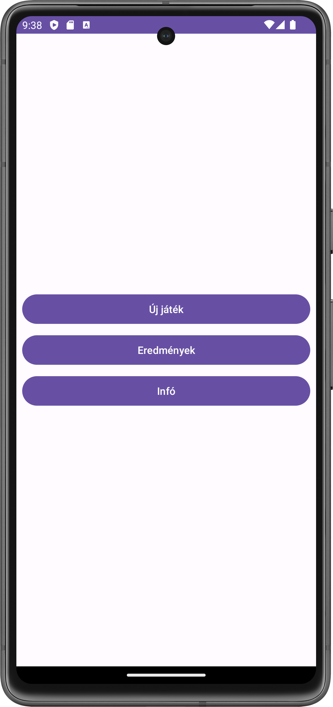
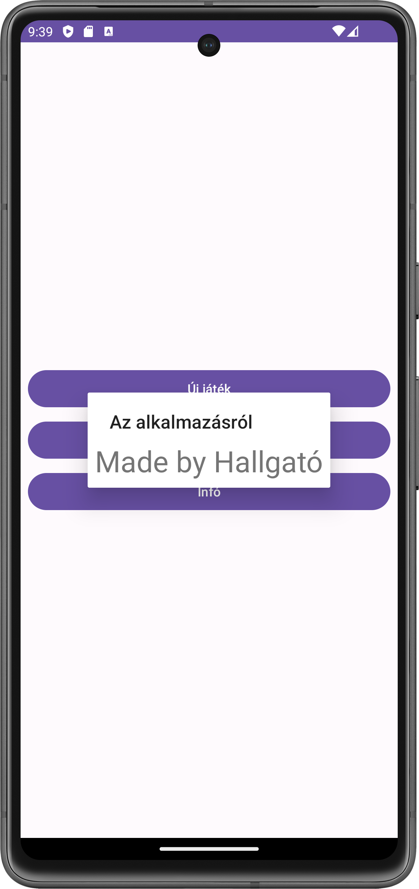
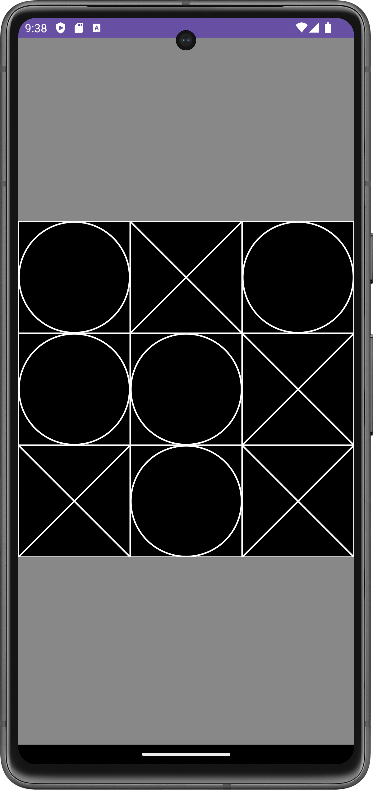
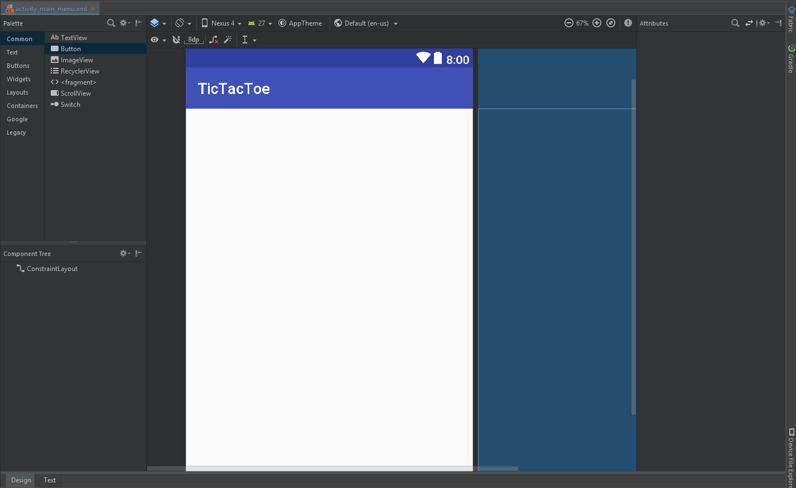
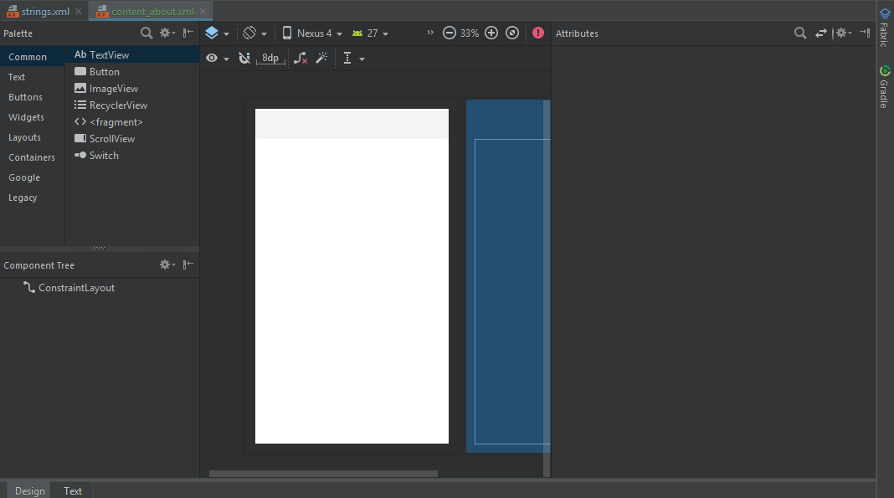
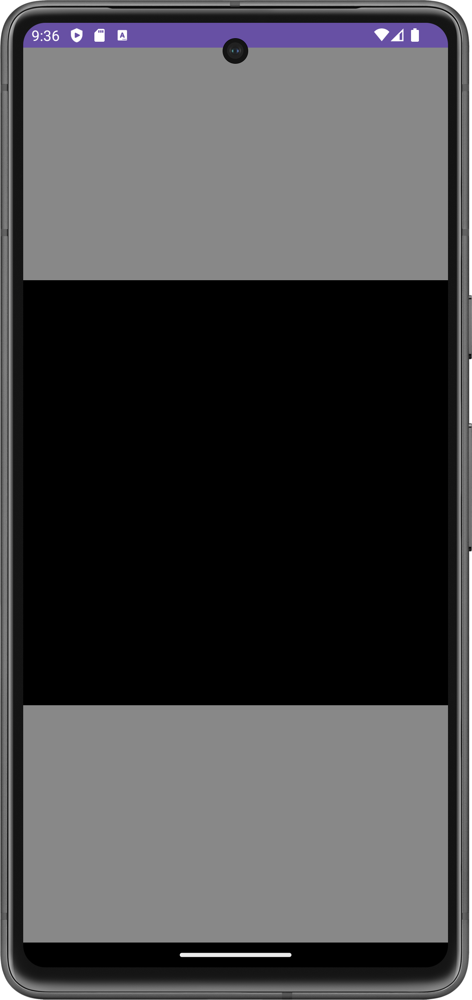

# Labor02 - Egyszerű felhasználói felület több Activity segítségével (TicTacToe)

## Bevezetés

A labor célja egy több `Activity`-ből álló Android alkalmazás elkészítése, valamint az egyszerű rajzolás bemutatása egy TicTacToe játék segítségével.

A labor során a következő funkciókat fogjuk megvalósítani:

* Menü Activity
* Játéktér Activity
* TicTacToe nézet
* Játék logika elkezdése

A laborhoz kapcsolódó önálló feladat:

* Játék logika megvalósítása: győzelem ellenőrzése 

A megvalósítandó játék felhasználói felületét az alábbi képernyőképek szemléltetik:

<p float="left">



</p>

## Előkészületek

A feladatok megoldása során ne felejtsd el követni a [feladat beadás folyamatát](../../tudnivalok/github/GitHub.md).

### Git repository létrehozása és letöltése

1. Moodle-ben keresd meg a laborhoz tartozó meghívó URL-jét és annak segítségével hozd létre a saját repository-dat.

1. Várd meg, míg elkészül a repository, majd checkout-old ki.

    !!! warning "Checkout"
        Egyetemi laborokban, ha a checkout során nem kér a rendszer felhasználónevet és jelszót, és nem sikerül a checkout, akkor valószínűleg a gépen korábban megjegyzett felhasználónévvel próbálkozott a rendszer. Először töröld ki a mentett belépési adatokat (lásd [itt](../../tudnivalok/github/GitHub-credentials.md)), és próbáld újra.

1. Hozz létre egy új ágat `megoldas` néven, és ezen az ágon dolgozz.

1. A `neptun.txt` fájlba írd bele a Neptun kódodat. A fájlban semmi más ne szerepeljen, csak egyetlen sorban a Neptun kód 6 karaktere.


!!! info "Android, Java, Kotlin"
	Az Android hagyományosan Java nyelven volt fejleszthető, azonban az utóbbi években a Google átállt a [Kotlin](https://kotlinlang.org/) nyelvre. Ez egy sokkal modernebb nyelv, mint a Java, sok olyan nyelvi elemet ad, amit kényelmes használni, valamint új nyelvi szabályokat, amikkel például elkerülhetőek a Java nyelven gyakori `NullPointerException` jellegű hibák.

	Másrészről viszont a nyelv sok mindenben tér el a hagyományosan C jellegű szintaktikát követő nyelvektől, amit majd látni is fogunk. A labor előtt érdemes megismerkedni a nyelvvel, egyrészt a fent látható linken, másrészt [ezt](https://developer.android.com/kotlin/learn) az összefoglaló cikket átolvasva.

## Projekt létrehozása

Első lépésként indítsuk el az Android Studio-t, majd:


1. Hozzunk létre egy új projektet, válasszuk az *Empty Views Activity* lehetőséget.
1. A projekt neve legyen `TicTacToe`, a kezdő package `hu.bme.aut.android.tictactoe`, a mentési hely pedig a kicheckoutolt repository-n belül a `TicTacToe` mappa.
1. Nyelvnek válasszuk a *Kotlin*-t.
1. A minimum API szint legyen API24: Android 7.0.
1. A `Build configuration language` Kotlin DSL legyen.

!!!danger "FILE PATH"
	A projekt mindenképpen a repository-ban lévő TicTacToe könyvtárba kerüljön, és beadásnál legyen is felpusholva! A kód nélkül nem tudunk maximális pontot adni a laborra!


Sikeres projekt létrehozás után a laborvezető vezetésével vizsgálja meg a forrás felépítését.

!!!info ""
	A projekt létrehozásakor, a fordító keretrendszernek rengeteg függőséget kell letöltenie. Amíg ez nem történt meg, addig a projektben nehézkes navigálni, hiányzik a kódkiegészítés, stb... Éppen ezért ezt tanácsos kivárni, azonban ez akár 5 percet is igénybe vehet az első alkalommal! Az ablak alján látható információs sávot kell figyelni.

## Az alkalmazás működése

A megvalósítandó alkalmazás működési elve a következő:

1. Az alkalmazás indításakor a `MainActivity` jelenik meg.
1. A `MainActivity`-ről lehet új játékot indítani az *Új játék* menüpont hatására, ez átnavigál a `GameActivity`-re.
1. A `MainActivity`-ről meg lehet tekinteni az *Eredmények*-et, ami jelenleg csak egy `Toast`-ot dob fel egy üzenettel (ezt a funkciót opcionálisan később meg lehet valósítani, ha a perzisztencia témakört már vettük előadáson).
1. A `MainActivity`-ről meg lehet nézni az alkalmazás készítőiről szóló információkat az *Infó* menüt választva. Ez a funkció átnavigál az `AboutActivity`-re, ami dialógus formában fog megjelenni.


## Szöveges erőforrások

Navigáljunk a `res/values/strings.xml`-re, ahol a projekt szöveges erőforrásai találhatóak. Használjuk a következő szöveges erőforrásokat:

```xml
<resources>
    <string name="app_name">TicTacToe</string>
    <string name="btn_start">Új játék</string>
    <string name="btn_highscore">Eredmények</string>
    <string name="btn_about">Infó</string>
    <string name="toast_highscore">Eredmények</string>
    <string name="txt_about">Made by Hallgató</string>
</resources>
```

## Szükséges további Activityk létrehozása

A fentiek alapján látható tehát, hogy a meglévő `MainActivity` mellett még két másik `Activity`-t, a `GameActivity`-t és az `AboutActivity`-t kell létrehoznunk. 

!!!info ""
	`Activity` létrehozásakor tipikusan az alábbi forrás állományok változnak:
	
	* Létrejön az `Activity`-hez tartozó Kotlin fájl.
	* Létrejön az `Activity`-hez tartozó layout XML.
	* Az `AndroidManifest.xml`-be bekerül az `Activity` az `<application>` tag-en belül.

	Az `Activity` létrehozást azonban megkönnyíti az Android Studio és a fenti lépéseket nem kell egyesével elvégeznie a fejlesztőnek.

1. A meglévő `Activity`-t tartalmazó package-re jobb egérgombbal kattintva válasszuk a *New -> Activity -> Empty Views Activity* opciót és hozzuk létre a másik két `Activity`-t (`AboutActivity`, `GameActivity`), *Source Language*-nek válasszuk a Kotlint.
1. Létrehozás után a `res/values/strings.xml`-ben a `<resources>` tagen belül vegyük fel a két új `Activity` címét: 
	```xml
		<string name="title_activity_about">Az alkalmazásról</string>
    	<string name="title_activity_game">Játék</string>
    ```
1. Állítsuk be a Manifestben azt, hogy az `AboutActivity` dialógus formában jelenjen meg, a `theme` attribútum beállításával
	
	!!!tip ""
		A kódkiegészítés segít megtalálni a megfelelő témát a lehetőségek közül, kezdjük el a kezdő betűket beírni!
	```xml
        <activity
            android:name=".AboutActivity"
            android:exported="false"
            android:label="@string/title_activity_about"
            android:parentActivityName=".MainActivity"
            android:theme="@style/Theme.AppCompat.Light.Dialog">
            <meta-data
                android:name="android.support.PARENT_ACTIVITY"
                android:value=".MainActivity" />
        </activity>
	```
	> A fenti kódrészletben az `AboutActivity` címét is beállítjuk a `label` attribútum beállításával
	
1. Állítsuk be a `GameActivity` címét is
	```xml
        <activity
            android:name=".GameActivity"
            android:exported="false"
            android:label="@string/title_activity_game" />
	```

*Létrehozás után ellenőrizzük a laborvezető segítségével a létrejött kódokat!*

## MainActivity felület

A `MainActivity` a fenti ábra alapján három menüpontot tartalmaz középre igazítva. Ezt a felületet a hozzá tartozó `res/layout/activity_main.xml`-ben hozhatjuk létre. Mivel az AndroidStudio már alapértelmezetten `ConstraintLayout` alapú nézetet generál, így most ezt fogjuk használni a megvalósításra. Az anyagban ennek működése csak később következik, így alább megtalálható a kész XML leíró. Akinek van kedve, a gif alapján kipróbálhatja a használatát:



> Tipp: Shift + Kattintással lehet több elemet kijelölni

```xml
<?xml version="1.0" encoding="utf-8"?>
<androidx.constraintlayout.widget.ConstraintLayout xmlns:android="http://schemas.android.com/apk/res/android"
    xmlns:app="http://schemas.android.com/apk/res-auto"
    xmlns:tools="http://schemas.android.com/tools"
    android:layout_width="match_parent"
    android:layout_height="match_parent"
    tools:context=".MainActivity">

    <Button
        android:id="@+id/btnStart"
        android:layout_width="0dp"
        android:layout_height="wrap_content"
        android:layout_marginStart="8dp"
        android:layout_marginEnd="8dp"
        android:text="@string/btn_start"
        app:layout_constraintBottom_toTopOf="@+id/btnHighScores"
        app:layout_constraintEnd_toEndOf="parent"
        app:layout_constraintHorizontal_bias="0.5"
        app:layout_constraintStart_toStartOf="parent"
        app:layout_constraintTop_toTopOf="parent"
        app:layout_constraintVertical_chainStyle="packed" />

    <Button
        android:id="@+id/btnHighScores"
        android:layout_width="0dp"
        android:layout_height="wrap_content"
        android:layout_marginStart="8dp"
        android:layout_marginTop="8dp"
        android:layout_marginEnd="8dp"
        android:text="@string/btn_highscore"
        app:layout_constraintBottom_toTopOf="@+id/btnAbout"
        app:layout_constraintEnd_toEndOf="parent"
        app:layout_constraintHorizontal_bias="0.5"
        app:layout_constraintStart_toStartOf="parent"
        app:layout_constraintTop_toBottomOf="@+id/btnStart" />

    <Button
        android:id="@+id/btnAbout"
        android:layout_width="0dp"
        android:layout_height="wrap_content"
        android:layout_marginStart="8dp"
        android:layout_marginTop="8dp"
        android:layout_marginEnd="8dp"
        android:text="@string/btn_about"
        app:layout_constraintBottom_toBottomOf="parent"
        app:layout_constraintEnd_toEndOf="parent"
        app:layout_constraintHorizontal_bias="0.5"
        app:layout_constraintStart_toStartOf="parent"
        app:layout_constraintTop_toBottomOf="@+id/btnHighScores" />
</androidx.constraintlayout.widget.ConstraintLayout>
```

Nézzük át a laborvezetővel a felület felépítését!

## Highscore gomb eseménykezelő

Az *Eredmények* menüpontra kattintva egy `Toast` üzenetet kell megjeleníteni. Ehhez meg kell keresni az *Eredmények* menüpont gombját és be kell állítani neki az alábbi eseménykezelőt a `MainActivity` `onCreate()` függvényén belül:

```kotlin
val btnHighScore = findViewById<Button>(R.id.btnHighScores)
btnHighScore.setOnClickListener {
    Toast.makeText(
        this@MainActivity,
        getString(R.string.toast_highscore),
        Toast.LENGTH_LONG
    ).show()
}
```

!!!info "onClickListener"
	A [`setOnClickListener`](https://developer.android.com/reference/android/view/View.html#setOnClickListener(android.view.View.OnClickListener)) függvény valójában egy [`View.OnClickListener`](https://developer.android.com/reference/android/view/View.OnClickListener) interfészt megvalósító objektumot vár paraméterként, amelynek egyetlen megvalósítandó függvénye van. Ezt létrehozhatnánk a Java-s [anonim osztályok stílusában](https://kotlinlang.org/docs/reference/object-declarations.html#object-expressions) is, de helyette kihasználjuk, hogy a függvények elsőrendű tagjai a Kotlin nyelvnek, így rendelkezünk igazi függvény típusokkal. Jelen esetben a paraméterben egy olyan [lambda kifejezést](https://kotlinlang.org/docs/reference/lambdas.html#lambda-expressions-and-anonymous-functions) adunk át, amely fejléce megegyezik az elvárt interfész egyetlen függvényének fejlécével, a [SAM conversion](https://kotlinlang.org/docs/reference/java-interop.html#sam-conversions) nyelvi funkció pedig a háttérben a lambda alapján létrehozza a megfelelő `View.OnClickListener` példányt. 


!!!example "BEADANDÓ (1 pont)"
	Készíts egy **képernyőképet**, amelyen látszik a **highscores Toast üzenet** (emulátoron, készüléket tükrözve vagy képernyőfelvétellel), a **az ahhoz tartozó kódrészlet**, valamint a **neptun kódod a kódban valahol kommentként**. A képet a megoldásban a repository-ba f1.png néven töltsd föl.


## AboutActivity felület

Ahogy korábban említettük, az *Infó* menü elindítja az `AboutActivity`-t. Elsőként készítsük el az `AboutActivity` felületét, melyet a `res/layout/activity_about.xml` ír le. Mint korábban, itt is lehet `ConstraintLayout`-ot készíteni a segítséggel, vagy alább megtalálható az XML:



```xml
<?xml version="1.0" encoding="utf-8"?>
<androidx.constraintlayout.widget.ConstraintLayout xmlns:android="http://schemas.android.com/apk/res/android"
    xmlns:app="http://schemas.android.com/apk/res-auto"
    xmlns:tools="http://schemas.android.com/tools"
    android:layout_width="match_parent"
    android:layout_height="match_parent"
    tools:context=".AboutActivity"
    tools:viewBindingIgnore="true">

    <TextView
        android:id="@+id/textView"
        android:layout_width="wrap_content"
        android:layout_height="wrap_content"
        android:layout_margin="8dp"
        android:text="@string/txt_about"
        android:textSize="32sp"
        app:layout_constraintBottom_toBottomOf="parent"
        app:layout_constraintEnd_toEndOf="parent"
        app:layout_constraintStart_toStartOf="parent"
        app:layout_constraintTop_toTopOf="parent" />

</androidx.constraintlayout.widget.ConstraintLayout>
```

## Navigáció megvalósítása Activityk közt

A következő lépésként valósítsuk meg a navigációt (váltást) az `Activity`-k között. Az *Új játék* menüpont hatására a `GameActivity`-re, az *Infó* menüpont hatására pedig az `AboutActivity`-re kell átváltanunk. `Activity`-k közti váltást egy  `Intent` segítségével tudunk implementálni - beszéljük meg a laborvezetővel az `Intent`-ek alapjait. Ezt a témát előadáson később mélyebben fogjuk még érinteni.

Valósítsuk meg ezen két gomb eseménykezelőjét szintén a `MainActivity` `onCreate()` függvényében!

!!!tip "findViewById"
	Ezt csinálhatnánk az előzőhöz hasonlóan, azaz példányosítunk egy gombot, a `findViewById` metódussal referenciát szerzünk a felületen lévő vezérlőre, és a példányon beállítjuk az eseménykezelőt. Azonban a `findViewById` hívásnak számos problémája [van](https://developer.android.com/topic/libraries/view-binding#findviewbyid). Ezekről bővebben az előadáson lesz szó (pl.: *Null safety*, *type safety*). Ezért e helyett "nézetkötést", azaz `ViewBinding`-ot fogunk használni.
	A [`ViewBinding`](https://developer.android.com/topic/libraries/view-binding) a kódírást könnyíti meg számunkra. Amennyiben ezt használjuk, az automatikusan generálódó *binding* osztályokon keresztül közvetlen referencián keresztül tudunk elérni minden *ID*-val rendelkező erőforrást az `XML` fájljainkban.

Először is be kell kapcsolnunk a modulunkra a `ViewBinding`-ot. Az `app` modulhoz tartozó `build.gradle.kts` fájlban az `android` tagen belülre illesszük be az engedélyezést:

```kotlin
android {
    ...
    buildFeatures {
        viewBinding = true
    }
}

```

Majd nyomjunk a felső kék sávon jobb oldalon megjelenő `Sync Now` gombra. Ezzel a `gradle` betölti szükséges változtatásokat.

!!! info "ViewBinding"
	Ebben az esetben a modul minden egyes XML layout fájljához generálódik egy úgynevezett binding osztály. Minden binding osztály tartalmaz referenciát az adott XML layout erőforrás gyökér elemére és az összes ID-val rendelkező view-ra. A generált osztály neve úgy áll elő, hogy az XML layout nevét Pascal formátumba alakítja a rendszer és a végére illeszti, hogy `Binding`. Azaz például a `activity_login.xml` erőforrásfájlból az alábbi binding osztály generálódik: `ActivityLoginBinding`.

	```xml
	<LinearLayout ... >
	    <TextView android:id="@+id/name" />
	    <ImageView android:cropToPadding="true" />
	    <Button android:id="@+id/button"
	        android:background="@drawable/rounded_button" />
	</LinearLayout>
	```
	
	A generált osztálynak két mezője van. A `name` id-val rendelkező `TextView` és a `button` id-jú `Button`. A layout-ban szereplő ImageView-nak nincs id-ja, ezért nem szerepel a binding osztályban.
	
	Minden generált osztály tartalmaz egy `getRoot()` metódust, amely direkt referenciaként szolgál a layout gyökerére. A példában a `getRoot()` metódus a `LinearLayout`-tal tér vissza.


Ezzel után már a teljes modulunkban automatikusan elérhetővé vált a `ViewBinging`. Használatához az `Activity`-nkben csak példányosítanunk kell a `binding` objektumot, amin keresztül majd elérhetjük az erőforrásainkat.
A `binding` példány működéséhez három dolgot kell tennünk:

1. A generált `binding` osztály *statikus* `inflate` függvényével példányosítjuk a `binding` osztályunkat az `Activity`-hez,
1. Szerzünk egy referenciát a gyökér nézetre a `getRoot()` függvénnyel,
1.  Ezt a gyükérelemet odaadjuk a `setContentView()` függvénynek, hogy ez legyen az aktív *view* a képernyőn:

```kotlin
package hu.bme.aut.android.tictactoe

import android.os.Bundle
import androidx.appcompat.app.AppCompatActivity
import hu.bme.aut.android.tictactoe.databinding.ActivityMainBinding

class MainActivity : AppCompatActivity() {
    private lateinit var binding: ActivityMainBinding

    override fun onCreate(savedInstanceState: Bundle?) {
        super.onCreate(savedInstanceState)
        binding = ActivityMainBinding.inflate(layoutInflater)
        setContentView(binding.root)
    }
}
```

!!!tip "lateinit"
	A [`lateinit`](https://kotlinlang.org/docs/reference/properties.html#late-initialized-properties-and-variables) kulcsszóval megjelölt property-ket a fordító megengedi inicializálatlanul hagyni az osztály konstruktorának lefutása utánig, anélkül, hogy nullable-ként kéne azokat megjelölnünk (ami később kényelmetlenné tenné a használatukat, mert mindig ellenőriznünk kéne, hogy `null`-e az értékük). Ez praktikus olyan esetekben, amikor egy osztály inicializálása nem a konstruktorában történik (például ahogy az `Activity`-k esetében az `onCreate`-ben), mert később az esetleges `null` eset lekezelése nélkül használhatjuk majd a property-t. A `lateinit` használatával átvállaljuk a felelősséget a fordítótól, hogy a property-t az első használata előtt inicializálni fogjuk - ellenkező esetben kivételt kapunk.

Ezek után már be is állíthatjuk a gombjaink eseménykezelőit. (Cseréljük le a `btnHighScores`-t is.):

```kotlin
binding.btnHighScores.setOnClickListener {
    Toast.makeText(
        this@MainActivity,
        getString(R.string.toast_highscore),
        Toast.LENGTH_LONG
    ).show()
}

binding.btnStart.setOnClickListener {
    startActivity(Intent(this@MainActivity, GameActivity::class.java))
}

binding.btnAbout.setOnClickListener {
    startActivity(Intent(this@MainActivity, AboutActivity::class.java))
}
```

!!!danger "setContentView"
	Gyakori hiba, hogy a `setContentView` függvénynek a gyökér nézet helyett véletlenül az *ID*-val hivatkozott *layout*-ot adjuk oda. (`R.layout.activity_main.xml`). Ilyenkor kétszer is példányosodik a felület, ráadásul a képernyőn az egyik jelenik meg, míg a `binding`-ok a másikra lesznek beállítva.

!!!example "BEADANDÓ (1 pont)"
	Készíts egy **képernyőképet**, amelyen látszik a **az AboutActivity** (emulátoron, készüléket tükrözve vagy képernyőfelvétellel), egy **ahhoz tartozó kódrészlet**, valamint a **neptun kódod a TextView szövegeként**. A képet a megoldásban a repository-ba f2.png néven töltsd föl.


## Játék logika

A 3x3-as TicTacToe táblajáték logikáját külön osztályban valósítjuk meg egy [*Singleton*](https://en.wikipedia.org/wiki/Singleton_pattern) formájában, így könnyen hozzáférhetünk majd.

> Amennyiben nem ismeri ezt a tervezési mintát, érdemes utánanézni, illetve rákérdezni a laborvezetőnél.

Készítsünk a `tictactoe` package-en belül egy `model` package-et, majd abban egy `TicTacToeModel` osztályt (a package-en jobb egérgomb, majd *New -> Kotlin File/Class*). Az osztály egy 3x3-as mátrixban tárolja a játéktér mezőinek tartalmát és különféle publikus függvényeket biztosít a játéktér lekérdezéséhez és módosításához.

```kotlin
package hu.bme.aut.android.tictactoe.model

object TicTacToeModel {

    const val EMPTY: Byte = 0
    const val CIRCLE: Byte = 1
    const val CROSS: Byte = 2

    var nextPlayer: Byte = CIRCLE

    private var model: Array<ByteArray> = arrayOf(
        byteArrayOf(EMPTY, EMPTY, EMPTY),
        byteArrayOf(EMPTY, EMPTY, EMPTY),
        byteArrayOf(EMPTY, EMPTY, EMPTY))

    fun resetModel() {
        for (i in 0 until 3) {
            for (j in 0 until 3) {
                model[i][j] = EMPTY
            }
        }
    }

    fun getFieldContent(x: Int, y: Int): Byte {
        return model[x][y]
    }

    fun changeNextPlayer() {
        if (nextPlayer == CIRCLE) {
            nextPlayer = CROSS
        } else {
            nextPlayer = CIRCLE
        }
    }

    fun setFieldContent(x: Int, y: Int, content: Byte): Byte {
        changeNextPlayer()
        model[x][y] = content
        return content
    }

}
```

!!!info "Singleton"
	Kotlinban nyelvi szintű támogatás van a singletonok létrehozására. Ahelyett, hogy nekünk kéne egyetlen statikus példányt felvennünk, elég csak a `class` kulcsszó helyett az [`object`](https://kotlinlang.org/docs/reference/object-declarations.html#object-declarations) kulcsszóval létrehoznunk az osztályt hogy egy singletont kapjunk.

!!!info "const"
	A fordítás időben konstans értékeket érdemes a [`const`](https://kotlinlang.org/docs/reference/properties.html#compile-time-constants) kulcsszóval megjelölnünk (erre a fejlesztőkörnyezet is figyelmeztet, ha nem tennénk), ezzel teljesítmény optimalizációkat érhetünk el, illetve a szándékainkat is tisztábban jelezzük.

!!!info "collection"
	A Kotlin standard library számos függvényt nyújt különböző collection-ök egyszerű létrehozására. Figyeljük meg a kódban az [`arrayOf`](https://kotlinlang.org/api/latest/jvm/stdlib/kotlin/array-of.html) és a [`byteArrayOf`](https://kotlinlang.org/api/latest/jvm/stdlib/kotlin/byte-array-of.html) használatát, amelyek meghívásával létrehozunk tömböket, és azonnal fel is töltjük őket elemekkel.

## Játéktér kirajzolása

A következő lépés a játéktér kirajzolása és annak hozzárendelése a `GameActivity`-hez.

Első lépésként a meglévő `tictactoe` package-ben hozzunk létre egy `view` package-et , majd abban egy `TicTacToeView` osztályt, mely a `View` ősosztályból származik:

```kotlin
package hu.bme.aut.android.tictactoe.view

import android.content.Context
import android.graphics.Canvas
import android.graphics.Color
import android.graphics.Paint
import android.util.AttributeSet
import android.view.MotionEvent
import android.view.View
import kotlin.math.min

class TicTacToeView : View {

    private val paintBg = Paint()
    private val paintLine = Paint()

    constructor(context: Context?) : super(context)
    constructor(context: Context?, attrs: AttributeSet?) : super(context, attrs)

    init {
        paintBg.color = Color.BLACK
        paintBg.style = Paint.Style.FILL

        paintLine.color = Color.WHITE
        paintLine.style = Paint.Style.STROKE
        paintLine.strokeWidth = 5F
    }

    override fun onDraw(canvas: Canvas) {
        canvas.drawRect(0F, 0F, width.toFloat(), height.toFloat(), paintBg)

        drawGameArea(canvas)
        drawPlayers(canvas)
    }

    private fun drawGameArea(canvas: Canvas) {
        //TODO
    }

    private fun drawPlayers(canvas: Canvas) {
        //TODO
    }

    override fun onMeasure(widthMeasureSpec: Int, heightMeasureSpec: Int) {
        val w = MeasureSpec.getSize(widthMeasureSpec)
        val h = MeasureSpec.getSize(heightMeasureSpec)
        val d: Int

        when {
            w == 0 -> { d = h }
            h == 0 -> { d = w }
            else -> { d = min(w, h) }
        }

        setMeasuredDimension(d, d)
    }

    override fun onTouchEvent(event: MotionEvent?): Boolean {
        when (event?.action) {
            MotionEvent.ACTION_DOWN -> {
                // TODO
                return true
            }
            else -> return super.onTouchEvent(event)
        }
    }

}
```

Látható, hogy az osztály egy nézet rajzolásáért felelős. Létrehozunk két `Paint` objektumot, melyek a háttér, illetve a pályaelemek rajzolásához lesznek használva. A konstruktorok, mint látjuk csak egy `super()` hívást valósítanak meg, mivel ebben a megvalósításban  az `init` blokk végzi az osztály inicializálását. Fontos, hogy az `onDraw()`-ban ne hozzunk létre objektumokat, hiszen az `onDraw()` minden képkocka kirajzolásakor meghívódik és sokszor hozná létre feleslegesen őket, lassítva ezzel a működést és megnehezítve a *garbage collector* dolgát.

Az osztály egyik leglényegesebb függvénye az `onDraw`, mely a kapott `canvas` objektumra rajzolja ki a nézet tartalmát. A jelenlegi implementáció feketére festi a területet és meghívja a játéktér kirajzolásért (négyzetrács) és a játékosok (X és O) kirajzolásáért felelős – egyelőre még üres – függvényeket.

Az `onMeasure` függvény felüldefiniálásával biztosítható, hogy a nézet mindig négyzetes formában jelenjen meg, azaz ugyanakkora legyen a szélessége, mint a magassága.

Végül az `onTouchEvent` függvényben tudjuk kezelni az érintés eseményeket. Jelenleg az `ACTION_DOWN` eseményt vizsgáljuk, de más érintés események is hasonlóan kezelhetők itt.

!!!info "init"
	Az [`init`](https://kotlinlang.org/docs/reference/classes.html#constructors) blokkban végezhetjük el az osztályunk olyan inicializálási feladatait, amelyekre bármilyen konstruktor meghívásakor szükségünk van.

!!!info "when"
	Figyeljük meg a [`when`](https://kotlinlang.org/docs/reference/control-flow.html#when-expression) kétféle használatát. Az `onTouchEvent` függvényben egy Java-s `switch`-hez hasonlóan futtat kódot a paraméterként megkapott kifejezés értékétől függően, míg az `onMeasure` függvényben egy kevésbé olvasható `if-else` lánc helyett használjuk, paraméter nélkül.

!!!info "kasztolás"
	Kotlinban a `(float) x` és `(int) y` stílusú castolások helyett a numerikus típusok között a `toInt()`, `toFloat()`, [és hasonló függvényekkel](https://kotlinlang.org/api/latest/jvm/stdlib/kotlin/-number/index.html) végezhetünk konverziót.

Ahhoz, hogy a `GameActivity` ezt a játékteret megjelenítse, módosítsuk a hozzá tartozó `res/layout/activity_game.xml` fájlt. A felület egy *Fragment* konténert tartalmaz, amibe majd a játéktér kerül:

```xml
<?xml version="1.0" encoding="utf-8"?>
<androidx.constraintlayout.widget.ConstraintLayout xmlns:android="http://schemas.android.com/apk/res/android"
    xmlns:app="http://schemas.android.com/apk/res-auto"
    xmlns:tools="http://schemas.android.com/tools"
    android:layout_width="match_parent"
    android:layout_height="match_parent"
    tools:context=".GameActivity"
    tools:viewBindingIgnore="true">

    <androidx.fragment.app.FragmentContainerView
        android:id="@+id/fragmentGameArea"
        android:name="hu.bme.aut.android.tictactoe.fragments.GameFragment"
        android:layout_width="0dp"
        android:layout_height="0dp"
        app:layout_constraintBottom_toBottomOf="parent"
        app:layout_constraintEnd_toEndOf="parent"
        app:layout_constraintStart_toStartOf="parent"
        app:layout_constraintTop_toTopOf="parent"
        tools:layout="@layout/fragment_game" />

</androidx.constraintlayout.widget.ConstraintLayout>
```

Következő lépésként készítsük el a játékteret tartalmazó *Fragmentet*. Ezt készíthetjük az *Activity*-hez hasonlóan varázslóval is, (jobb klinn -> New -> Fragment...) azonban ez túl sok olyan kódot generálna, amire nekünk most nincs szükségünk. Csináljunk tehát egy új layout fájlt, aminek a neve legyen `fragment_game`. Ez egy szürkés hátterű `ConstraintLayout` közepén jelenítse meg a `TicTacToeView` nézetet:

```xml
<?xml version="1.0" encoding="utf-8"?>
<androidx.constraintlayout.widget.ConstraintLayout xmlns:android="http://schemas.android.com/apk/res/android"
    xmlns:app="http://schemas.android.com/apk/res-auto"
    android:layout_width="match_parent"
    android:layout_height="match_parent"
    android:background="#888888">

    <hu.bme.aut.android.tictactoe.view.TicTacToeView
        android:id="@+id/ticTacToeView"
        android:layout_width="wrap_content"
        android:layout_height="wrap_content"
        android:layout_marginStart="8dp"
        android:layout_marginTop="8dp"
        android:layout_marginEnd="8dp"
        android:layout_marginBottom="8dp"
        app:layout_constraintBottom_toBottomOf="parent"
        app:layout_constraintEnd_toEndOf="parent"
        app:layout_constraintStart_toStartOf="parent"
        app:layout_constraintTop_toTopOf="parent"
        app:layout_constraintVertical_bias="0.495" />

</androidx.constraintlayout.widget.ConstraintLayout>
```

!!!warning "package"
	Fontos, hogy az itt szereplő package név a saját `TicTacToeView` osztályunk neve előtt azonos legyen a nézet forrásának tetején szereplő package névvel, egyébként hibát fogunk kapni, amikor megpróbáljuk megnyitni ezt a képernyőt. - De szerencsére a kódkiegészítő ebben is segít.

A felület után készítsük el egy külön `fragments` *package*-be magát a `GameFragment`-et is, aminek egyetlen feladata, hogy megjelenítse a felületünket:

```kotlin
package hu.bme.aut.android.tictactoe.fragments

import android.os.Bundle
import android.view.LayoutInflater
import android.view.View
import android.view.ViewGroup
import androidx.fragment.app.Fragment
import hu.bme.aut.android.tictactoe.databinding.FragmentGameBinding

class GameFragment : Fragment() {

    private lateinit var binding: FragmentGameBinding

    override fun onCreateView(
        inflater: LayoutInflater,
        container: ViewGroup?,
        savedInstanceState: Bundle?
    ): View {
        binding = FragmentGameBinding.inflate(layoutInflater, container, false)
        return binding.root
    }
}
```
Próbáljuk ki az alkalmazást! Most már az *Új játék* gombra nyomva meg kell, hogy jelenjen a (még erősen hiányos) játékterünk.



!!!example "BEADANDÓ (1 pont)"
	Készíts egy **képernyőképet**, amelyen látszik a **játéktér** (emulátoron, készüléket tükrözve vagy képernyőfelvétellel), a **GameFragmenthez tartozó kódrészlet**, valamint a **neptun kódod a kódban valahol kommentként**. A képet a megoldásban a repository-ba f3.png néven töltsd föl.


Következő lépésként valósítsuk meg a játéktér kirajzolását a `TicTacToeView` `drawGameArea` függvényében, azaz rajzoljuk meg a vízszintes és függőleges vonalakat:

```kotlin
private fun drawGameArea(canvas: Canvas) {
    val widthFloat: Float = width.toFloat()
    val heightFloat: Float = height.toFloat()

    // border
    canvas.drawRect(0F, 0F, widthFloat, heightFloat, paintLine)

    // two horizontal lines
    canvas.drawLine(0F, heightFloat / 3, widthFloat, widthFloat / 3, paintLine)
    canvas.drawLine(0F, 2 * heightFloat / 3, widthFloat, 2 * heightFloat / 3, paintLine)

    // two vertical lines
    canvas.drawLine(widthFloat / 3, 0F, widthFloat / 3, heightFloat, paintLine)
    canvas.drawLine(2 * widthFloat / 3, 0F, 2 * widthFloat / 3, heightFloat, paintLine)
}
```

Ezt követően valósítsuk meg a modell alapján a játéktérben az X-ek és O-k kirajzolását az `drawPlayers` függvényben. A megvalósítás során végigmegyünk a játéktér mátrix elemein és a benne található értékek szerint O-t vagy X-et rajzolunk az adott mezőbe:

```kotlin
private fun drawPlayers(canvas: Canvas) {
    // draw a circle at the center of the field
    // X coordinate: left side of the square + half width of the square
    for (i in 0 until 3) {
        for (j in 0 until 3) {
            when (TicTacToeModel.getFieldContent(i, j)) {
                TicTacToeModel.CIRCLE -> {
                    val centerX = i * width / 3 + width / 6
                    val centerY = j * height / 3 + height / 6
                    val radius = height / 6 - 2
                    canvas.drawCircle(centerX.toFloat(), centerY.toFloat(), radius.toFloat(), paintLine)
                }
                TicTacToeModel.CROSS -> {
                    canvas.drawLine(
                        (i * width / 3).toFloat(),
                        (j * height / 3).toFloat(),
                        ((i + 1) * width / 3).toFloat(),
                        ((j + 1) * height / 3).toFloat(),
                        paintLine
                    )
                    canvas.drawLine(
                        ((i + 1) * width / 3).toFloat(),
                        (j * height / 3).toFloat(),
                        (i * width / 3).toFloat(),
                        ((j + 1) * height / 3).toFloat(),
                        paintLine
                    )
                }
            }
        }
    }
}
```

!!!info "for ciklus"
	A Kotlin [`for` ciklusának](https://kotlinlang.org/docs/reference/control-flow.html#for-loops) nincs három részre bontott, `;`-vel elválasztott verziója. Csak a fenti kódban is látható *for each* stílusú `for` ciklust támogatja a nyelv, amellyel azonban bármilyen iterálható objektumon ugyanúgy tudunk iterálni. Ha egyszerűen számokon szeretnénk ezt megtenni, létrehozhatunk egy iterálható [`Range`](https://kotlinlang.org/docs/reference/ranges.html)-et például a `0..3` szintaxissal amivel egy zárt intervallumot kapunk, vagy a fent használt [`0 until 3`](https://kotlinlang.org/api/latest/jvm/stdlib/kotlin.ranges/until.html) szintaxissal, ami egy jobbról nyílt intervallumot hoz létre, tehát a `3` értéket már nem fogja felvenni a ciklus változó.

Végül valósítsuk meg az érintés eseményre való reagálást úgy, hogy a megfelelő mezőbe – ha az üres – elhelyezzük az aktuális játékost, melyet a modell `nextPlayer` változója reprezentál. 

*A modell frissítése után az újrarajzolást az `invalidate()` függvény meghívásával tudjuk elérni.*

```kotlin
override fun onTouchEvent(event: MotionEvent?): Boolean {
    when (event?.action) {
        MotionEvent.ACTION_DOWN -> {
            val tX: Int = (event.x / (width / 3)).toInt()
            val tY: Int = (event.y / (height / 3)).toInt()
            if (tX < 3 && tY < 3 && TicTacToeModel.getFieldContent(tX, tY) == TicTacToeModel.EMPTY) {
                TicTacToeModel.setFieldContent(tX, tY, TicTacToeModel.nextPlayer)
                invalidate()
            }
            return true
        }
        else -> return super.onTouchEvent(event)
    }
}
```

## Alkalmazás ikon lecserélése

Az alkalmazás ikonját jelenleg a `res/mipmap[-ldpi/mdpi/hdpi/xhdpi/...]` mappákban található `ic_launcher.png` jelképezi. A laborvezető segítségével keressünk egy új ikont és cseréljük le. Nem muszáj az ikont minden felbontásban elkészíteni, egyszerűen elhelyezhetónk egy méretet a `mipmap` mappában is (melyet létre kell hozni), ekkor természetesen különböző felbontású eszközökön torzulhat az ikon képe. (Ha marad idő, a beépített *Asset Studio*-val elkészíthetjük az összes szükséges változatot.)

Próbáljuk ki az alkalmazást!

Észrevehetjük, hogy ha a játéktérről visszalépünk és megint új játékot kezdünk, a játéktér nem törlődik. Ezért a `GameActivity`-re való navigáció előtt a `TicTacToeModel`-t alapállapotba kell állítanunk, hogy új játék kezdődjön (`MainActivity.kt`):

```kotlin
binding.btnStart.setOnClickListener {
    TicTacToeModel.resetModel()
    startActivity(Intent(this@MainActivity, GameActivity::class.java))
}
```

!!!example "BEADANDÓ (1 pont)"
	Készíts egy **képernyőképet**, amelyen látszik a **játéktér játék közben** (emulátoron, készüléket tükrözve vagy képernyőfelvétellel), a **TicTacToeView kódjának egy részlete**, valamint a **neptun kódod a kódban valahol kommentként**. A képet a megoldásban a repository-ba f4.png néven töltsd föl.


## Játéklogika ellenőrzése - önálló feladat

Valósítson meg egy függvényt, mely minden lépés után leellenőrzi, hogy győzött-e valamelyik játékos, vagy nincs-e döntetlen. Amennyiben vége a játéknak, egy `Toast` üzenettel jelezze ezt a felhasználónak és lépjen vissza a főmenübe. A laborvezető segítségével vizsgálja meg, hogy a `View` osztályból hogyan érhető el az őt tartalmazó "host" `Activity`, aminek így például egy `gameOver()` függvénye meghívható, ami megvalósítja a fent leírt játék befejezést.

Jó munkát kívánunk!

???success "Segítség"
	A játékállapot ellenőrzése a `TicTacToeModel` feladata, így oda készítsünk egy függvényt, ami ezt teszi meg:

	```kotlin
    fun checkGameState(): Byte { 
        ///TODO 4 állapottal térhet vissza: 
        // kör nyert
        // kereszt nyert
        // döntetlen
        // még nincs vége
        return CIRCLE
    }
	```

	Játék állapotot ellenőrizni új jel lehelyezése után érdemes, tehát pl. a `TicTacToeView` `onTouchEvent()` függvényében:

	```kotlin
	override fun onTouchEvent(event: MotionEvent?): Boolean {
        when (event?.action) {
            MotionEvent.ACTION_DOWN -> {
                val tX: Int = (event.x / (width / 3)).toInt()
                val tY: Int = (event.y / (height / 3)).toInt()
                if (tX < 3 && tY < 3 && TicTacToeModel.getFieldContent(tX, tY) == TicTacToeModel.EMPTY) {
                    TicTacToeModel.setFieldContent(tX, tY, TicTacToeModel.nextPlayer)
                    invalidate()
                    val result = TicTacToeModel.checkGameState()
                    ///vége van, tehát tovább hívunk
                    if (result != TicTacToeModel.EMPTY) {
                        (context as GameActivity).gameOver(result)
                    }
                }
                return true
            }
            else -> return super.onTouchEvent(event)
        }
    }
	```

	!!!warning ""
		A `context` ilyen kasztolása nem szép, és veszélyes is. Itt csak az egyszerűsége miatt használjuk. A félév későbbi részében tanulunk szebb megoldást erre a problémára.

	A *Toast*-ot pedig a `GameActivity`-ből dobjuk az eredmény alapján, majd bezárjuk az *Activity*-t:

	```kotlin
	fun gameOver(result: Byte) {
        when (result) {
            ///TODO több eset
            TicTacToeModel.CIRCLE -> {
                Toast.makeText(this@GameActivity, "A kör nyert", Toast.LENGTH_LONG).show()
            }
        }
        finish()
    }
	```

!!!example "BEADANDÓ (1 pont)"
	Készíts egy **képernyőképet**, amelyen látszik a **játék végét jelző Toast üzenet** (emulátoron, készüléket tükrözve vagy képernyőfelvétellel), a **játékállapot ellenőrzéséhez tartozó kódrészlet**, valamint a **neptun kódod a kódban valahol kommentként**. A képet a megoldásban a repository-ba f5.png néven töltsd föl.
