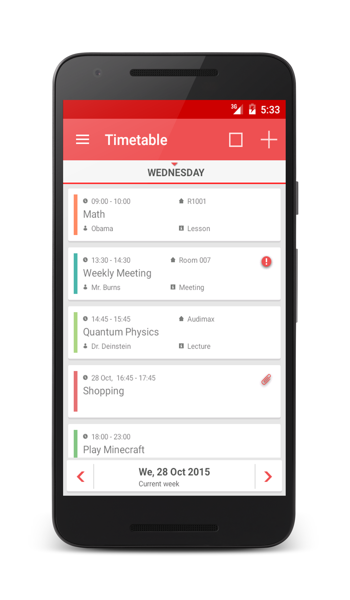
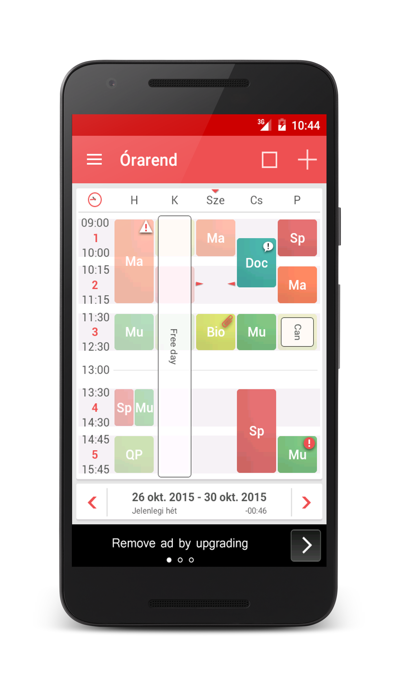
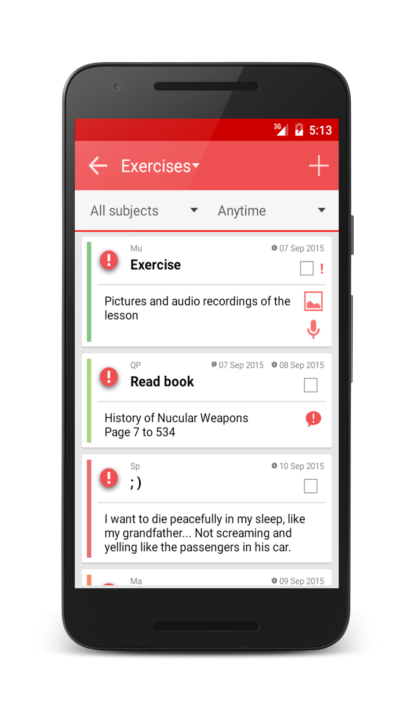

# LaborExtra - Órarend

## Bevezető
A labor során a feladat egy **órarend** alkalmazás elkészítése, ahol a felhasználó grafikus felületen szerkesztheti és láthatja a napi, valamint heti beosztását.





Az Play Store-ban számos ilyen szoftver található, melyeket érdemes megvizsgálni és ötleteket meríteni a megvalósításhoz.    

## Előkészületek

A feladatok megoldása során ne felejtsd el követni a [feladat beadás folyamatát](../../tudnivalok/github/GitHub.md).

### Git repository létrehozása és letöltése

1. Moodle-ben keresd meg a laborhoz tartozó meghívó URL-jét és annak segítségével hozd létre a saját repository-dat.

1. Várd meg, míg elkészül a repository, majd checkout-old ki.

    !!! warning "Checkout"
        Egyetemi laborokban, ha a checkout során nem kér a rendszer felhasználónevet és jelszót, és nem sikerül a checkout, akkor valószínűleg a gépen korábban megjegyzett felhasználónévvel próbálkozott a rendszer. Először töröld ki a mentett belépési adatokat (lásd [itt](../../tudnivalok/github/GitHub-credentials.md)), és próbáld újra.

1. Hozz létre egy új ágat `megoldas` néven, és ezen az ágon dolgozz.

1. A `neptun.txt` fájlba írd bele a Neptun kódodat. A fájlban semmi más ne szerepeljen, csak egyetlen sorban a Neptun kód 6 karaktere.

!!!danger "FILE PATH"
	A projekt mindenképpen egy repository-ban lévő könyvtárba kerüljön, és beadásnál legyen is felpusholva! A kód nélkül nem tudunk maximális pontot adni a laborra!

## Követelmények

Az alkalmazás megtervezése és megvalósítása teljes mértékben kötetlen, az elvárt minimális funkcionalitás:

- Óra (esemény) létrehozása, szerkesztése, törlése. Attribútumai (legalább): 
	- Kezdési, befejezési idő (pl. 8:15-11:45), 
	- Tárgy (pl. Android alapú szoftverfejlesztés), 
	- Helyszín (pl. QBF08), 
	- Szín, amellyel megjelenik a naptárban (pl. #234567)
- Órák átlátható megjelenítése napi és heti bontásban teljes képernyőn
- Egy óra részletes adatlapja
- Adatok perzisztens tárolása 

A fenti specifikáció megvalósítása 4-es osztályzatot jelent, jobb minősítéshez további kreatív funkciók beépítése és igényes felhasználói felület szükséges.

Néhány ötlet:

- Widget
- Emlékeztető beállítása az órákhoz
- A-hét, B-hét támogatása
- Vizsgák, ZH-k beépítése
- telefon és tablet, álló-fekvő felhasználói felület
- nem default UI elemek használata (mint a School Helper-ben)
- Események importálása naptárból, vagy iCal fájlból
- Teljes órarend exportálása-importálása saját tervezésű fájlba
- Több skin támogatása

!!!example "BEADANDÓ (5 pont)"
	A repóba feltöltendő az alkalmazás **projekt könyvtárán felül egy felhasználói kézikönyv is** (README.md), ami leírja az elkészített szoftver funkcióit, és képeket is tartalmaz minden releváns képernyőről. 