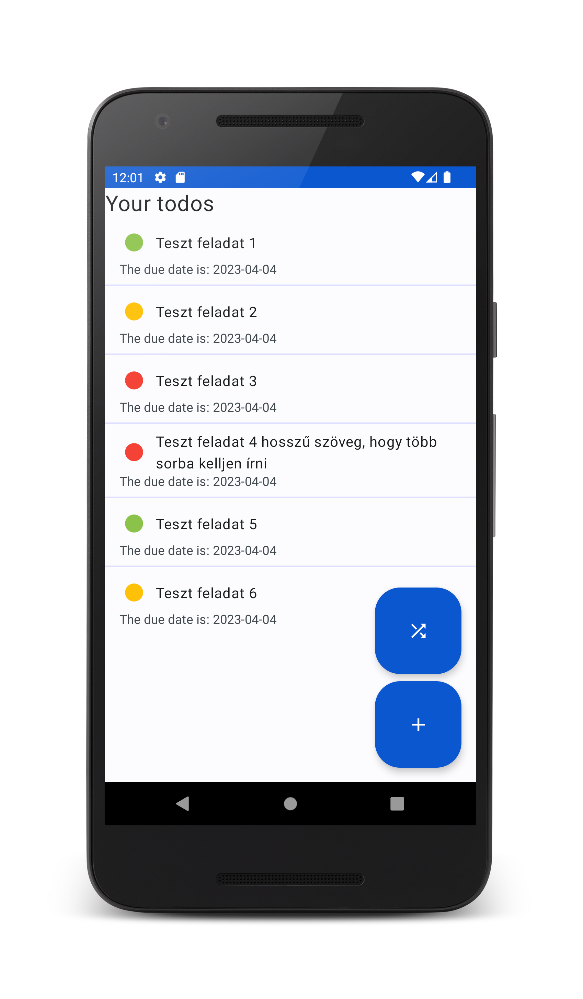
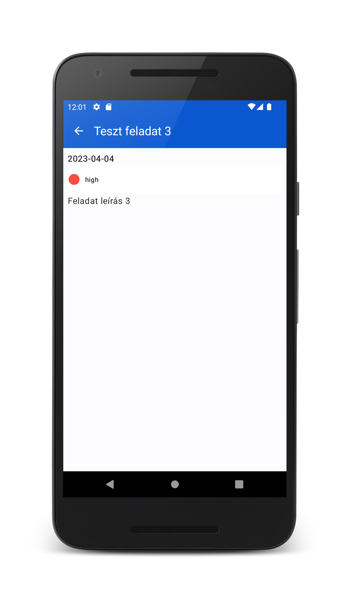
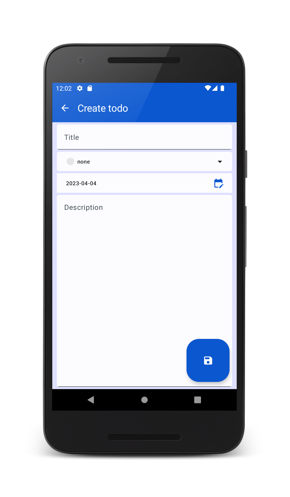
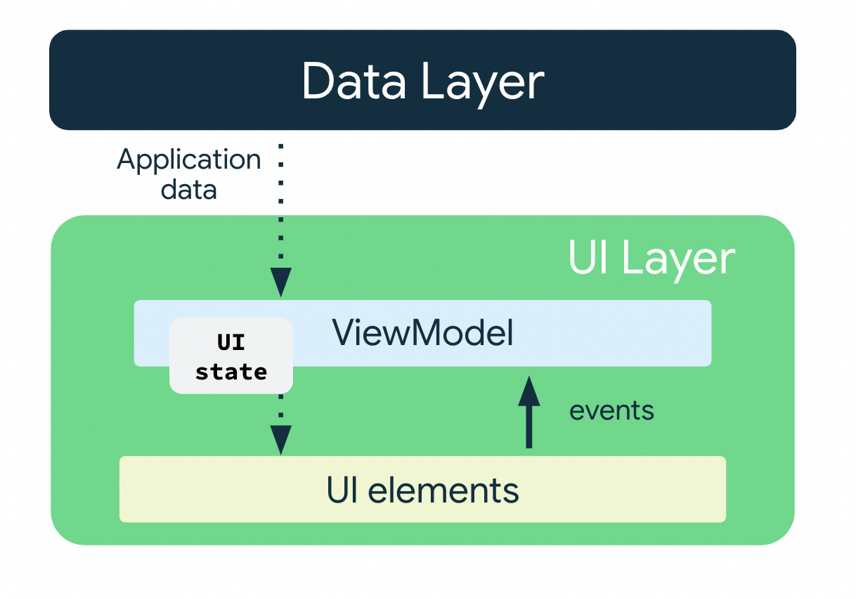

# Labor05 - Todo Alkalmazás

A labor célja, hogy bemutassa, hogyan lehet egy egyszerű ToDo alkalmazást megvalósítani a Compose keretrendszerben.

<p float="left">




</p>

## Előkészületek

A feladatok megoldása során ne felejtsd el követni a [feladat beadás folyamatát](../../tudnivalok/github/GitHub.md).

### Git repository létrehozása és letöltése

1. Moodle-ben keresd meg a laborhoz tartozó meghívó URL-jét és annak segítségével hozd létre a saját repository-dat.

2. Várd meg, míg elkészül a repository, majd checkout-old ki.

    !!! tip ""
        Egyetemi laborokban, ha a checkout során nem kér a rendszer felhasználónevet és jelszót, és nem sikerül a checkout, akkor valószínűleg a gépen korábban megjegyzett felhasználónévvel próbálkozott a rendszer. Először töröld ki a mentett belépési adatokat (lásd [itt](../../tudnivalok/github/GitHub-credentials.md)), és próbáld újra.

3. Hozz létre egy új ágat `megoldas` néven, és ezen az ágon dolgozz.

4. A `neptun.txt` fájlba írd bele a Neptun kódodat. A fájlban semmi más ne szerepeljen, csak egyetlen sorban a Neptun kód 6 karaktere.

Ezután indítsuk el az Android Studio-t, majd:

1. Hozzunk létre egy új projektet, válasszuk az *Empty Activity* lehetőséget.
2. A projekt neve legyen `Todo`, a kezdő package pedig `hu.bme.aut.android.todo`.
3.  A projektet a repository-n belül egy külön mappában hozzuk létre. 
4. A minimum API szint legyen 24 (Android 7.0).
5. A Build configuration language-nél válasszuk a Kotlin DSL-t.

!!!danger "FILE PATH"
	A projekt a repository-ban lévő `Todo` könyvtárba kerüljön, és beadásnál legyen is felpusholva! A kód nélkül nem tudunk maximális pontot adni a laborra!

Ellenőrízzük, hogy a létrejött projekt lefordul és helyesen működik!

## Verziók frissítése
Annak érdekében, hogy mindig kompatibilis compose könyvtárakat importáljunk a projektben, használjuk a [Compose Bill of Materials](https://developer.android.com/jetpack/compose/bom/bom)-t. Ehhez adjuk hozzá a _modul_ szintű `build.gradle` fájlhoz a következőt a dependencies részhez:

```gradle
implementation platform('androidx.compose:compose-bom:2023.09.02')
```
Majd minden Compose-hoz kapcsolható könyvtár importálásánál töröljük a verziót, a végeredményben ezt kapva:

```gradle
dependencies {
    implementation(platform("androidx.compose:compose-bom:2023.09.02"))
    implementation("androidx.core:core-ktx:1.9.0")
    implementation("androidx.lifecycle:lifecycle-runtime-ktx:2.6.2")
    implementation("androidx.activity:activity-compose")
    implementation(platform("androidx.compose:compose-bom:2023.03.00"))
    implementation("androidx.compose.ui:ui")
    implementation("androidx.compose.ui:ui-graphics")
    implementation("androidx.compose.ui:ui-tooling-preview")
    implementation("androidx.compose.material3:material3")
    testImplementation("junit:junit:4.13.2")
    androidTestImplementation("androidx.test.ext:junit:1.1.5")
    androidTestImplementation("androidx.test.espresso:espresso-core:3.5.1")
    androidTestImplementation(platform("androidx.compose:compose-bom:2023.03.00"))
    androidTestImplementation("androidx.compose.ui:ui-test-junit4")
    debugImplementation("androidx.compose.ui:ui-tooling")
    debugImplementation("androidx.compose.ui:ui-test-manifest")

    coreLibraryDesugaring("com.android.tools:desugar_jdk_libs:2.0.3")
}
```

A fenti függőségekhez 34-es SDK-val kell fordítanunk a projektet, ha a legenerált alkalmazásban korábbi lenne megadva, akkor frissítsük ezt is a modul szintű `build.gradle.kts` fájlunkban:

```gradle
    compileSdk = 34
```

Vegyük fel a `compileOptions` részbe a `isCoreLibraryDesugaringEnabled = true` értéket, ezek mellett ellenőrizzük a kotlin plugin és a compose verzióját. A labor készítésekor a következőek voltak érvényben:

- _Projekt_ szintű `build.gradle`:
```gradle
plugins {  
  ...
  id 'org.jetbrains.kotlin.android' version '1.8.10' apply false  
}
```
- _Modul_ szintű `build.gradle`:
```gradle
android {
    ...
    compileOptions {  
		  isCoreLibraryDesugaringEnabled = true  
		  sourceCompatibility JavaVersion.VERSION_1_8  
		  targetCompatibility JavaVersion.VERSION_1_8  
		}
		...
    composeOptions {
        kotlinCompilerExtensionVersion '1.4.3'
    }
}
dependencies {
		...
		coreLibraryDesugaring 'com.android.tools:desugar_jdk_libs:2.0.3'
}
```

## Adatosztályok létrehozása
Mielőtt nekilátnánk az alkalmazás felületeinek, illetve logikájának kialakításába, érdemes létrehozni azokat a modellosztályokat, amiket az alkalmazáson belül használni fogunk. Az alkalmazásunkban feladatokat akarunk tárolni, melyek a következő tulajdonságokkal fognak rendelkezni:

 - Név
 - Leírás
 - Feladat határideje
 - Fontosság
 - Azonosító

Hozzunk létre egy új `domain` package-t létre a projektünk gyökerében, mely az alkalmazásunk adatrétegének részeit fogja tartalmazni, majd ezen belül hozzunk létre egy `model` package-et, mely az adatmodellek osztály megfelelőit fogja tartalmazni. Ebben hozzuk létre az alábbi két fájlt:
`Todo.kt`:
```kotlin
import kotlinx.datetime.LocalDate  
  
data class Todo(  
    val id: Int,  
    val title: String,  
    val priority: Priority,  
    val dueDate: LocalDate,  
    val description: String  
)
```

`Priority.kt`:
```kotlin
enum class Priority {  
    NONE,  
    LOW,  
    MEDIUM,  
    HIGH,  
}
```
A `LocalDate` egy általános implementációja az idő kezelésének, mely multiplatform környezetben is használható, ehhez a következő függőséget kell hozzáadnunk a _modul_ szintű build.gradle fájlhoz:
```gradle
implementation("org.jetbrains.kotlinx:kotlinx-datetime:0.4.1")
```
!!!danger "Idő osztályok kezelése"
	A labor során a `LocalDate` mindig a `kotlinx`, mig a `LocalDateTime` mindig a `java` könyvtárból legyen importálva.

Az adat típusú osztályok esetében a Kotlin automatikusan deklarál gyakran használt függvényeket, mint például az `equals()` és `hashCode()` függvényeket különböző objektumok összehasonlításához, illetve egy `toString()` függvényt, mely visszaadja a tárolt változók értékét.

A felhasználói felület kódjának egyszerűsítése érdékében érdemes olyan segédosztályokat is definiálni, melyek már közvetlenül a felületen használt értékeket fogják használni. Ehhez deifiniáljuk a `ui` package-en belül a `model` package-et, és vegyük fel a következő osztályokat:
`UiText.kt`:
```kotlin
sealed class UiText {
    data class DynamicString(val value: String): UiText()
    data class StringResource(@StringRes val id: Int): UiText()

    fun asString(context: Context): String {
        return when(this) {
            is DynamicString -> this.value
            is StringResource -> context.getString(this.id)
        }
    }
}

fun Throwable.toUiText(): UiText {
    val message = this.message.orEmpty()
    return if (message.isBlank()) {
        UiText.StringResource(R.string.some_error_message)
    } else {
        UiText.DynamicString(message)
    }
}
```
Vegyük fel a `some_error_message` kulccsal egy új String erőforrást, `Error` értékkel.

Vizsgáljuk meg, hogy tudjuk a `sealed class` segítségével általánosan definiálni a szövegeket, melyek így jöhetnek a beégetett erőforrásból, vagy érkezhetnek a szerveren keresztül egy külső forrásból.

`PriorityUi.kt`:
```kotlin
 enum class PriorityUi(
    val title: Int,
    val color: Color
) {
    None(
        title =  R.string.priority_title_none,
        color = Color(0xFFE6E4E4)
    ),
    Low(
        title = R.string.priority_title_low,
        color = Color(0xFF8BC34A)
    ),
    Medium(
        title = R.string.priority_title_medium,
        color = Color(0xFFFFC107)
    ),
    High(
        title = R.string.priority_title_high,
        color = Color(0xFFF44336)
    ),
}

fun PriorityUi.asPriority(): Priority {
    return when(this) {
        PriorityUi.None -> Priority.NONE
        PriorityUi.Low -> Priority.LOW
        PriorityUi.Medium -> Priority.MEDIUM
        PriorityUi.High -> Priority.HIGH
    }
}

fun Priority.asPriorityUi(): PriorityUi {
    return when(this) {
        Priority.NONE -> PriorityUi.None
        Priority.LOW -> PriorityUi.Low
        Priority.MEDIUM -> PriorityUi.Medium
        Priority.HIGH -> PriorityUi.High
    }
}
```
A hiányzó sztringek értékére vegyük fel a `none`, `low`, `medium`, `high` értékeket.

`TodoUi.kt`
```kotlin
data class TodoUi(  
    val id: Int = 0,  
    val title: String = "",  
    val priority: PriorityUi = PriorityUi.None,  
		val dueDate: String = LocalDate(  
		    LocalDateTime.now().year,  
		    LocalDateTime.now().monthValue,  
		    LocalDateTime.now().dayOfMonth  
		).toString(),
    val description: String = ""  
)  
  
fun Todo.asTodoUi(): TodoUi = TodoUi(  
    id = id,  
    title = title,  
    priority = priority.asPriorityUi(),  
    dueDate = dueDate.toString(),  
    description = description  
)  
  
fun TodoUi.asTodo(): Todo = Todo(  
    id = id,  
    title = title,  
    priority = priority.asPriority(),  
    dueDate = dueDate.toLocalDate(),  
    description = description  
)
```

## Navigáció kialakítása

Az előző laborhoz hasonlóan alakítsuk ki a projektben a navigációnál használt osztályokat! Itt is a Compose Navigation könyvtárat fogjuk használni, ezért adjuk ezt hozzá a _modul_ szintű build.gradle fájlunkhoz.
```kotlin
implementation("androidx.navigation:navigation-compose:2.7.4")
```
Hozzunk létre a gyökérkönyvtárban létre egy új package-et `navigation` néven, majd hozzuk létre benne az útvonalakat reprezentáló `Screen` osztályt:
```kotlin
sealed class Screen(val route: String) {  

}
```
 Illetve hozzuk létre a navigációt végző `Composable` függvényt is a `NavGraph.kt` fájlban:
```kotlin
@Composable
fun NavGraph(
    navController: NavHostController = rememberNavController(),
) {
    NavHost(
        navController = navController,
        startDestination = ""
    ) {

    }
}
```

A `NavGraph` Composable szerepe, hogy karban tartsa az útvonalakat, itt fogjuk a navgiációs eseményeket feldolgozni.

Végül frissítsük a `MainActivity` tartalmát úgy, hogy a `NavGraph` Composable-t használja:

```kotlin
class MainActivity : ComponentActivity() {
    override fun onCreate(savedInstanceState: Bundle?) {
        super.onCreate(savedInstanceState)
        setContent {
            TodoTheme {
                NavGraph()
            }
        }
    }
}
```

## Lista oldal kialakítása

Ahhoz, hogy az alkalmazásunk működjön, szükségünk lesz egy oldalra, amit induláskor meg tudunk jeleníteni. Az első oldal, melyet létrehozunk, a feladatokat megjelenítő lista oldal lesz. Gondoljuk végig, milyen feladatokat kell elvégezni, illetve milyen interakciók történnek ezen a felületen:

- Az oldalra való navigáláskor be kell tölteni az összes feladatot.
- Egy feladatra való kattintás után el kell navigálni egy részletező oldalra.
- Elérhetővé kell tenni egy új feladat létrehozását, melynek hatására új oldalra kell navigálnunk.

Az új oldalakra való navigáláshoz szükségünk van a navigációt vezérlő kontrollerre, melyet a `NavGraph` Composable kezel, ezért ezeknél az eseményeknél az oldal olyan függvény callback objektumokat fog meghívni, melyeket a konstruktorán keresztül kap meg, így a `NavGraph` könnyen tud értesülni róluk.

Az adatok kezeléséhez tipikusan a `ViewModel` osztályt használjuk. A `ViewModel` segítségével biztosítjuk azt, hogy elkülönüljenek az alkalmazásunk megjelenítésért szolgáló kódjai az alkalmazás logikáját biztosító kódjaitól. Míg az előbbiek a felület megjelenéséért felelnek, a `ViewModel` tárolja és dolgozza fel a UI-nak szükséges adatokat.


Vegyük fel a szükséges függőségeket:
```gradle
val lifecycle_version = "2.6.2"
implementation("androidx.lifecycle:lifecycle-runtime-compose:$lifecycle_version")
implementation("androidx.lifecycle:lifecycle-viewmodel-compose:$lifecycle_version")
``` 

Hozzunk létre a gyökérkönyvtáron belül a `feature` package-et, mely az egyes oldalak `Composable` és `ViewModel` osztályait fogja tartalmazni külön packagenként, majd hozzuk létre ebben a `todo_list` package-t.

Először foglalkozzunk az oldalhoz tartozó `ViewModel` osztállyal. Hozzuk létre a `TodoListViewModel.kt` fájlt, majd másoljuk be az alábbi kódrészletet:
```kotlin
sealed class TodoListState {
    object Loading : TodoListState()
    data class Error(val error: Throwable) : TodoListState()
    data class Result(val todoList : List<TodoUi>) : TodoListState()
}

class TodoListViewModel() : ViewModel() {
    private val _state = MutableStateFlow<TodoListState>(TodoListState.Loading)
    val state = _state.asStateFlow()

    init {
        loadTodos()
    }

    private fun loadTodos() {
        viewModelScope.launch {
            try {
                _state.value = TodoListState.Loading
                delay(2000)
                //TODO: Add todo loading logic
                _state.value = TodoListState.Result(
                    todoList = listOf(
                        TodoUi(
                            id = 1,
                            title = "Teszt feladat 1",
                            priority = PriorityUi.Low,
                            description = "Feladat leírás 1",
                        ),
                        TodoUi(
                            id = 2,
                            title = "Teszt feladat 2",
                            priority = PriorityUi.Medium,
                            description = "Feladat leírás 2",
                        ),
                        TodoUi(
                            id = 3,
                            title = "Teszt feladat 3",
                            priority = PriorityUi.High,
                            description = "Feladat leírás 3",
                        ),
                    ),
                )
            } catch (e: Exception) {
                _state.value = TodoListState.Error(e)
            }
        }
    }

    companion object {
        val Factory: ViewModelProvider.Factory = viewModelFactory {
            initializer {
                TodoListViewModel()
            }
        }
    }
}
```
A felületet leíró állapot osztályt `sealed class`-ként deklaráljuk, és jól elkülönített állapot osztályokat veszünk fel, így is jelezve, hogy az egyes állapotokban az oldalunkon mit kell megjeleníteni. Ezeket egy `MutableStateFlow` segítségével kezeljük, melyet egy csak olvasható változatában osztunk meg az oldalt reprezentáló `Composable`-el. Az adatok betöltését egyelőre a ViewModel magában végzi el, ez azonban hamarosan ki lesz bővítve külső adatbetöltés támogatásával.

Mivel a `ViewModel` képes túlélni az őt létrehozó komponenst, ezért a kódból mi nem a konstruktor hívásával fogjuk létrehozni a példányt, hanem a keretrendszernek tudunk átadni egy speciális _factory_ metódust, amit a rendszer az első alkalommal meg fog hívni. Ezt a metódust szerveztük ki a `companion object` részbe, ami jelenleg csak létrehoz egy példányt, a későbbiekben azonban hasznos lesz különböző külső értékek inicializálására.

Hozzuk létre a felületet megvalósító `TodoListScreen.kt` fájlt is ugyanebben a packageben:

```kotlin
@Composable
fun TodoListScreen(
    onListItemClick: (Int) -> Unit,
    onFabClick: () -> Unit,
    viewModel: TodoListViewModel = viewModel(factory = TodoListViewModel.Factory),
) {
    val state = viewModel.state.collectAsStateWithLifecycle().value
    val context = LocalContext.current

    Scaffold(
        modifier = Modifier.fillMaxSize(),
        floatingActionButton = {
            LargeFloatingActionButton(
                onClick = onFabClick,
                containerColor = MaterialTheme.colorScheme.primary,
                contentColor = MaterialTheme.colorScheme.onPrimary
            ) {
                Icon(imageVector = Icons.Default.Add, contentDescription = null)
            }
        }
    ) {
        Box(
            modifier = Modifier
                .fillMaxSize()
                .padding(it)
                .background(
                    color = if (state is TodoListState.Loading || state is TodoListState.Error) {
                        MaterialTheme.colorScheme.secondaryContainer
                    } else {
                        MaterialTheme.colorScheme.background
                    }
                ),
            contentAlignment = Alignment.Center
        ) {
            when (state) {
                is TodoListState.Loading -> CircularProgressIndicator(
                    color = MaterialTheme.colorScheme.secondaryContainer
                )
                is TodoListState.Error -> Text(
                    text = state.error.toUiText().asString(context)
                )
                is TodoListState.Result -> {
                    if (state.todoList.isEmpty()) {
                        Text(text = stringResource(id = R.string.text_empty_todo_list))
                    } else {
                        ///TODO: handle list
                    }
                }
            }
        }
    }
}
``` 
A `text_empty_todo_list` kulcs értékére vegyük fel a `You haven\'t added any todos yet.` értéket!

Mint a legtöbb esetben, itt is egy `Scaffold`-ot használunk az oldalunk kezelésére, melyhez most egy `LargeFloatingActionButton`-t is adunk, mellyel majd új feladatokat lehet létrehozni. Ne felejtsük el a Scaffold fő tartalmában `it` névvel megkapott `PaddingValues` értékeket a megfelelő helyre beszúrni (ez ebben az esetben a fő `Box` köré kerül. Ezek mellett látható, hogyan tudunk az aktuális állapot különböző értékeinek függvényében elágazni, és különböző elemeket megjeleníteni.

Vizsgáljuk meg, hogyan történik az oldal frissítése! A `collectAsStateWithLifecycle()` függvényhívással automatikusan feliratkozunk a `ViewModel`-ben tárolt állapotra. Ha változás történik ebben, újra le fog futni a `Composable`, mely így már a frisebb állapotot fogja megjeleníteni.

Valósítsuk meg a lista megjelenítését is! Másoljuk be az alábbi kódot a megfelelő `else` ágba:
```kotlin
Column {
    Text(
        text = stringResource(id = R.string.text_your_todo_list),
        fontSize = 24.sp
    )
    LazyColumn(
        modifier = Modifier
            .fillMaxSize()
    ) {
        items(state.todoList, key = { todo -> todo.id }) { todo ->
            ListItem(
                headlineContent = {
                    Row(verticalAlignment = Alignment.CenterVertically) {
                        Icon(
                            imageVector = Icons.Default.Circle,
                            contentDescription = null,
                            tint = todo.priority.color,
                            modifier = Modifier
                                .size(40.dp)
                                .padding(
                                    end = 8.dp,
                                    top = 8.dp,
                                    bottom = 8.dp
                                ),
                        )
                        Text(text = todo.title)
                    }
                },
                supportingContent = {
                    Text(
                        text = stringResource(
                            id = R.string.list_item_supporting_text,
                            todo.dueDate
                        )
                    )
                },
                modifier = Modifier.clickable(onClick = {
                    onListItemClick(
                        todo.id
                    )
                })
            )
            if (state.todoList.last() != todo) {
                Divider(
                    thickness = 2.dp,
                    color = MaterialTheme.colorScheme.secondaryContainer
                )
            }
        }
    }
}
```
A `Circle` ikon csak a kiegészítő Material Icon könyvtárban található meg, melyet az alábbi függőséggel tudunk hozzáadni a projekthez:
```gradle
implementation("androidx.compose.material:material-icons-extended")
```
A hiányzó szöveges erőforrásokat az alábbiak szerint vegyük fel:

- `text_your_todo_list` : `Your todos`
- `list_item_supporting_text` : `The due date is: %1$s`

Ha hibát dobna az `items`-re, és nem találja az importot, adjuk hozzá az alábbi importot a fájl tetejéhez:
```kotlin 
import androidx.compose.foundation.lazy.items
```

Látható, hogy a lista megjelenítésére a `LazyColumn` Composable-t használjuk, mely képes nagy elemszámú listát hatékonyan megjeleníteni. Ahhoz, hogy jól működjön a lista módosítása esetén is (pl. hozzáadás, törlés, átrendezés), mindenképp érdemes a `key` paramétert úgy definiálni, hogy az adott listaelemet egyértelműen beazonosítsa.

Az oldal elkészült, már csak a navigációt kell frissíteni az oldalhoz. Vegyük fel az útvonalat a `Screen` osztályba:
```kotlin
sealed class Screen(val route: String) {  
    object TodoList : Screen("todo_list")  
}
```

Illetve a `NavGraph` Composable-t:
```kotlin
@Composable
fun NavGraph(
    navController: NavHostController = rememberNavController(),
) {
    NavHost(
        navController = navController,
        startDestination = Screen.TodoList.route
    ) {
        composable(Screen.TodoList.route) {
            TodoListScreen(
                onListItemClick = {
                    //TODO: Navigate to detailed screen
                },
                onFabClick = {
                    //TODO: Navigate to create screen
                }
            )
        }
    }
}
```
Futtassuk az alkalmazás!
!!!example "BEADANDÓ (1 pont)" 
	Készíts egy **képernyőképet**, amelyen látszik a **futó alkalmazás** (emulátoron, készüléket tükrözve vagy képernyőfelvétellel), az **ahhoz tartozó kódrészlet**, valamint a **neptun kódod a kódban valahol kommentként**. 

	A képet a megoldásban a repository-ba f1.png néven töltsd föl.

	A képernyőkép szükséges feltétele a pontszám megszerzésének.

## Adatréteg kialakítása
Ezen a laboron egy egyszerűsített megoldást mutatunk be a feladatok tárolására, mely csak a memóriában menti el az értékeket. Hozzunk létre egy `data` package-et a gyökérkönyvtáron belül, majd hozzuk létre az alábbi két fájlt:

`TodoRepository.kt`:
```kotlin
interface TodoRepository {
    suspend fun insertTodo(todo: Todo)
    suspend fun deleteTodo(todo: Todo)
    suspend fun getTodoById(id: Int): Todo
    suspend fun getAllTodos(): List<Todo>
    suspend fun updateTodo(updatedTodo: Todo)
}
``` 

`MemoryTodoRepository.kt` :

```kotlin
object MemoryTodoRepository : TodoRepository {
    private val todos = mutableListOf(
        Todo(
            id = 1,
            title = "Teszt feladat 1",
            priority = Priority.LOW,
            description = "Feladat leírás 1",
            dueDate = LocalDateTime.now().toKotlinLocalDateTime().date,
        ),
        Todo(
            id = 2,
            title = "Teszt feladat 2",
            priority = Priority.MEDIUM,
            description = "Feladat leírás 2",
            dueDate = LocalDateTime.now().toKotlinLocalDateTime().date,
        ),
        Todo(
            id = 3,
            title = "Teszt feladat 3",
            priority = Priority.HIGH,
            description = "Feladat leírás 3",
            dueDate = LocalDateTime.now().toKotlinLocalDateTime().date,
        ),
        Todo(
            id = 4,
            title = "Teszt feladat 4 hosszű szöveg, hogy több sorba kelljen írni",
            priority = Priority.HIGH,
            description = "Feladat leírás 4",
            dueDate = LocalDateTime.now().toKotlinLocalDateTime().date,
        ),
        Todo(
            id = 5,
            title = "Teszt feladat 5",
            priority = Priority.LOW,
            description = "Feladat leírás 5",
            dueDate = LocalDateTime.now().toKotlinLocalDateTime().date,
        ),
        Todo(
            id = 6,
            title = "Teszt feladat 6",
            priority = Priority.MEDIUM,
            description = "Feladat leírás 6",
            dueDate = LocalDateTime.now().toKotlinLocalDateTime().date,
        )
    )

    override suspend fun insertTodo(todo: Todo) {
        delay(1000)
        todos.add(todo)
    }

    override suspend fun deleteTodo(todo: Todo) {
        delay(1000)
        todos.remove(todo)
    }

    override suspend fun getTodoById(id: Int): Todo {
        delay(1000)
        for (todo in todos) {
            if (todo.id == id) return todo
        }
        return todos.first()
    }

    override suspend fun getAllTodos(): List<Todo> {
        delay(1000)
        return todos.toList()
    }

    override suspend fun updateTodo(updatedTodo: Todo) {
        delay(1000)
        for (todo in todos) {
            if (todo.id == updatedTodo.id)
                todos[todos.indexOf(todo)] = updatedTodo
        }
    }
}
```

A `TodoRepository` egy általános interfészt ír le, mellyel elérhetővé válnak a feladatok az alkalmazás számára, míg a `MemoryTodoRepository` egy memória alapú megvalósítását mutatja be. Bár itt most nem lenne szükség a `suspend` kulcsszó használatára, ezzel tudjuk biztosítani, hogy a későbbiekben egy adatbázis vagy hálózati `TodoRepository` elkészítése után könnyedén tudjuk migrálni a projektet, ezt a késleltetést imitáljuk a `delay()` függvény hívásával is. Az `object` kulcsszóval a _Singleton_ mintát tudjuk egyszerűen megvalósítani.

Frissítsük a `TodoListViewModel` osztályt, hogy ezt a memória alapú megvalósítást használja:

```kotlin
class TodoListViewModel(private val repository: TodoRepository) : ViewModel() {
    private val _state = MutableStateFlow<TodoListState>(TodoListState.Loading)
    val state = _state.asStateFlow()

    init {
        loadTodos()
    }

    private fun loadTodos() {
        viewModelScope.launch {
            try {
                _state.value = TodoListState.Loading
				delay(2000)
                val list = repository.getAllTodos()
                _state.value = TodoListState.Result(
                    todoList = list.map { it.asTodoUi() }
                )
            } catch (e: Exception) {
                _state.value = TodoListState.Error(e)
            }
        }
    }

    companion object {
        val Factory: ViewModelProvider.Factory = viewModelFactory {
            initializer {
                TodoListViewModel(
                    MemoryTodoRepository
                )
            }
        }
    }
}
```
Futassuk az alkalmazást, és ellenőrizzük, hogy továbbra is megjelennek a feladatok a listában. 

## Részletes feladat felület

Következő lépésként készítsük fel a részletező felületet, melyen a feladat leírását tudjuk megnézni. Készítsük el az oldalt a lista oldal mintájára.

Kezdjük a navigáció implementálásával. Ebben az esetben az útvonal fogja tartalmazni az azonosítóját a feladatnak az alábbi módon:
`Screen.kt`:
```kotlin
sealed class Screen(val route: String) {  
    object TodoList : Screen("todo_list")  
    object TodoDetail : Screen("todo_detail/{id}"){  
        fun passId(id: Int) = "todo_detail/$id"  
  }  
}
```
A feladat azonosítóját egy `/` jellel elválasztva tesszük be az útvonalba.

`NavGraph.kt`:
```kotlin
@Composable
fun NavGraph(
    navController: NavHostController = rememberNavController(),
) {
    NavHost(
        navController = navController,
        startDestination = Screen.TodoList.route
    ) {
        composable(Screen.TodoList.route) {
            TodoListScreen(
                onListItemClick = {
                    navController.navigate(Screen.TodoDetail.passId(it))
                },
                onFabClick = {
                    //TODO: Navigate to create screen
                }
            )
        }
        composable(
            route = Screen.TodoDetail.route,
            arguments = listOf(
                navArgument("id") {
                    type = NavType.IntType
                }
            )
        ) {
            TodoDetailScreen(onNavigateBack = { navController.popBackStack() })
        }
    }
}
```

Az azonosítót a `composable`-ben is fel kell tüntetnünk az `arguments` paraméterben. Itt tudjuk megadni, hogy milyen típusú lesz az érték, amit átadunk a paraméterben, így a keretrendszer automatikusan át tudja alakítani a megfelelő típussá.
Hozzunk létre egy új package-et a `feature` package-en belül `todo_detail` néven. 

`TodoDetailViewModel.kt`:
```kotlin
sealed class TodoDetailState {
    object Loading : TodoDetailState()
    data class Error(val error: Throwable) : TodoDetailState()
    data class Result(val todo: TodoUi) : TodoDetailState()
}

class TodoDetailViewModel(private val repository: TodoRepository, private val savedStateHandle: SavedStateHandle) : ViewModel() {

    private val _state = MutableStateFlow<TodoDetailState>(TodoDetailState.Loading)
    val state = _state.asStateFlow()

    init {
        loadTodos()
    }

    private fun loadTodos() {
        val id = checkNotNull<Int>(savedStateHandle["id"])
        viewModelScope.launch {
            try {
                _state.value = TodoDetailState.Loading
				delay(2000)
                val todo = repository.getTodoById(id)
                _state.value = TodoDetailState.Result(
                    todo.asTodoUi()
                )
            } catch (e: Exception) {
                _state.value = TodoDetailState.Error(e)
            }
        }
    }

    companion object {
        val Factory: ViewModelProvider.Factory = viewModelFactory {
            initializer {
                val savedStateHandle = createSavedStateHandle()
                TodoDetailViewModel(
                    MemoryTodoRepository,
                    savedStateHandle
                )
            }
        }
    }
}
```
Az útvonalban átadott paraméter kiolvasásához a `SavedStateHandle` osztályt használjuk. Ennek az osztálynak a szerepe az olyan adatok mentése, melyet az alkalmazás háttérben történő megsemmisítése és újraindítása után is ki akarunk olvasni. Ezt a funkcióját most nem használjuk ki, viszont a keretrendszer ebbe tölti be az útvonal paramétereket is, melyekhez így könnyen hozzáférünk, amikor az új feladatot kell betölteni.

`TodoDetailScreen.kt`:
```kotlin
@OptIn(ExperimentalMaterial3Api::class)
@Composable
fun TodoDetailScreen(
    onNavigateBack: () -> Unit,
    viewModel: TodoDetailViewModel = viewModel(factory = TodoDetailViewModel.Factory)
) {
    val state = viewModel.state.collectAsStateWithLifecycle().value

    val context = LocalContext.current

    Scaffold(
        topBar = {
            if (state is TodoDetailState.Result) {
                TopAppBar(
                    title = { Text(state.todo.title) },
                    navigationIcon = {
                        IconButton(onClick = onNavigateBack) {
                            Icon(imageVector = Icons.Default.ArrowBack, contentDescription = null)
                        }
                    },
                    colors = TopAppBarDefaults.topAppBarColors(
                        containerColor = MaterialTheme.colorScheme.primary,
                        titleContentColor = MaterialTheme.colorScheme.onPrimary,
                        actionIconContentColor = MaterialTheme.colorScheme.onPrimary,
                        navigationIconContentColor = MaterialTheme.colorScheme.onPrimary
                    ),
                )
            }
        },
    ) {
        Box(
            modifier = Modifier
                .fillMaxSize()
                .padding(it),
            contentAlignment = Alignment.Center
        ) {
            when (state) {
                is TodoDetailState.Loading -> CircularProgressIndicator(
                    color = MaterialTheme.colorScheme.secondaryContainer
                )
                is TodoDetailState.Error -> Text(
                    text = state.error.toUiText().asString(context)
                )
                is TodoDetailState.Result -> {
                    val todo = state.todo
                    Column(
                        modifier = Modifier.fillMaxSize().padding(all = 8.dp)
                    ) {
                        Text(
                            todo.dueDate,
                            style = MaterialTheme.typography.titleMedium
                        )
                        Row(
                            modifier = Modifier
                                .height(TextFieldDefaults.MinHeight)
                                .fillMaxWidth()
                                .clip(shape = RoundedCornerShape(size = 5.dp))
                                .background(color = Color.White),
                            verticalAlignment = Alignment.CenterVertically
                        ) {
                            Icon(
                                imageVector = Icons.Default.Circle,
                                contentDescription = null,
                                tint = todo.priority.color,
                                modifier = Modifier
                                    .size(24.dp)
                            )
                            Spacer(modifier = Modifier.width(8.dp))
                            Text(
                                modifier = Modifier
                                    .weight(weight = 8f),
                                text = stringResource(id = todo.priority.title),
                                style = MaterialTheme.typography.labelMedium
                            )
                        }
                        Text(
                            todo.description
                        )
                    }
                }
            }
        }
    }
}
```
Végül a lista oldalhoz hasonlóan kiolvassuk a `ViewModel`-ben tárolt állapotot és megjelenítjük a megfelelő felületi elemeket.

!!!example "BEADANDÓ (1 pont)" 
	Készíts egy **képernyőképet**, amelyen látszik a **részletes nézet** (emulátoron, készüléket tükrözve vagy képernyőfelvétellel), az **ahhoz tartozó kódrészlet**, valamint a **neptun kódod a kódban valahol kommentként**. 

	A képet a megoldásban a repository-ba f2.png néven töltsd föl.

	A képernyőkép szükséges feltétele a pontszám megszerzésének.


## Feladat létrehozása felület komponensek

Az utolsó felület, melyet elkészítünk az alkalmazáshoz, a feladat létrehozása felület lesz. Ehhez több önálló felületi elemre lesz szükségünk, melyeket az oldal előtt létrehozunk. Hozzuk létre a `ui` package-en belül a `common` package-et, mely az olyan `Composable` elemeket tartalmazza, melyeket akár több oldalon is fel tudnánk használni. Ezen belül hozzuk létre az alábbi elemeket:

`DatePicker.kt`:

```kotlin
@Composable
fun DatePicker(
    pickedDate: LocalDate,
    onClick: () -> Unit,
    modifier: Modifier = Modifier,
    enabled: Boolean = true
) {
    val shape = RoundedCornerShape(5.dp)

    Surface(
        modifier = modifier
            .width(TextFieldDefaults.MinWidth)
            .background(MaterialTheme.colorScheme.background)
            .height(TextFieldDefaults.MinHeight)
            .clip(shape = shape)
            .clickable(enabled = enabled, onClick = onClick),
        shape = shape
    ) {
        Row(
            modifier = modifier
                .width(TextFieldDefaults.MinWidth)
                .height(TextFieldDefaults.MinHeight)
                .clip(shape = shape),
            verticalAlignment = Alignment.CenterVertically
        ) {
            Text(
                modifier = Modifier
                    .weight(weight = 8f)
                    .padding(start = 20.dp),
                text = pickedDate.toString(),
                style = MaterialTheme.typography.labelMedium
            )
            IconButton(
                modifier = Modifier
                    .weight(weight = 1.5f),
                onClick = onClick
            ) {
                Icon(
                    imageVector = Icons.Default.EditCalendar,
                    contentDescription = null,
                    tint = MaterialTheme.colorScheme.primary
                )
            }
        }
    }
}

@Preview
@Composable
fun DatePicker_Preview() {
    val d = LocalDateTime.now()
    DatePicker(
        pickedDate = LocalDate(d.year, d.month, d.dayOfMonth),
        onClick = { }
    )
}
```

`NormalTextField.kt`:
```kotlin
@Composable
fun NormalTextField(
    value: String,
    label: String,
    onValueChange: (String) -> Unit,
    modifier: Modifier = Modifier,
    leadingIcon: @Composable (() -> Unit)? = null,
    trailingIcon: @Composable (() -> Unit)? = null,
    singleLine: Boolean = false,
    enabled: Boolean = true,
    onDone: (KeyboardActionScope.() -> Unit)?
) {
    val shape = RoundedCornerShape(5.dp)

    TextField(
        value = value,
        onValueChange = onValueChange,
        label = { Text(text = label) },
        leadingIcon = leadingIcon,
        trailingIcon = trailingIcon,
        modifier = modifier.clip(shape),
        singleLine = singleLine,
        enabled = enabled,
        keyboardOptions = KeyboardOptions(
            keyboardType = KeyboardType.Text,
            imeAction = ImeAction.Done
        ),
        keyboardActions = KeyboardActions(
            onDone = onDone
        ),
        shape = shape
    )
}
```

`PriorityDropdown.kt`
```kotlin
@Composable
fun PriorityDropDown(
    priorities: List<PriorityUi>,
    selectedPriority: PriorityUi,
    onPrioritySelected: (PriorityUi) -> Unit,
    modifier: Modifier = Modifier,
    enabled: Boolean = true
) {
    var expanded by remember { mutableStateOf(false) }
    val angle: Float by animateFloatAsState(
        targetValue = if (expanded) 180f else 0f,
        label = "Priority arrow angle animation"
    )

    val shape = RoundedCornerShape(5.dp)

    Surface(
        modifier = modifier
            .width(TextFieldDefaults.MinWidth)
            .height(TextFieldDefaults.MinHeight)
            .clip(shape = shape)
            .background(MaterialTheme.colorScheme.background)
            .clickable(enabled = enabled) { expanded = true },
        shape = shape
    ) {
        Row(
            modifier = modifier
                .width(TextFieldDefaults.MinWidth)
                .height(TextFieldDefaults.MinHeight)
                .clip(shape = shape),
            verticalAlignment = Alignment.CenterVertically
        ) {
            Spacer(modifier = Modifier.width(20.dp))
            Icon(
                imageVector = Icons.Default.Circle,
                contentDescription = null,
                tint = selectedPriority.color,
                modifier = Modifier
                    .size(20.dp)
            )
            Spacer(modifier = Modifier.width(5.dp))
            Text(
                modifier = Modifier
                    .weight(weight = 8f),
                text = stringResource(id = selectedPriority.title),
                style = MaterialTheme.typography.labelMedium
            )
            IconButton(
                modifier = Modifier
                    .weight(weight = 1.5f)
                    .rotate(degrees = angle),
                onClick = { expanded = true }
            ) {
                Icon(
                    imageVector = Icons.Default.ArrowDropDown,
                    contentDescription = null,
                    modifier = Modifier.padding(5.dp)
                )
            }
            DropdownMenu(
                modifier = modifier
                    .width(TextFieldDefaults.MinWidth),
                expanded = expanded,
                onDismissRequest = { expanded = false }
            ) {
                priorities.forEach { priority ->
                    DropdownMenuItem(
                        text = {
                            Text(
                                text = stringResource(id = priority.title),
                                style = MaterialTheme.typography.labelMedium
                            )
                        },
                        onClick = {
                            expanded = false
                            onPrioritySelected(priority)
                        },
                        leadingIcon = {
                            Icon(
                                imageVector = Icons.Default.Circle,
                                contentDescription = null,
                                tint = priority.color,
                                modifier = Modifier.size(22.dp)
                            )
                        }
                    )
                }
            }
        }
    }
}

@Composable
@Preview
fun PriorityDropdown_Preview() {
    val priorities = listOf(PriorityUi.Low, PriorityUi.Medium, PriorityUi.High)
    var selectedPriority by remember { mutableStateOf(priorities[0]) }

    Column(
        modifier = Modifier.fillMaxSize(),
        verticalArrangement = Arrangement.Center,
        horizontalAlignment = Alignment.CenterHorizontally
    ) {
        PriorityDropDown(
            priorities = priorities,
            selectedPriority = selectedPriority,
            onPrioritySelected = {
                selectedPriority = it
            }
        )
    }
}
```

Ezt a három elemet fogjuk össze a `TodoEditor` komponenssel, melyet ugyanitt hozzunk létre:
```kotlin
@OptIn(ExperimentalComposeUiApi::class)
@Composable
fun TodoEditor(
    titleValue: String,
    titleOnValueChange: (String) -> Unit,
    descriptionValue: String,
    descriptionOnValueChange: (String) -> Unit,
    modifier: Modifier = Modifier,
    priorities: List<PriorityUi> = listOf(PriorityUi.Low, PriorityUi.Medium, PriorityUi.High),
    selectedPriority: PriorityUi,
    onPrioritySelected: (PriorityUi) -> Unit,
    pickedDate: LocalDate,
    onDatePickerClicked: () -> Unit,
    enabled: Boolean = true,
) {
    val fraction = 0.95f

    val keyboardController = LocalSoftwareKeyboardController.current

    Column(
        modifier = modifier
            .fillMaxSize()
            .background(MaterialTheme.colorScheme.secondaryContainer),
        horizontalAlignment = Alignment.CenterHorizontally,
        verticalArrangement = Arrangement.SpaceAround,
    ) {
        if (enabled) {
            NormalTextField(
                value = titleValue,
                label = stringResource(id = R.string.textfield_label_title),
                onValueChange = titleOnValueChange,
                singleLine = true,
                onDone = { keyboardController?.hide()  },
                modifier = Modifier
                    .fillMaxWidth(fraction)
                    .padding(top = 5.dp)
            )
        }
        Spacer(modifier = Modifier.height(5.dp))
        PriorityDropDown(
            priorities = priorities,
            selectedPriority = selectedPriority,
            onPrioritySelected = onPrioritySelected,
            modifier = Modifier
                .weight(1f)
                .fillMaxWidth(fraction),
            enabled = enabled
        )
        Spacer(modifier = Modifier.height(5.dp))
        DatePicker(
            pickedDate = pickedDate,
            onClick = onDatePickerClicked,
            modifier = Modifier
                .weight(1f)
                .fillMaxWidth(fraction),
            enabled = enabled
        )
        Spacer(modifier = Modifier.height(5.dp))
        NormalTextField(
            value = descriptionValue,
            label = stringResource(id = R.string.textfield_label_description),
            onValueChange = descriptionOnValueChange,
            singleLine = false,
            onDone = { keyboardController?.hide() },
            modifier = Modifier
                .weight(10f)
                .fillMaxWidth(fraction)
                .padding(bottom = 5.dp),
            enabled = enabled
        )
    }
}

@Composable
@Preview(showBackground = true)
fun TodoEditor_Preview() {
    var title by remember { mutableStateOf("") }
    var description by remember { mutableStateOf("") }

    val priorities = listOf(PriorityUi.Low, PriorityUi.Medium, PriorityUi.High)
    var selectedPriority by remember { mutableStateOf(priorities[0]) }

    val c = LocalDateTime.now()
    val pickedDate by remember { mutableStateOf(LocalDate(c.year,c.month,c.dayOfMonth)) }

    Box(Modifier.fillMaxSize()) {
        TodoEditor(
            titleValue = title,
            titleOnValueChange = { title = it },
            descriptionValue = description,
            descriptionOnValueChange = { description = it },
            priorities = priorities,
            selectedPriority = selectedPriority,
            onPrioritySelected = { selectedPriority = it },
            pickedDate = pickedDate,
            onDatePickerClicked = {

            },
        )
    }
}
```

A hiányzó szövegerőforrásra vegyük fel rendre a `Title` és `Description` értékeket.

Ezek mellett a létrehozás oldalon szükségünk lesz egy `TopAppBar` elemre is. Egy ilyet már létrehoztunk a részletes nézeten, ezt kiemelve és általánosítva hozzuk létre az új `TodoAppBar` elemet ugyanebbe a package-be:
```kotlin
@OptIn(ExperimentalMaterial3Api::class)
@Composable
fun TodoAppBar(
    modifier: Modifier = Modifier,
    title: String,
    actions: @Composable() RowScope.() -> Unit = {},
    onNavigateBack: () -> Unit
) {
    TopAppBar(
        modifier = modifier,
        title = { Text(text = title) },
        navigationIcon = {
            IconButton(onClick = onNavigateBack) {
                Icon(imageVector = Icons.Default.ArrowBack, contentDescription = null)

            }
        },
        actions = actions,
        colors = TopAppBarDefaults.topAppBarColors(
            containerColor = MaterialTheme.colorScheme.primary,
            titleContentColor = MaterialTheme.colorScheme.onPrimary,
            actionIconContentColor = MaterialTheme.colorScheme.onPrimary,
            navigationIconContentColor = MaterialTheme.colorScheme.onPrimary
        )
    )
}

@Composable
@Preview
fun TodoAppBar_Preview() {
    TodoAppBar(
        title = "Title",
        actions = {},
        onNavigateBack = {}
    )
}
```
Ezzel a `TodoDetailScreen` `TopAppBar` része az alábbi egyszerűbb deklarációra cserélhető:
```kotlin
TodoAppBar(
	title = state.todo.title,
	onNavigateBack = onNavigateBack,
)
``` 
## Feladat készítése oldal
Hozzuk létre a `feature` package-en belül a `todo_create` package-et. Ezen belül készítsük el az oldal logikáját megvalósító `TodoCreateViewModel` osztályt:
```kotlin
data class TodoCreateState(
    val todo: TodoUi = TodoUi()
)

sealed class TodoCreateUiEvent{
    object Success : TodoCreateUiEvent()
    data class Failure(val error: UiText) : TodoCreateUiEvent()
}

sealed class TodoCreateEvent {
    data class ChangeTitle(val text: String): TodoCreateEvent()
    data class ChangeDescription(val text: String): TodoCreateEvent()
    data class SelectPriority(val priority: PriorityUi): TodoCreateEvent()
    data class SelectDate(val date: LocalDate): TodoCreateEvent()
    object SaveTodo: TodoCreateEvent()
}

class TodoCreateViewModel(
    private val todoRepository: TodoRepository
) : ViewModel() {

    private val _state = MutableStateFlow(TodoCreateState())
    val state = _state.asStateFlow()

    private val _uiEvent = Channel<TodoCreateUiEvent>()
    val uiEvent = _uiEvent.receiveAsFlow()

    fun onEvent(event: TodoCreateEvent) {
        when(event) {
            is TodoCreateEvent.ChangeTitle -> {
                val newValue = event.text
                _state.update { it.copy(
                    todo = it.todo.copy(title = newValue)
                ) }
            }
            is TodoCreateEvent.ChangeDescription -> {
                val newValue = event.text
                _state.update { it.copy(
                    todo = it.todo.copy(description = newValue)
                ) }
            }
            is TodoCreateEvent.SelectPriority -> {
                val newValue = event.priority
                _state.update { it.copy(
                    todo = it.todo.copy(priority = newValue)
                ) }
            }
            is TodoCreateEvent.SelectDate -> {
                val newValue = event.date
                _state.update { it.copy(
                    todo = it.todo.copy(dueDate = newValue.toString())
                ) }
            }
            TodoCreateEvent.SaveTodo -> {
                onSave()
            }
        }
    }

    private fun onSave() {
        viewModelScope.launch {
            try {
                todoRepository.insertTodo(state.value.todo.asTodo())
                _uiEvent.send(TodoCreateUiEvent.Success)
            } catch (e: Exception) {
                _uiEvent.send(TodoCreateUiEvent.Failure(e.toUiText()))
            }
        }
    }

    companion object {
        val Factory: ViewModelProvider.Factory = viewModelFactory {
            initializer {
                TodoCreateViewModel(
                    todoRepository = MemoryTodoRepository
                )
            }
        }
    }
}
```

Ebben a `ViewModel` osztályban két új architektúra mintát is megfigyelhetünk:

 - A felhasználói felületről érkező eseményeknek egy új osztályt definiáltunk `TodoCreateEvent` néven. Ezeket az eseményeket egy általános, `onEvent()` metódusban kezeljük le, így könnyebben követhető, milyen interakciókra számíthatunk a `ViewModel` oldaláról. Szükség esetén az egyes események kezelésére létrehozható egyedi privát metódus, de a UI csak az `onEvent()`-et hívja meg.
 - Vannak olyan események, melyekre a UI rétegnek reagálnia kell a megjelenítés helyett. Például egy feladat sikeres létrehozása után azt szeretnénk, hogy az alkalmazás navigáljon vissza az előző oldalra. Ilyenkor azt akarjuk, hogy ez az esemény csak és kizárólag egyszer kerüljön feldolgozásra. Ezeket egy `Channel` segítségével osztjuk meg.

Az ehhez tartozó oldalhoz hozzuk létre a `TodoCreateScreen.kt` fájlt ebbe a package-be:

```kotlin
@Composable
fun TodoCreateScreen(
    onNavigateBack: () -> Unit,
    viewModel: TodoCreateViewModel = viewModel(factory = TodoCreateViewModel.Factory)
) {
    val state by viewModel.state.collectAsStateWithLifecycle()

    val hostState = remember { SnackbarHostState() }

    val scope = rememberCoroutineScope()

    val context = LocalContext.current

    LaunchedEffect(key1 = true) {
        viewModel.uiEvent.collect { uiEvent ->
            when(uiEvent) {
                is TodoCreateUiEvent.Success -> { onNavigateBack() }
                is TodoCreateUiEvent.Failure -> {
                    scope.launch {
                        hostState.showSnackbar(uiEvent.error.asString(context))
                    }
                }
            }
        }
    }

    Scaffold(
        snackbarHost = { SnackbarHost(hostState) },
        topBar = {
            TodoAppBar(
                title = stringResource(id = R.string.app_bar_title_create_todo),
                onNavigateBack = onNavigateBack,
                actions = { }
            )
        },
        floatingActionButton = {
            LargeFloatingActionButton(
                onClick = { viewModel.onEvent(TodoCreateEvent.SaveTodo) },
                containerColor = MaterialTheme.colorScheme.primary,
                contentColor = MaterialTheme.colorScheme.onPrimary
            ) {
                Icon(imageVector = Icons.Default.Save, contentDescription = null)
            }
        }
    ) { padding ->
        Box(
            modifier = Modifier
                .fillMaxSize()
                .padding(padding),
            contentAlignment = Alignment.Center
        ) {
            TodoEditor(
                titleValue = state.todo.title,
                titleOnValueChange = { viewModel.onEvent(TodoCreateEvent.ChangeTitle(it)) },
                descriptionValue = state.todo.description,
                descriptionOnValueChange = { viewModel.onEvent(TodoCreateEvent.ChangeDescription(it)) },
                priorities = Priority.values().map { it.asPriorityUi() },
                selectedPriority = state.todo.priority,
                onPrioritySelected = { viewModel.onEvent(TodoCreateEvent.SelectPriority(it)) },
                pickedDate = state.todo.dueDate.toLocalDate(),
                onDatePickerClicked = {
                    //TODO: Open date picker dialog
                },
                modifier = Modifier
            )
        }
    }
}
```

A hiányzó szöveges erőforrás helyére vegyük fel a `Create todo` szöveget.

Utolsó lépésként kössük be a navigációt is ehhez az oldalhoz. Frissítsük a `Screen.kt` fájlt az alábbi kóddal:

```kotlin
sealed class Screen(val route: String) {
    object TodoList : Screen("todo_list")
    object TodoDetail : Screen("todo_detail/{id}"){
        fun passId(id: Int) = "todo_detail/$id"
    }
    object TodoCreate : Screen("todo_create")
}
```

Valósítsuk meg a navigációt is a `NavGraph.kt` fájlban:

```kotlin
@Composable
fun NavGraph(
    navController: NavHostController = rememberNavController(),
) {
    NavHost(
        navController = navController,
        startDestination = Screen.TodoList.route
    ) {
        composable(Screen.TodoList.route) {
            TodoListScreen(
                onListItemClick = {
                    navController.navigate(Screen.TodoDetail.passId(it))
                },
                onFabClick = {
                    navController.navigate(Screen.TodoCreate.route)
                }
            )
        }
        composable(
            route = Screen.TodoDetail.route,
            arguments = listOf(
                navArgument("id") {
                    type = NavType.IntType
                }
            )
        ) {
            TodoDetailScreen(onNavigateBack = { navController.popBackStack() })
        }
        composable(Screen.TodoCreate.route) {
            TodoCreateScreen(
                onNavigateBack = {
                    navController.popBackStack()
                }
            )
        }
    }
}
```
Próbáljuk ki az alkalmazást! Mit tapasztalunk egy feladat létrehozásánál?

!!!example "BEADANDÓ (1 pont)" 
	Készíts egy **képernyőképet**, amelyen látszik a **feladat létrehozása nézet** (emulátoron, készüléket tükrözve vagy képernyőfelvétellel), az **ahhoz tartozó kódrészlet**, valamint a **neptun kódod a kódban valahol kommentként**. 

	A képet a megoldásban a repository-ba f3.png néven töltsd föl.

	A képernyőkép szükséges feltétele a pontszám megszerzésének.


## Kiegészítő feladat 1 - Feladat lista frissítése

Észrevehetjük, hogy ha létrehozunk egy új feladatot, az nem jelenik meg a listában. Ez azért történik, mert a lista oldal tartalmát csak az oldal létrejöttekor frissítjük be, a feladat létrehozása után történő visszalépés viszont a meglévő oldalra lép vissza, nem hoz létre egy újat. Ezt több módon is meg tudjuk oldani.

 - A visszalépés során meghívunk egy metódust, mely befrissíti a lista oldal tartalmát. Ez történhet egy `Channel`-en keresztül az oldal felé, vagy kiemelhetjük a lista nézet `ViewModel` osztályát a navigációs komponensbe, amin így közvetlenül meg tudjuk hívni a lista frissítést.
 - A feladatokat tároló `Repository` egy reaktív `Flow`-al térne vissza az egyszeri lista helyett, így a lista oldal ezen keresztül tud értesülni a változásokról (pl. Firebase hasonló elven is tud működni)
 - Az oldal aktívvá válásakor automatikusan frissítjük a lista tartalmát is.

Mi most a harmadik megoldást fogjuk alkalmazni. Ehhez értesülnünk kell arról, amikor az adott oldal aktívvá válík (hasonlóan az `Activity` `onResume()` életciklusához). Ezt az [itt látható leírás](https://developer.android.com/jetpack/compose/side-effects#disposableeffect) alapján tudjuk megvalósítani.

`TodoListScreen.kt`:
```kotlin
fun TodoListScreen(
    onListItemClick: (Int) -> Unit,
    onFabClick: () -> Unit,
    viewModel: TodoListViewModel = viewModel(factory = TodoListViewModel.Factory),
) {
    val state = viewModel.state.collectAsStateWithLifecycle().value
    val context = LocalContext.current

    val lifecycleOwner = LocalLifecycleOwner.current
    DisposableEffect(lifecycleOwner) {
        val observer = LifecycleEventObserver { _, event ->
            if (event == Lifecycle.Event.ON_RESUME) {
                viewModel.loadTodos()
            }
        }
        lifecycleOwner.lifecycle.addObserver(observer)
        onDispose {
            lifecycleOwner.lifecycle.removeObserver(observer)
        }
    }
	...
}
```

Tegyük a `ViewModel` loadTodos() metódusát publikussá, és töröljük az inicializáló kódblokkban történő meghívását. Próbáljuk ki az alkalmazást! Ha zavar a töltés miatti képernyő bevillanása, akkor akár ki is vehetjük a `loadTodos()` metódusból a `Loading` állapot beállítását.

## Kiegészítő feladat 2 - Animáció optimalizálás

Vizsgáljuk meg, hogyan történik a fontosságot kiválasztó felületi elemen a lenyitást jelző elem animációja:
`PriorityDropdown.kt`:
```kotlin
@Composable
fun PriorityDropDown(
	...
) {
    var expanded by remember { mutableStateOf(false) }
    val angle: Float by animateFloatAsState(
        targetValue = if (expanded) 180f else 0f,
        label = "Priority arrow angle animation"
    )
	
    Surface(
        ...
    ) {
        Row(
			...
        ) {
			...
            IconButton(
                modifier = Modifier
                    .rotate(degrees = angle),
                onClick = { expanded = true }
            ) {
                Icon(
					...
				)
            }
            ...
        }
    }
}
```
Az `animateFloatAsState()` egy nagyon hasznos State objektumot tesz elérhetővé az objektumonkun belül. A `targetValue` értékét állítva a kiolvasott érték nem egyből, hanem egy átmenettel fogja megközelíteni a célértéket, mely így könnyen felhasználható animációk készítésére. Ráadásul mivel az összes `Composable` egy Kotlin függvénynek felel meg, tetszőleges elágazást vagy felületet létre tudok hozni egy ilyen animáció segítségével. Arra viszont érdemes ügyelni, hogy ezek az animációk minél hatékonyabbak legyenek, mindig csak a szükséges elemeket rajzolják újra.

Egy State objektum értéknek a változása során minden kontextust, mely kiolvasta az értékét, újra fogja futtatni. Ebben a helyzetben az IconButton létrehozásakor olvassuk ki az aktuális értékét, mely a `Row` elem függvény callbackjében történik meg, tehát a szög módosítása hatására ezt a kódblokkot mindenképp újra kell futtatnia a Composenak.

Első optimalizációs lépésként beljebb vihetjük a forgatást elvégzó kódrészletet az `IconButton` belsejében található `Icon` elemre:

```kotlin
IconButton(
	modifier = Modifier
		.weight(weight = 1.5f),
	onClick = { expanded = true }
) {
	Icon(
		imageVector = Icons.Default.ArrowDropDown,
		contentDescription = null,
		modifier = Modifier.padding(5.dp)
			.rotate(degrees = angle),
	)
}
```
Így a szög kiolvasása az `Icon` létrehozásakor történik, mely az `IconButton` callbackjében történik, melyben csak az `Icon` létrehozása történik, így kevesebb elemet kell létrehozni ennek a módosítására.

A kiolvasás helyének módosítása mellett egy másik szempontra is érdemes figyelnünk a State objektumok használatánál: a Compose melyik fázisában történik a kiolvasás. Ennek megértésére nézzük át az alábbi ábrát:


Az aktuális helyzetben a Composition rétegben olvassuk ki az értékét a szögnek, pedig valójában csak a kirajzoláskor kellene egy forgatási transzformációt használni. A Compose sok esetben két megoldást biztosít egy paraméter megadására: a közvetlen értékadás, illetve a callbacken keresztüli visszatérés. 

Jelenleg a közvetlen értékadást használjuk, mert akkor megadjuk a forgatás értékét, amikor létrehozzuk az adott `Modifier` objektumot. Ezt általában egyszerűbb, viszont cserébe korábban kiolvasásra kerül az érték, mint szükség lenne. A callbacken keresztüli visszatérés esetén a Compose garantálja, hogy csak abban a fázisban olvassa ki az adott értéket, amikor már mindenképp szükséges. Ezt forgatásnál is lehet használni a következő módon:
```kotlin
Icon(
	imageVector = Icons.Default.ArrowDropDown,
	contentDescription = null,
	modifier = Modifier.padding(5.dp)
		.graphicsLayer {
			rotationZ = angle
		}
)
```

Így ebben az esetben a szög kiolvasása már csak a Drawing fázisban történik, nem kell a teljes cikluson végigfutni az animáció során.

## Önálló feladat

### Dátumválasztó elkészítése

Először is csináljunk meg a megjelenítésért felelős `DatePickerDialog.kt` elemet a `ui/common` package-be:

```kotlin
@Composable
fun DatePickerDialog(
    currentDate: LocalDate,
    onConfirm: (LocalDate) -> Unit,
    onDismiss: () -> Unit
) {
    var selectedDate by remember { mutableStateOf(currentDate) }
    AlertDialog(
        text = {
            Kalendar(
                onCurrentDayClick = { kalendarDay, _ ->
                    selectedDate = kalendarDay.localDate
                },
                kalendarThemeColor = KalendarThemeColor(
                    backgroundColor = Color.Transparent,
                    dayBackgroundColor = MaterialTheme.colorScheme.primaryContainer,
                    headerTextColor = MaterialTheme.colorScheme.onPrimaryContainer
                ),
                kalendarDayColors = KalendarDayColors(
                    selectedTextColor = MaterialTheme.colorScheme.primary,
                    textColor = MaterialTheme.colorScheme.onPrimaryContainer
                ),
                kalendarType = KalendarType.Firey,
                takeMeToDate = currentDate
            )
        },
        confirmButton = {
            Button(onClick = { onConfirm(selectedDate) }) {
                Text(text = stringResource(id = R.string.dialog_ok_button_text))
            }
        },
        dismissButton = {
            Button(onClick = onDismiss) {
                Text(text = stringResource(id = R.string.dialog_dismiss_button_text))
            }
        },
        onDismissRequest = onDismiss
    )
}
```
Vegyük fel az itt használt `Kalendar` elem függőségét a **modul** szintű `build.gradle` fájlba:

```gradle
implementation "com.himanshoe:kalendar:1.2.0"
```
A hiányzó szöveges erőforrásokra vegyük fel az `Ok` és `Close` értékeket.

Jelenítsük meg ezt a dialogot a `TodoCreateScreen`-en. Ehhez fel kell vennünk egy `showDialog` változót az oldalon belül, melyet a `TodoEditor` megfelelő callbackjében be kell állítanunk. Ha pedig a `showDialog` `true` értékre van tartalmazva, akkor az oldalhoz tartozó `Scaffold` végén jelenítsük meg a dialógust a megfelelő paraméterezésével. Ne felejtsük el átadni az aktuális dátumot, illetve a két eseményt kezeljük le megfelelően. 

!!!example "BEADANDÓ (1 pont)" 
	Készíts egy **képernyőképet**, amelyen látszik a **dátumválasztó dialógus** (emulátoron, készüléket tükrözve vagy képernyőfelvétellel), az **ahhoz tartozó kódrészlet**, valamint a **neptun kódod a kódban valahol kommentként**. 

	A képet a megoldásban a repository-ba f4.png néven töltsd föl.

	A képernyőkép szükséges feltétele a pontszám megszerzésének.

### Lista összekeverése

Adjunk hozzá egy függvényt a `TodoListViewModel`-hez, mely megkeveri a lista elemeit! Használjuk ehhez a `shuffled()` függvényt. Hívjuk meg ezt a függvényt egy új _floating action button_  megnyomására (tegyük egy `Column`-be a létrehozás gombot, és fölé tegyünk egy új gombot). Vegyük fel a listán belül a `ListItem` `modifier` láncához az `animateItemPlacement()` hívást. Mit tapasztalunk, ha így megkeverjük a lista tartalmát? Mi történik, ha kivesszük a `LazyColumn` `items` blokkjából a `key` paramétert?

!!!example "BEADANDÓ (1 pont)" 
	Készíts egy **képernyőképet**, amelyen látszik a **lista megkevert állapotában** (emulátoron, készüléket tükrözve vagy képernyőfelvétellel), az **animációt tartalmazó kódrészlet**, valamint a **neptun kódod a kódban valahol kommentként**. 

	A képet a megoldásban a repository-ba f5.png néven töltsd föl.

	A képernyőkép szükséges feltétele a pontszám megszerzésének.
